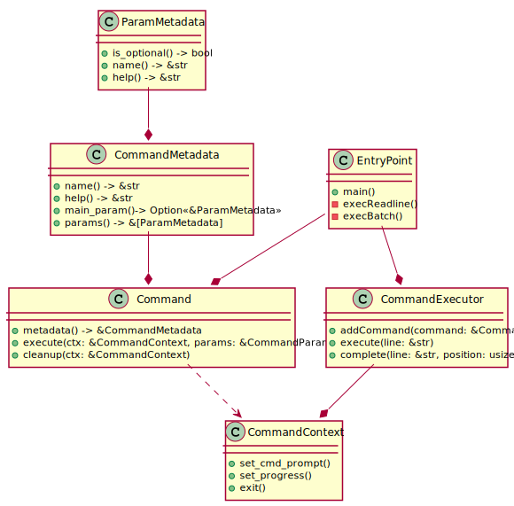

# Indy CLI Design

## Re-implementation of CLI
This proposal follow the idea to re-implement CLI from scratch. Main reasons are:
* Existing code base is written in hard-to support way.
* Existing code base is too far from libindy entities model.
* Existing code base requires complex runtime (python) and additional dependencies (python libindy wrapper) that complicates deployment.
* It is just cheaper to re-implement CLI than to perform deep refactoring.

## Use Rust language
We propose to re-implement CLI in Rust. Main reasons are:
* Main libindy code base uses Rust. Team has deep Rust experience.
* No need to big runtime, small list of dependencies. As result simple packaging and deployment.
* Rust is nice and reliable cross-platform solution for native apps.

## Terminal input-output handling
To handle complex terminal input, history and autocompletion support on different terminals linefeed crate will be used (few additional alternatives are also available). To handle colored terminal output ansi_term crate will be used.

## Auto completion
The following autocompletion will be provided through readline infrastructure:
* Command group name completion
* Command name completion
* Command param name completion

## Libindy wrapper
CLI project will contain simple synchronous libindy wrapper:
* Code from libindy tests that provides similar wrapper will be partially reused.
* Synchronization will be performed through Rust channels:
  * Main thread creates channel and closure that will send message to this channel.
  * Calls libindy and puts this closure as callback.
  * Blocks on reading from channel.

As channel reading assumes timeouts it will be possible to emulate progress updating .

## Threading model
There will be one main thread that will perform io operations with terminal and libindy calls synchronized through Rust’s channel. Blocking will be limited by small channel read timeout.

## Execution modes
CLI will support 2 execution modes:
* Interactive. In this mode CLI will read commands from terminal interactively.
* Batch. In this code all commands will be read from file or pipe and executed in series.

## Code structure
* CLI code will define "Command" structure that will be container for:
  * Command meta information (name, command help, supported params, params help)
  * "Executor" function that will contain command execution logic
  * "Cleaner" function that will contain command cleanup logic
* Each command will be implemented as Rust module with one public "new" function that returns configured "Command" instance
* All commands will share one "CommandContext". "CommandContext" will hold application state and contain 2 parts:
  * Pre-defined application part. Part that holds application-level state like command prompt, isExit flag and etc...
  * Generic command specific part. This part will be key-value storage that will allow commands to store command-speficic data like Indy SDK handles, used DID and etc... 
* "Executor" and "Cleaner" functions will get CommandContext as parameter
* Actual execution of commands will be performed by CommandExecutor class. This class will:
  * Instantiation of shared "CommandContext"
  * Hold all commands and command grouping info
  * Parse command lines according to commands meta information and search for relevant command
  * Triggering of command execution
  * Provide line auto completion logic
  * Triggerid of command cleanup
Command instances will optionally share few contexts:
* EntryPoint will:
* Instantiate CommandExecutor and provide commands to command executor instance.
* Determine execution mode.
  * In interactive mode it will start readline cycle and execute each line with CommandExecutor until Exit command received.
  * In batch mode it will execute each command in the list and finish execution after completion of all commands.

See diagram:



## Commands
Command format
```
indy> [<group>] <command> [[<main_param_name>=]<main_param_value>] [<param_name1>=<param_value1>] ... [<param_nameN>=<param_valueN>]
```
### Common commands

#### Help
Print list of groups with group help:
```
indy> help
```
Print list of group commands with command help:
```
indy> <group> help
```
Print command help, list of command param and help for each param:
```
indy> <group> <command> help
```

#### About
Print about and license info:
```
indy> about
```

#### Exit
Exit from CLI:
```
indy> exit
```

#### Prompt
Change command prompt:
```
indy> prompt <new_prompt>
```

#### Show
Print content of file:
```
indy> show [file=]<file_path>
```

### Wallets management commands (wallet group)
```
indy> wallet <command>
```

#### Wallet create
Create new wallet with specified name and pool:
```
indy> wallet create [name=]<wallet name> pool_name=<pool name> [key=<key>]
```
TODO: Think about custom wallet types support. Now we force default wallet security model.. 

#### Wallet open
Open the wallet with specified name and make it available for commands that require wallet. If there was opened wallet it will be closed:
```
indy> wallet open [name=]<wallet name> [key=<key>] [rekey=<rekey>]
```

#### Wallet close
Close the opened wallet
```
indy> wallet close
```

#### Wallet list
List all created wallets with corresponded status (indicates opened one):
```
indy> wallet list
```

### Pool management commands
```
indy> pool <subcommand>
```

#### Create config
Create name pool (network) configuration
```
indy> pool create [name=]<pool name> gen_txn_file=<gen txn file path> 
```

#### Connect
Connect to Indy nodes pool and make it available for operation that require pool access. If there was pool connection it will be disconnected.
```
indy> pool connect [name=]<pool name>
```

#### Disconnect
Disconnect from Indy nodes pool
```
indy> pool disconnect
```

#### List
List all created pools configurations with status (indicates connected one)
```
indy> pool list
```

### Identity Management
```
indy> did <subcommand>
```

#### New
Create and store my DID in the opened wallet. Requires opened wallet.
```
indy> did new [did=<did>] [seed=<seed str>] [metadata=<metadata string>]
```

#### List
List my DIDs stored in the opened wallet as table (did, verkey, metadata). Requires wallet to be opened.:
```
indy> did list
```

#### Use
Use the DID as identity owner for commands that require identity owner:
```
indy> did use [did=]<did>
```

#### Rotate key
Rotate keys for used DID. Sends NYM to the ledger with updated keys. Requires opened wallet and connection to pool:
```
indy> did rotate-key [seed=<seed str>]
```

### Ledger transactions/messages
```
indy> ledger <subcommand>
```

#### NYM transaction
Send NYM transaction
```
ledger nym did=<did-value> [verkey=<verkey-value>] [role=<role-value>]
```

#### GET_NYM transaction
Send GET_NYM transaction
```
ledger get-nym did=<did-value>
```

#### ATTRIB transaction
Send ATTRIB transaction
```
ledger attrib did=<did-value> [hash=<hash-value>] [raw=<raw-value>] [enc=<enc-value>]
```

#### GET_ATTRIB transaction
Send GET_ATTRIB transaction
```
ledger get-attrib did=<did-value> [raw=<raw-value>] [hash=<hash-value>] [enc=<enc-value>]
```

#### NODE transaction
Send NODE transaction
```
ledger node target=<target-value> node_ip=<node_ip-value> node_port=<node_port-value> client_ip=<client_ip-value> client_port=<client_port-value> alias=<alias-value> blskey=<blskey-value> [services=<services-value>]
```

#### POOL_UPGRADE transaction
Send POOL_UPGRADE transaction
```
ledger pool-upgrade name=<name> version=<version> action=<start or cancel> sha256=<sha256> [timeout=<timeout>] [schedule=<schedule>] [justification=<justification>] [reinstall=<true or false (default false)>] [force=<true or false (default false)>]
```

#### SCHEMA transaction
Send SCHEMA transaction
```
ledger schema name=<name-value> version=<version-value> attr_names=<attr_names-value>
```

#### GET_SCHEMA transaction
```
ledger get-schema did=<did-value> name=<name-value> version=<version-value>
```

#### CLAIM_DEF transaction
Send CLAIM_DEF transaction
```
ledger claim-def schema_no=<schema_no-value> signature_type=<signature_type-value> primary=<primary-value> [revocation=<revocation-value>]
```

#### GET_CLAIM_DEF transaction
Send GET_CLAIM_DEF transaction
```
ledger get-claim-def schema_no=<schema_no-value> signature_type=<signature_type-value> origin=<origin-value>
```

#### POOL_CONFIG transaction
Send POOL_CONFIG transaction
```
ledger pool-config writes=<true or false (default false)> [force=<true or false (default false)>]
```

#### Custom transaction
Send custom transaction with user defined json body and optional signature
```
ledger custom [txn=]<txn-json-value> [sign=<true|false>]
```

## Examples

#### Create pool configuration and connect to pool
```
indy> pool create sandbox gen_txn_file=/etc/sovrin/sandbox.txn
indy> pool connect sandbox
pool(sandbox):indy> pool list
```

#### Create and open wallet
```
sandbox|indy> wallet create alice_wallet pool_name=sandbox
sandbox|indy> wallet open alice_wallet
pool(sandbox):wallet(alice_wallet):indy> wallet list
```

#### Create DID in the wallet from seed and use it for the next commands
```
pool(sandbox):wallet(alice_wallet):indy> did new seed=SEED0000000000000000000000000001 metadata="Alice DID"
pool(sandbox):wallet(alice_wallet):indy> did use MYDID000000000000000000001
pool(sandbox):wallet(alice_wallet):did(MYD...001):indy> did list
```

#### Create new DID for BOB
```
pool(sandbox):wallet(alice_wallet):did(MYD...001):indy> did new metadata="Bob DID"
```

#### Post new NYM to the ledger
```
pool(sandbox):wallet(alice_wallet):did(MYD...001):indy> ledger nym did=MYDID000000000000000000001
```

#### Send GET_NYM transaction
```
pool(sandbox):wallet(alice_wallet):did(MYD...001):indy> ledger get-nym did=MYDID000000000000000000001
```
