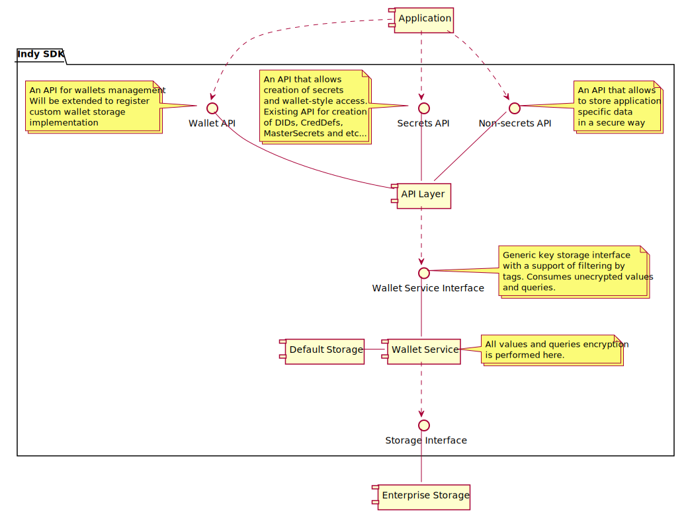
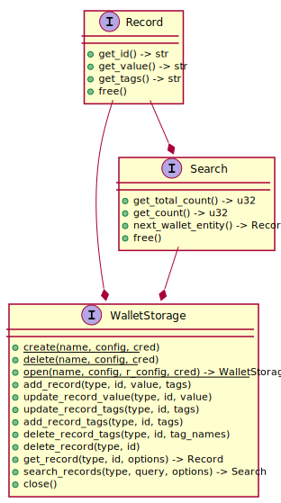
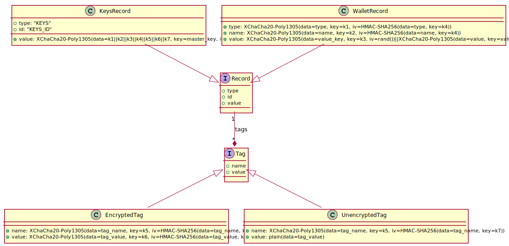

# Wallet Storage Design

In current state libindy allows to plug different wallet implementations. Plugged wallet now handles both security
and storage layers. This design proposes to restrict our plugged interface by handling only storage layer.
All encryption will be performed in libindy. It will simplify plugged wallets and warranty good security level
for 3d party wallets implementations.

Also proposals enhances our API for efficient and flexible search with paging support.

Also proposals enhances our API to support storing of application specific
data into the wallet.

## Goals and ideas

* Simplify plugged wallets and warranty security level for 3d party wallets implementation by perform all
  encryption on libindy level:
  * Record ids will be always encrypted.
  * Record values will be always encrypted.
  * Tag names will be always encrypted.
  * Tag values will be **optionally** encrypted. If user wants to perform some complex searches it can
    be possible to include some additional un-encrypted tags.
* Allow plugging of different storages with native OpenSSL style object-oriented C interface for.
  Try to avoid unnecessary json and re-allocation.
* Allow efficient and flexible search for entities with pagination support.
* Expose public API to store application specific data into the wallet. This API shouldn't
  have an access to secrets stored by libindy.

## Wallet Components



## Secrets API

It is our existing endpoints for secrets creation and access like ```indy_create_and_store_did``` or ```indy_create_and_store_cred_def```:

1. Allow to create a secret into the wallet
1. Return record id and optionally public part (if needed)
1. Allow to search for stored secrets ids (if needed)
1. Allow to reference secret by id in crypto calls that require this secret
1. Don't allow to get stored secret back

## Non-secrets API

This API is intended to store and read application specific identity data in the wallet.
This API shouldn't have an access to secrets stored by Secret Entities API.

```Rust
/// Create a new non-secret record in the wallet
///
/// #Params
/// command_handle: command handle to map callback to caller context
/// wallet_handle: wallet handle (created by open_wallet)
/// type_: allows to separate different record types collections
/// id: the id of record
/// value: the value of record
/// tags_json: the record tags used for search and storing meta information as json:
///   {
///     "tagName1": <str>, // string tag (will be stored encrypted)
///     "tagName2": <int>, // int tag (will be stored encrypted)
///     "~tagName3": <str>, // string tag (will be stored un-encrypted)
///     "~tagName4": <int>, // int tag (will be stored un-encrypted)
///   }
///   Note that null means no tags
///   If tag name starts with "~" the tag will be stored un-encrypted that will allow
///   usage of this tag in complex search queries (comparison, predicates)
///   Encrypted tags can be searched only for exact matching
extern pub fn indy_add_wallet_record(command_handle: i32,
                                     wallet_handle: i32,
                                     type_: *const c_char,
                                     id: *const c_char,
                                     value: *const c_char,
                                     tags_json: *const c_char,
                                     cb: Option<extern fn(command_handle_: i32, err: ErrorCode)>) -> ErrorCode {}

/// Update a non-secret wallet record value
///
/// #Params
/// command_handle: command handle to map callback to caller context
/// wallet_handle: wallet handle (created by open_wallet)
/// type_: allows to separate different record types collections
/// id: the id of record
/// value: the new value of record
extern pub fn indy_update_wallet_record_value(command_handle: i32,
                                              wallet_handle: i32,
                                              type_: *const c_char,
                                              id: *const c_char,
                                              value: *const c_char,
                                              cb: Option<extern fn(command_handle_: i32, err: ErrorCode)>) -> ErrorCode {}

/// Update a non-secret wallet record tags
///
/// #Params
/// command_handle: command handle to map callback to caller context
/// wallet_handle: wallet handle (created by open_wallet)
/// type_: allows to separate different record types collections
/// id: the id of record
/// tags_json: the record tags used for search and storing meta information as json:
///   {
///     "tagName1": <str>, // string tag (will be stored encrypted)
///     "tagName2": <int>, // int tag (will be stored encrypted)
///     "~tagName3": <str>, // string tag (will be stored un-encrypted)
///     "~tagName4": <int>, // int tag (will be stored un-encrypted)
///   }
///   Note that null means no tags
///   If tag name starts with "~" the tag will be stored un-encrypted that will allow
///   usage of this tag in complex search queries (comparison, predicates)
///   Encrypted tags can be searched only for exact matching
extern pub fn indy_update_wallet_record_tags(command_handle: i32,
                                             wallet_handle: i32,
                                             type_: *const c_char,
                                             id: *const c_char,
                                             tags_json: *const c_char,
                                             cb: Option<extern fn(command_handle_: i32, err: ErrorCode)>) -> ErrorCode {}

/// Add new tags to the wallet record
///
/// #Params
/// command_handle: command handle to map callback to caller context
/// wallet_handle: wallet handle (created by open_wallet)
/// type_: allows to separate different record types collections
/// id: the id of record
/// tags_json: the record tags used for search and storing meta information as json:
///   {
///     "tagName1": <str>, // string tag (will be stored encrypted)
///     "tagName2": <int>, // int tag (will be stored encrypted)
///     "~tagName3": <str>, // string tag (will be stored un-encrypted)
///     "~tagName4": <int>, // int tag (will be stored un-encrypted)
///   }
///   Note that null means no tags
///   If tag name starts with "~" the tag will be stored un-encrypted that will allow
///   usage of this tag in complex search queries (comparison, predicates)
///   Encrypted tags can be searched only for exact matching
///   Note if some from provided tags already assigned to the record than
///     corresponding tags values will be replaced
extern pub fn indy_add_wallet_record_tags(command_handle: i32,
                                          wallet_handle: i32,
                                          type_: *const c_char,
                                          id: *const c_char,
                                          tags_json: *const c_char,
                                          cb: Option<extern fn(command_handle_: i32, err: ErrorCode)>) -> ErrorCode {}

/// Delete tags from the wallet record
///
/// #Params
/// command_handle: command handle to map callback to caller context
/// wallet_handle: wallet handle (created by open_wallet)
/// type_: allows to separate different record types collections
/// id: the id of record
/// tag_names_json: the list of tag names to remove from the record as json array:
///   ["tagName1", "tagName2", ...]
///   Note that null means no tag names
extern pub fn indy_delete_wallet_record_tags(command_handle: i32,
                                             wallet_handle: i32,
                                             type_: *const c_char,
                                             id: *const c_char,
                                             tag_names_json: *const c_char,
                                             cb: Option<extern fn(command_handle_: i32, err: ErrorCode)>) -> ErrorCode {}

/// Delete an existing wallet record in the wallet
///
/// #Params
/// command_handle: command handle to map callback to caller context
/// wallet_handle: wallet handle (created by open_wallet)
/// type_: record type
/// id: the id of record
extern pub fn indy_delete_wallet_record(command_handle: i32,
                                        wallet_handle: i32,
                                        type_: *const c_char,
                                        id: *const c_char,
                                        cb: Option<extern fn(command_handle_: i32, err: ErrorCode)>) -> ErrorCode> {}

/// Get an wallet record by id
///
/// #Params
/// command_handle: command handle to map callback to caller context
/// wallet_handle: wallet handle (created by open_wallet)
/// type_: allows to separate different record types collections
/// id: the id of record
/// options_json: //TODO: FIXME: Think about replacing by bitmask
///  {
///    retrieveType: (optional, false by default) Retrieve record type,
///    retrieveValue: (optional, true by default) Retrieve record value,
///    retrieveTags: (optional, false by default) Retrieve record tags
///  }
/// #Returns
/// wallet record json:
/// {
///   id: "Some id",
///   value: "Some value", // present only if retrieveValue set to true
///   tags: <tags json>, // present only if retrieveTags set to true
/// }
extern pub fn indy_get_wallet_record(command_handle: i32,
                                     wallet_handle: i32,
                                     type_: *const c_char,
                                     id: *const c_char,
                                     options_json: *const c_char,
                                     cb: Option<extern fn(command_handle_: i32, err: ErrorCode,
                                                          record_json: *const c_char)>) -> ErrorCode {}

/// Search for wallet records.
///
/// Note instead of immediately returning of fetched records
/// this call returns wallet_search_handle that can be used later
/// to fetch records by small batches (with indy_fetch_wallet_search_next_records).
///
/// #Params
/// wallet_handle: wallet handle (created by open_wallet)
/// type_: allows to separate different record types collections
/// query_json: MongoDB style query to wallet record tags:
///  {
///    "tagName": "tagValue",
///    $or: {
///      "tagName2": { $regex: 'pattern' },
///      "tagName3": { $gte: 123 },
///    },
///  }
/// options_json: //TODO: FIXME: Think about replacing by bitmask
///  {
///    retrieveRecords: (optional, true by default) If false only "counts" will be calculated,
///    retrieveTotalCount: (optional, false by default) Calculate total count,
///    retrieveValue: (optional, true by default) Retrieve record value,
///    retrieveTags: (optional, false by default) Retrieve record tags,
///  }
/// #Returns
/// wallet_search_handle: Wallet search handle that can be used later
///   to fetch records by small batches (with indy_fetch_wallet_search_next_records)
extern pub fn indy_open_wallet_search(command_handle: i32,
                                      wallet_handle: i32,
                                      type_: *const c_char,
                                      query_json: *const c_char,
                                      options_json: *const c_char,
                                      cb: Option<extern fn(command_handle_: i32, err: ErrorCode,
                                                           wallet_search_handle_p: *mut i32)>) -> ErrorCode {}


/// Fetch next records for wallet search.
///
/// Not if there are no records this call returns WalletNoRecords error.
///
/// #Params
/// wallet_handle: wallet handle (created by open_wallet)
/// wallet_search_handle: wallet wallet handle (created by indy_open_wallet_search)
/// count: Count of records to fetch
///
/// #Returns
/// wallet records json:
/// {
///   totalCount: <int>, // present only if retrieveTotalCount set to true
///   records: [{ // present only if retrieveRecords set to true
///       id: "Some id",
///       value: "Some value", // present only if retrieveValue set to true
///       tags: <tags json>, // present only if retrieveTags set to true
///   }],
/// }
extern pub fn indy_fetch_wallet_search_next_records(command_handle: i32,
                                                    wallet_handle: i32,
                                                    wallet_search_handle: i32,
                                                    count: usize,
                                                    cb: Option<extern fn(command_handle_: i32, err: ErrorCode,
                                                                         records_json: *const c_char)>) -> ErrorCode {}
```

## Wallet API and Storage Interface

Wallet API already exists and allows wallet management. It requires to be update to allow plugging different storages implementation to libindy. For example, to allow storing
of wallet records in SQL database. To achieve this we will replace existing ```indy_register_wallet_type``` call with ```indy_register_wallet_storage``` call:

```Rust
/// Register custom wallet storage implementation.
///
/// It allows library user to provide custom wallet storage implementation as set of handlers.
///
/// #Params
/// command_handle: Command handle to map callback to caller context.
/// type_: Wallet storage name.
/// create: Wallet storage "create" operation handler
/// delete: Wallet storage "delete" operation handler
/// open: Wallet storage "open" operation handler
/// close: Wallet storage "close" operation handler
/// add_record: Wallet storage "add_record" operation handler
/// update_record_value: Wallet storage "update_record_value" operation handler
/// update_record_tags: Wallet storage "update_record_tags" operation handler
/// add_record_tags: Wallet storage "add_record_tags" operation handler
/// delete_record_tags: Wallet storage "delete_record_tags" operation handler
/// delete_record: Wallet storage "delete_record" operation handler
/// get_record: Wallet storage "get_record" operation handler
/// get_record_id: Wallet storage "get_record_id" operation handler
/// get_record_value: Wallet storage "get_record_value" operation handler
/// get_record_tags: Wallet storage "get_record_tags" operation handler
/// free_record: Wallet storage "free_record" operation handler
/// search_records: Wallet storage "search_records" operation handler
/// get_search_total_count: Wallet storage "get_search_total_count" operation handler
/// get_search_count: Wallet storage "get_search_count" operation handler
/// get_search_next_record: Wallet storage "get_search_next_record" operation handler
/// free_search: Wallet storage "free_search" operation handler
///
/// #Returns
/// Error code
#[no_mangle]
pub extern fn indy_register_wallet_storage(command_handle: i32,
                                           type_: *const c_char,

                                           /// Create the wallet storage (For example, database creation)
                                           ///
                                           /// #Params
                                           /// name: wallet storage name (the same as wallet name)
                                           /// config: wallet storage config (For example, database config)
                                           /// credentials: wallet storage credentials (For example, database credentials)
                                           create: Option<extern fn(name: *const c_char,
                                                                    config: *const c_char,
                                                                    credentials: *const c_char) -> ErrorCode>,

                                           /// Delete the wallet storage (For example, database deletion)
                                           ///
                                           /// #Params
                                           /// name: wallet storage name (the same as wallet name)
                                           /// config: wallet storage config (For example, database config)
                                           /// credentials: wallet storage credentials (For example, database credentials)
                                           delete: Option<extern fn(name: *const c_char,
                                                                    config: *const c_char,
                                                                    credentials: *const c_char) -> ErrorCode>,

                                           /// Open the wallet storage (For example, opening database connection)
                                           ///
                                           /// #Params
                                           /// name: wallet storage name (the same as wallet name)
                                           /// config: wallet storage config (For example, database config)
                                           /// runtime_config: wallet storage runtime config (For example, connection config)
                                           /// credentials: wallet storage credentials (For example, database credentials)
                                           /// storage_handle_p: pointer to store opened storage handle
                                           open: Option<extern fn(name: *const c_char,
                                                                  config: *const c_char,
                                                                  runtime_config: *const c_char,
                                                                  credentials: *const c_char,
                                                                  storage_handle_p: *mut i32) -> ErrorCode>,

                                           /// Close the opened walled storage (For example, closing database connection)
                                           ///
                                           /// #Params
                                           /// storage_handle: opened storage handle (See open handler)
                                           close: Option<extern fn(handle: i32) -> ErrorCode>,

                                           /// Create a new record in the wallet storage
                                           ///
                                           /// #Params
                                           /// storage_handle: opened storage handle (See open handler)
                                           /// type_: allows to separate different record types collections
                                           /// id: the id of record
                                           /// value: the value of record (pointer to buffer)
                                           /// value_len: the value of record (buffer size)
                                           /// tags_json: the record tags used for search and storing meta information as json:
                                           ///   {
                                           ///     "tagName1": "tag value 1", // string value
                                           ///     "tagName2": 123, // numeric value
                                           ///   }
                                           ///   Note that null means no tags
                                           add_record: Option<extern fn(storage_handle: i32,
                                                                        type_: *const c_char,
                                                                        id: *const c_char,
                                                                        value: *const u8,
                                                                        value_len: usize,
                                                                        tags_json: *const c_char) -> ErrorCode>,

                                           /// Update a record value
                                           ///
                                           /// #Params
                                           /// storage_handle: opened storage handle (See open handler)
                                           /// type_: allows to separate different record types collections
                                           /// id: the id of record
                                           /// value: the value of record (pointer to buffer)
                                           /// value_len: the value of record (buffer size)
                                           update_record_value: Option<extern fn(storage_handle: i32,
                                                                                 type_: *const c_char,
                                                                                 id: *const c_char,
                                                                                 value: *const c_char,
                                                                                 value_len: usize) -> ErrorCode>,

                                           /// Update a record tags
                                           ///
                                           /// #Params
                                           /// storage_handle: opened storage handle (See open handler)
                                           /// type_: allows to separate different record types collections
                                           /// id: the id of record
                                           /// tags_json: the new record tags used for search and storing meta information as json:
                                           ///   {
                                           ///     "tagName1": "tag value 1", // string value
                                           ///     "tagName2": 123, // numeric value
                                           ///   }
                                           ///   Note that null means no tags
                                           update_record_tags: Option<extern fn(storage_handle: i32,
                                                                                type_: *const c_char,
                                                                                id: *const c_char,
                                                                                tags_json: *const c_char) -> ErrorCode>,

                                           /// Add new tags to the record
                                           ///
                                           /// #Params
                                           /// storage_handle: opened storage handle (See open handler)
                                           /// type_: allows to separate different record types collections
                                           /// id: the id of record
                                           /// tags_json: the additional record tags as json:
                                           ///   {
                                           ///     "tagName1": "tag value 1", // string value
                                           ///     "tagName2": 123, // numeric value,
                                           ///     ...
                                           ///   }
                                           ///   Note that null means no tags
                                           ///   Note if some from provided tags already assigned to the record than
                                           ///     corresponding tags values will be replaced
                                           add_record_tags: Option<extern fn(storage_handle: i32,
                                                                             type_: *const c_char,
                                                                             id: *const c_char,
                                                                             tags_json: *const c_char) -> ErrorCode>,

                                           /// Delete tags from the record
                                           ///
                                           /// #Params
                                           /// storage_handle: opened storage handle (See open handler)
                                           /// type_: allows to separate different record types collections
                                           /// id: the id of record
                                           /// tag_names_json: the list of tag names to remove from the record as json array:
                                           ///   ["tagName1", "tagName2", ...]
                                           ///   Note that null means no tag names
                                           delete_record_tags: Option<extern fn(storage_handle: i32,
                                                                                type_: *const c_char,
                                                                                id: *const c_char,
                                                                                tag_names_json: *const c_char) -> ErrorCode>,

                                           /// Delete an existing record in the wallet storage
                                           ///
                                           /// #Params
                                           /// storage_handle: opened storage handle (See open handler)
                                           /// type_: record type
                                           /// id: the id of record
                                           delete_record: Option<extern fn(storage_handle: i32,
                                                                           type_: *const c_char,
                                                                           id: *const c_char) -> ErrorCode>,

                                           /// Get an wallet storage record by id
                                           ///
                                           /// #Params
                                           /// storage_handle: opened storage handle (See open handler)
                                           /// type_: allows to separate different record types collections
                                           /// id: the id of record
                                           /// options_json: //TODO: FIXME: Think about replacing by bitmask
                                           ///  {
                                           ///    retrieveType: (optional, false by default) Retrieve record type,
                                           ///    retrieveValue: (optional, true by default) Retrieve record value,
                                           ///    retrieveTags: (optional, false by default) Retrieve record tags
                                           ///  }
                                           /// record_handle_p: pointer to store retrieved record handle
                                           get_record: Option<extern fn(storage_handle: i32,
                                                                        type_: *const c_char,
                                                                        id: *const c_char,
                                                                        options_json: *const c_char,
                                                                        record_handle_p: *mut i32) -> ErrorCode>,

                                          /// Get an id for retrieved wallet storage record
                                          ///
                                          /// #Params
                                          /// storage_handle: opened storage handle (See open handler)
                                          /// record_handle: retrieved record handle (See get_record handler)
                                          ///
                                          /// returns: record id
                                          ///          Note that pointer lifetime the same as retrieved record lifetime
                                          ///            (until record_free called)
                                          get_record_id: Option<extern fn(storage_handle: i32,
                                                                          record_handle: i32,
                                                                          record_id_p: *mut *const c_char) -> ErrorCode>,

                                          /// Get an type for retrieved wallet storage record
                                          ///
                                          /// #Params
                                          /// storage_handle: opened storage handle (See open handler)
                                          /// record_handle: retrieved record handle (See get_record handler)
                                          ///
                                          /// returns: record id
                                          ///          Note that pointer lifetime the same as retrieved record lifetime
                                          ///            (until record_free called)
                                          ///          Note that null be returned if no type retrieved
                                          get_record_type: Option<extern fn(storage_handle: i32,
                                                                            record_handle: i32,
                                                                            record_type_p: *mut *const c_char) -> ErrorCode>,

                                          /// Get an value for retrieved wallet storage record
                                          ///
                                          /// #Params
                                          /// storage_handle: opened storage handle (See open handler)
                                          /// record_handle: retrieved record handle (See get_record handler)
                                          ///
                                          /// returns: record value
                                          ///          Note that pointer lifetime the same as retrieved record lifetime
                                          ///            (until record_free called)
                                          ///          Note that null be returned if no value retrieved
                                          get_record_value: Option<extern fn(storage_handle: i32,
                                                                             record_handle: i32,
                                                                             record_value_p: *mut *const u8,
                                                                             record_value_len_p: *mut i32) -> ErrorCode>,

                                          /// Get an tags for retrieved wallet record
                                          ///
                                          /// #Params
                                          /// storage_handle: opened storage handle (See open handler)
                                          /// record_handle: retrieved record handle (See get_record handler)
                                          ///
                                          /// returns: record tags as json
                                          ///          Note that pointer lifetime the same as retrieved record lifetime
                                          ///            (until record_free called)
                                          ///          Note that null be returned if no tags retrieved
                                          get_record_tags: Option<extern fn(storage_handle: i32,
                                                                            record_handle: i32,
                                                                            record_tags_p: *mut *const c_char) -> ErrorCode>,

                                          /// Free retrieved wallet record (make retrieved record handle invalid)
                                          ///
                                          /// #Params
                                          /// storage_handle: opened storage handle (See open_wallet_storage)
                                          /// record_handle: retrieved record handle (See wallet_storage_get_wallet_record)
                                          free_record: Option<extern fn(storage_handle: i32,
                                                                        record_handle: i32) -> ErrorCode>,

                                          /// Search for wallet storage records
                                          ///
                                          /// #Params
                                          /// storage_handle: opened storage handle (See open handler)
                                          /// type_: allows to separate different record types collections
                                          /// query_json: MongoDB style query to wallet record tags:
                                          ///  {
                                          ///    "tagName": "tagValue",
                                          ///    $or: {
                                          ///      "tagName2": { $regex: 'pattern' },
                                          ///      "tagName3": { $gte: 123 },
                                          ///    },
                                          ///  }
                                          /// options_json: //TODO: FIXME: Think about replacing by bitmask
                                          ///  {
                                          ///    retrieveRecords: (optional, true by default) If false only "counts" will be calculated,
                                          ///    retrieveTotalCount: (optional, false by default) Calculate total count,
                                          ///    retrieveType: (optional, false by default) Retrieve record type,
                                          ///    retrieveValue: (optional, true by default) Retrieve record value,
                                          ///    retrieveTags: (optional, false by default) Retrieve record tags,
                                          ///  }
                                          /// search_handle_p: pointer to store wallet search handle
                                          search_records: Option<extern fn(storage_handle: i32,
                                                                           type_: *const c_char,
                                                                           query_json: *const c_char,
                                                                           options_json: *const c_char,
                                                                           search_handle_p: *mut i32) -> ErrorCode>,

                                          /// Search for wallet storage records
                                          ///
                                          /// Note that for each record id, type, value and tags will be retrieved
                                          /// Note that total count will not be calculated
                                          ///
                                          /// #Params
                                          /// storage_handle: opened storage handle (See open handler)
                                          /// search_handle_p: pointer to store wallet search handle
                                          search_all_records: Option<extern fn(storage_handle: i32,
                                                                               search_handle_p: *mut i32) -> ErrorCode>,

                                          /// Get total count of records that corresponds to wallet storage search query
                                          ///
                                          /// #Params
                                          /// storage_handle: opened storage handle (See open handler)
                                          /// search_handle: wallet search handle (See search_records handler)
                                          ///
                                          /// returns: total count of records that corresponds to wallet storage search query
                                          ///          Note -1 will be returned if retrieveTotalCount set to false for search_records
                                          get_search_total_count: Option<extern fn(storage_handle: i32,
                                                                                   search_handle: i32,
                                                                                   total_count_p: *mut usize) -> ErrorCode>,

                                          /// Get the next wallet storage record handle retrieved by this wallet search.
                                          ///
                                          /// #Params
                                          /// storage_handle: opened storage handle (See open handler)
                                          /// search_handle: wallet search handle (See search_records handler)
                                          ///
                                          /// returns: record handle (the same as for get_record handler)
                                          ///          Note if no more records WalletNoRecords error will be returned
                                          fetch_search_next_record: Option<extern fn(storage_handle: i32,
                                                                                     search_handle: i32,
                                                                                     record_handle_p: *mut i32) -> ErrorCode>,

                                          /// Free wallet search (make search handle invalid)
                                          ///
                                          /// #Params
                                          /// storage_handle: opened storage handle (See open handler)
                                          /// search_handle: wallet search handle (See search_records handler)
                                          free_search: Option<extern fn(storage_handle: i32,
                                                                        search_handle: i32) -> ErrorCode>,

                                          cb: Option<extern fn(command_handle_: i32,
                                                               err: ErrorCode)>) -> ErrorCode
```

Storage Interface entities are:



## Wallet Service Interface

```Rust

impl WalletService {

  pub fn new() -> WalletService {}

  pub fn register_wallet_storage(&self,
                                 type_: *const c_char,
                                 create: extern fn(name: *const c_char,
                                                   config: *const c_char)  -> ErrorCode,
                                 delete: extern fn(name: *const c_char,
                                                   config: *const c_char,
                                                   credentials: *const c_char) -> ErrorCode,
                                 open: extern fn(name: *const c_char,
                                                 config: *const c_char,
                                                 runtime_config: *const c_char,
                                                 credentials: *const c_char,
                                                 storage_handle_p: *mut i32) -> ErrorCode,
                                 close: extern fn(handle: i32) -> ErrorCode,
                                 add_record: extern fn(storage_handle: i32,
                                                       type_: *const c_char,
                                                       id: *const c_char,
                                                       value: *const u8,
                                                       value_len: usize,
                                                       tags_json: *const c_char) -> ErrorCode,
                                 update_record_value: extern fn(storage_handle: i32,
                                                                type_: *const c_char,
                                                                id: *const c_char,
                                                                value: *const u8,
                                                                value_len: usize) -> ErrorCode,
                                 update_record_tags: extern fn(storage_handle: i32,
                                                               type_: *const c_char,
                                                               id: *const c_char,
                                                               tags_json: *const c_char) -> ErrorCode,
                                 add_record_tags: extern fn(storage_handle: i32,
                                                            type_: *const c_char,
                                                            id: *const c_char,
                                                            tags_json: *const c_char) -> ErrorCode,
                                 delete_record_tags: extern fn(storage_handle: i32,
                                                               type_: *const c_char,
                                                               id: *const c_char,
                                                               tag_names_json: *const c_char) -> ErrorCode,
                                 delete_record: extern fn(storage_handle: i32,
                                                          type_: *const c_char,
                                                          id: *const c_char) -> ErrorCode,
                                 get_record: extern fn(storage_handle: i32,
                                                       type_: *const c_char,
                                                       id: *const c_char,
                                                       options_json: *const c_char,
                                                       record_handle_p: *mut i32) -> ErrorCode,
                                 get_record_id: extern fn(storage_handle: i32,
                                                          record_handle: i32,
                                                          record_id_p: *mut *const c_char) -> ErrorCode,
                                 get_record_value: extern fn(storage_handle: i32,
                                                             record_handle: i32,
                                                             record_value_p: *mut *const u8,
                                                             record_value_len_p: *mut usize) -> ErrorCode,
                                 get_record_tags: extern fn(storage_handle: i32,
                                                            record_handle: i32,
                                                            record_tags_p: *mut *const c_char) -> ErrorCode,
                                 free_record: extern fn(storage_handle: i32,
                                                        record_handle: i32) -> ErrorCode,
                                 search_records: extern fn(storage_handle: i32,
                                                           type_: *const c_char,
                                                           query_json: *const c_char,
                                                           options_json: *const c_char,
                                                           search_handle_p: *mut i32) -> ErrorCode,
                                search_all_records: extern fn(storage_handle: i32,
                                                              search_handle_p: *mut i32) -> ErrorCode,
                                 get_search_total_count: extern fn(storage_handle: i32,
                                                                   search_handle: i32,
                                                                   total_count_p: *mut usize) -> ErrorCode,
                                 fetch_search_next_record: Option<extern fn(storage_handle: i32,
                                                                            search_handle: i32,
                                                                            record_handle_p: *mut i32) -> ErrorCode,
                                 free_search: extern fn(storage_handle: i32,
                                                        search_handle: i32) -> ErrorCode>) -> Result<(), WalletError> {}

   pub fn create_wallet(&self,
                        pool_name: &str,
                        name: &str,
                        storage_type: Option<&str>,
                        storage_config: Option<&str>,
                        credentials: &str) -> Result<(), WalletError> {}

   pub fn delete_wallet(&self,
                        name: &str,
                        credentials: &str) -> Result<(), WalletError> {}

   pub fn open_wallet(&self,
                      name: &str,
                      credentials: &str) -> Result<i32, WalletError> {}

   pub fn close_wallet(&self,
                       wallet_handle: i32) -> Result<(), WalletError> {}

   pub fn list_wallets(&self) -> Result<Vec<WalletMetadata>, WalletError> {}

   pub fn add_record(wallet_handle: i32,
                     type_: &str,
                     id: &str,
                     tags_json: &str) -> Result<(), WalletError> {}

   pub fn update_record_value(wallet_handle: i32,
                              type_: &str,
                              id: &str,
                              value: &str) -> Result<(), WalletError> {}

   pub fn update_record_tags(wallet_handle: i32,
                             type_: &str,
                             id: &str,
                             tags_json: &str) -> Result<(), WalletError> {}

   pub fn add_record_tags(wallet_handle: i32,
                          type_: &str,
                          id: &str,
                          tags_json: &str) -> Result<(), WalletError> {}

   pub fn delete_record_tags(storage_handle: i32,
                             type_: &str,
                             id: &str,
                             tag_names_json: &str) -> Result<(), WalletError> {}

   pub fn delete_record(storage_handle: i32,
                        type_: &str,
                        id: &str) -> Result<(), WalletError> {}

   pub fn get_record(storage_handle: i32,
                     type_: &str,
                     id: &str,
                     options_json: &str) -> Result<WalletRecord, WalletError> {}

    pub fn search_records(storage_handle: i32,
                          type_: &str,
                          query_json: &str,
                          options_json: &str) -> Result<WalletSearch, WalletError> {}

    pub fn search_all_records(storage_handle: i32) -> Result<WalletSearch, WalletError> {}
}

impl WalletRecord {

  pub fn get_id() -> &str {}

  pub fn get_type() -> Option<&str> {}

  pub fn get_value() -> Option<&str> {}

  pub fn get_tags() -> Option<&str> {}
}

impl WalletSearch {

  pub fn get_total_count() -> Result<Option<i32>, WalletError> {}

  pub fn fetch_next_record() -> Result<Option<WalletRecord>, WalletError> {}
}

```

## Wallet Query Language

This language will be used to define queries in Non-secrets API, Wallet Service and
Wallet Storage Interface.

```Rust
query = {subquery}
subquery = {subquery, ..., subquery} - WHERE subquery AND ... AND subquery
subquery = $or: [{subquery},..., {subquery}] - WHERE subquery OR ... OR subquery
subquery = $not: {subquery} - Where NOT (subquery)
subquery = "tagName": tagValue - WHERE tagName == tagValue
subquery = "tagName": {$neq: tagValue} - WHERE tagName != tagValue
subquery = "tagName": {$gt: tagValue} - WHERE tagName > tagValue
subquery = "tagName": {$gte: tagValue} - WHERE tagName >= tagValue
subquery = "tagName": {$lt: tagValue} - WHERE tagName < tagValue
subquery = "tagName": {$lte: tagValue} - WHERE tagName <= tagValue
subquery = "tagName": {$like: tagValue} - WHERE tagName LIKE tagValue
subquery = "tagName": {$in: [tagValue, ..., tagValue]} - WHERE tagName IN (tagValue, ..., tagValue)
```

## Separation of libindy secrets from non-secrets

The idea is the following:

* libindy will use specific prefix for all internal record types like "~did"
* For non-secret interface it will be impossible to use this prefix
* If user passes value with this prefix as entity type libindy will return validation error

## Separation of libindy defined tags from user defined tags

The idea is the following:

* libindy will use specific prefix for all internal record tags like "indy:tagName"
* For all user interfaces it will be impossible to modify tags with this prefix
* If user passes tag with this prefix to any function that modifies tags libindy will return validation error
* Note that it will be possible for user application to read libindy defined tags and use these tags for searching

## Wallet Encryption

Encryption schema is the following:

