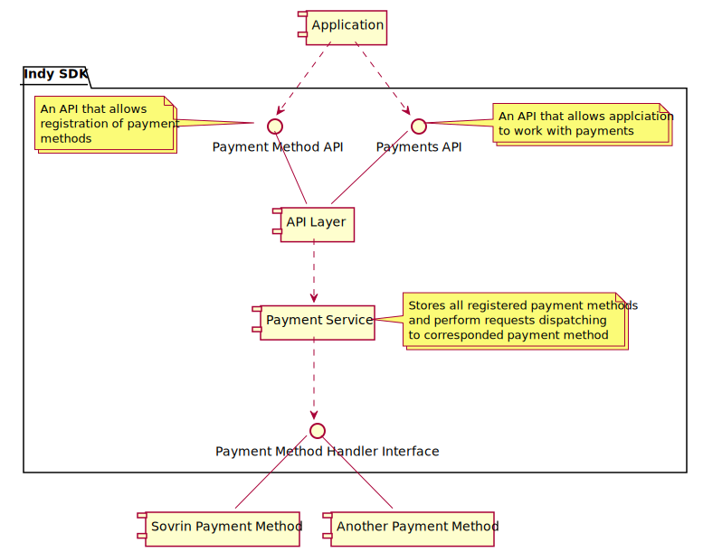

# Payment Interface

This design proposes to make libindy aware about payments and tokens that can be implemented with Indy infrastructure.

## Goals and ideas

* Libindy should be aware about some details of payments in Indy infrastructure:
  * The idea of payments in general. Transactions might need to be paid for, transactions
    can be used for money/tokens transfer.
  * Concept of different Payment Methods that can be plugged to libindy
    (like Sovrin tokens, Bitcoin tokens, Visa and etc...). A payment method in libindy might be
    identified by prefix: “pay:sov” could be the prefix for the Sovrin token payment method,
    and “pay:xyz” could be the prefix for a different payment method.
  * Concept of Payment Address that is common for supported Payment Methods. Different
    payment use different format of Payment Address, but there is agreement on fully resolvable
    payment address format.  This is very much like the notion of the general DID spec with
    sub-specs called DID method specs that are associated with a name.
    Payment addresses would be things like “pay:sov:12345”.
  * The idea of payments take inputs and outputs.
  * General payment errors that might happen (e.g., “insufficient funds”).
* Out-of-box libindy will not provide support of any payment method, but there will be
  API to register payment methods.
* Each payment method should be aware about:
  * Its payment method prefix, and the format of its payment addresses.
  * How to create pure payment transactions, such as those that transfers sources, mint sources,
    or lookup balances.
  * How to modify an unsigned non-payment transaction (e.g., NYM) to pay fees.
  * How to modify transaction signing in a way that satisfies its payment method.
  * Possibly, special payment addresses that are significant to its method
    (e.g., the payment address at which the Sovrin Foundation receives fees).
* Libindy should provide generic API for payment addresses creation, building of payment-related transactions,
  assigning fees to transactions. This API will look to registered payment methods and call corresponded
  handlers.
* Payments interface must be interoperable as possible between different payment methods.



## Payment Method API

Payment Method API will allow to register custom payment method implementation
by calling ```indy_register_payment_method``` call:

```Rust
/// Register custom payment implementation.
///
/// It allows library user to provide custom payment method implementation as set of handlers.
///
/// #Params
/// command_handle: Command handle to map callback to caller context.
/// payment_method: The type of payment method also used as sub-prefix for fully resolvable payment address format ("sov" - for example)
/// create_payment_address: "create_payment_address" operation handler
/// add_request_fees: "add_request_fees" operation handler
/// parse_response_with_fees: "parse_response_with_fees" operation handler
/// build_get_payment_sources_request: "build_get_payment_sources_request" operation handler
/// parse_get_payment_sources_response: "parse_get_payment_sources_response" operation handler
/// build_payment_req: "build_payment_req" operation handler
/// parse_payment_response: "parse_payment_response" operation handler
/// build_mint_req: "build_mint_req" operation handler
/// build_set_txn_fees_req: "build_set_txn_fees_req" operation handler
/// build_get_txn_fees_req: "build_get_txn_fees_req" operation handler
/// parse_get_txn_fees_response: "parse_get_txn_fees_response" operation handler
/// build_verify_payment_req: "build_verify_payment_req" operation handler
/// parse_verify_payment_response: "parse_verify_payment_response" operation handler
///
/// #Returns
/// Error code
#[no_mangle]
pub extern fn indy_register_payment_method(command_handle: i32,
                                           payment_method: *const c_char,

                                           create_payment_address: Option<CreatePaymentAddressCB>,
                                           add_request_fees: Option<AddRequestFeesCB>,
                                           parse_response_with_fees: Option<ParseResponseWithFeesCB>,
                                           build_get_payment_sources_request: Option<BuildGetPaymentSourcesRequestCB>,
                                           parse_get_payment_sources_response: Option<ParseGetPaymentSourcesResponseCB>,
                                           build_payment_req: Option<BuildPaymentReqCB>,
                                           parse_payment_response: Option<ParsePaymentResponseCB>,
                                           build_mint_req: Option<BuildMintReqCB>,
                                           build_set_txn_fees_req: Option<BuildSetTxnFeesReqCB>,
                                           build_get_txn_fees_req: Option<BuildGetTxnFeesReqCB>,
                                           parse_get_txn_fees_response: Option<ParseGetTxnFeesResponseCB>,
                                           build_verify_req: Option<BuildVerifyReqCB>,
                                           parse_verify_response: Option<ParseVerifyResponseCB>,
                                           cb: Option<extern fn(command_handle_: i32,
                                                                err: ErrorCode) -> ErrorCode>) -> ErrorCode {}
```

### Payment Method Handler Interface

Registered functions will be called by libindy as part of processing libindy API calls.
Libindy will pass its own callback to the functions to retrieve result of the 3rd party function implementation.
The list below is type description for registered calls.

```Rust
/// Create the payment address for this payment method.
///
/// This method generates private part of payment address
/// and stores it in a secure place. Ideally it should be
/// secret in libindy wallet (see crypto module).
///
/// Note that payment method should be able to resolve this
/// secret by fully resolvable payment address format.
///
/// #Params
/// command_handle: command handle to map callback to context
/// wallet_handle: wallet handle where keys for signature are stored
/// config: payment address config as json:
///   {
///     seed: <str>, // allows deterministic creation of payment address
///   }
///
/// #Returns
/// payment_address - public identifier of payment address in fully resolvable payment address format
type CreatePaymentAddressCB = extern fn(command_handle: i32,
                                        wallet_handle: i32,
                                        config: *const c_char,
                                        cb: Option<extern fn(command_handle_: i32,
                                                             err: ErrorCode,
                                                             payment_address: *const c_char) -> ErrorCode>) -> ErrorCode;

/// Modifies Indy request by adding information how to pay fees for this transaction
/// according to this payment method.
///
/// This method consumes set of inputs and outputs. The difference between inputs balance
/// and outputs balance is the fee for this transaction.
///
/// Not that this method also produces correct fee signatures.
///
/// Format of inputs is specific for payment method. Usually it should reference payment transaction
/// with at least one output that corresponds to payment address that user owns.
///
/// #Params
/// command_handle: command handle to map callback to context
/// wallet_handle: wallet handle
/// submitter_did : DID of request sender
/// req_json: initial transaction request as json
/// inputs_json: The list of payment sources as json array:
///   ["source1", ...]
///   Note that each source should reference payment address
/// outputs_json: The list of outputs as json array:
///   [{
///     recipient: <str>, // payment address of recipient
///     amount: <int>, // amount
///   }]
/// extra: // optional information for payment operation
///
/// #Returns
/// req_with_fees_json - modified Indy request with added fees info
type AddRequestFeesCB = extern fn(command_handle: i32,
                                  wallet_handle: i32,
                                  submitter_did: *const c_char,
                                  req_json: *const c_char,
                                  inputs_json: *const c_char,
                                  outputs_json: *const c_char,
                                  cb: Option<extern fn(command_handle_: i32,
                                                       err: ErrorCode,
                                                       req_with_fees_json: *const c_char) -> ErrorCode>) -> ErrorCode;

/// Parses response for Indy request with fees.
///
/// #Params
/// command_handle: command handle to map callback to context
/// resp_json: response for Indy request with fees
///
/// #Returns
/// receipts_json - parsed (payment method and node version agnostic) receipts info as json:
///   [{
///      receipt: <str>, // receipt that can be used for payment referencing and verification
///      recipient: <str>, //payment address for this recipient
///      amount: <int>, // amount
///      extra: <str>, // optional data from payment transaction
///   }]
type ParseResponseWithFeesCB = extern fn(command_handle: i32,
                                         resp_json: *const c_char,
                                         cb: Option<extern fn(command_handle_: i32,
                                                              err: ErrorCode,
                                                              receipts_json: *const c_char) -> ErrorCode>) -> ErrorCode;
                                                       
/// Builds Indy request for getting sources list for payment address
/// according to this payment method.
///
/// #Params
/// command_handle: command handle to map callback to context
/// wallet_handle: wallet handle
/// submitter_did : DID of request sender
/// payment_address: target payment address
///
/// #Returns
/// get_sources_txn_json - Indy request for getting sources list for payment address
type BuildGetPaymentSourcesRequestCB = extern fn(command_handle: i32,
                                       wallet_handle: i32,
                                       submitter_did: *const c_char,
                                       payment_address: *const c_char,
                                       cb: Option<extern fn(command_handle_: i32,
                                                            err: ErrorCode,
                                                            get_sources_txn_json: *const c_char) -> ErrorCode>) -> ErrorCode;

/// Parses response for Indy request for getting sources list.
///
/// #Params
/// command_handle: command handle to map callback to context
/// resp_json: response for Indy request for getting sources list
///
/// #Returns
/// sources_json - parsed (payment method and node version agnostic) sources info as json:
///   [{
///      source: <str>, // source input
///      paymentAddress: <str>, //payment address for this source
///      amount: <int>, // amount
///      extra: <str>, // optional data from payment transaction
///   }]
type ParseGetPaymentSourcesResponseCB = extern fn(command_handle: i32,
                                        resp_json: *const c_char,
                                        cb: Option<extern fn(command_handle_: i32,
                                                             err: ErrorCode,
                                                             sources_json: *const c_char) -> ErrorCode>) -> ErrorCode;

/// Builds Indy request for doing payment
/// according to this payment method.
///
/// This method consumes set of inputs and outputs.
///
/// Format of inputs is specific for payment method. Usually it should reference payment transaction
/// with at least one output that corresponds to payment address that user owns.
///
/// #Params
/// command_handle: command handle to map callback to context
/// wallet_handle: wallet handle
/// submitter_did : DID of request sender
/// inputs_json: The list of payment sources as json array:
///   ["source1", ...]
///   Note that each source should reference payment address
/// outputs_json: The list of outputs as json array:
///   [{
///     recipient: <str>, // payment address of recipient
///     amount: <int>, // amount
///   }]
/// extra: // optional information for payment operation
///
/// #Returns
/// payment_req_json - Indy request for doing payment
type BuildPaymentReqCB = extern fn(command_handle: i32,
                                   wallet_handle: i32,
                                   submitter_did: *const c_char,
                                   inputs_json: *const c_char,
                                   outputs_json: *const c_char,
                                   cb: Option<extern fn(command_handle_: i32,
                                                        err: ErrorCode,
                                                        payment_req_json: *const c_char) -> ErrorCode>) -> ErrorCode;

/// Parses response for Indy request for payment txn.
///
/// #Params
/// command_handle: command handle to map callback to context
/// resp_json: response for Indy request for payment txn
///
/// #Returns
/// receipts_json - parsed (payment method and node version agnostic) receipts info as json:
///   [{
///      receipt: <str>, // receipt that can be used for payment referencing and verification
///      recipient: <str>, //payment address for this receipt
///      amount: <int>, // amount
///      extra: <str>, // optional data from payment transaction
///   }]
type ParsePaymentResponseCB = extern fn(command_handle: i32,
                                        resp_json: *const c_char,
                                        cb: Option<extern fn(command_handle_: i32,
                                                             err: ErrorCode,
                                                             receipts_json: *const c_char) -> ErrorCode>) -> ErrorCode;

/// Builds Indy request for doing minting
/// according to this payment method.
///
/// #Params
/// command_handle: command handle to map callback to context
/// wallet_handle: wallet handle
/// submitter_did : DID of request sender
/// outputs_json: The list of outputs as json array:
///   [{
///     recipient: <str>, // payment address of recipient
///     amount: <int>, // amount
///   }]
/// extra: // optional information for payment operation
///
/// #Returns
/// mint_req_json - Indy request for doing minting
type BuildMintReqCB = extern fn(command_handle: i32,
                                wallet_handle: i32,
                                submitter_did: *const c_char,
                                outputs_json: *const c_char,
                                cb: Option<extern fn(command_handle_: i32,
                                                     err: ErrorCode,
                                                     mint_req_json: *const c_char) -> ErrorCode>) -> ErrorCode;

/// Builds Indy request for setting fees for transactions in the ledger
///
/// # Params
/// command_handle: command handle to map callback to context
/// wallet_handle: wallet handle
/// submitter_did : DID of request sender
/// fees_json {
///   txnType1: amount1,
///   txnType2: amount2,
///   .................
///   txnTypeN: amountN,
/// }
///
/// # Return
/// set_txn_fees_json - Indy request for setting fees for transactions in the ledger
type BuildSetTxnFeesReqCB = extern fn(command_handle: i32,
                                      wallet_handle: i32,
                                      submitter_did: *const c_char,
                                      fees_json: *const c_char,
                                      cb: Option<extern fn(command_handle_: i32,
                                                           err: ErrorCode,
                                                           set_txn_fees_json: *const c_char) -> ErrorCode>) -> ErrorCode;

/// Builds Indy get request for getting fees for transactions in the ledger
///
/// # Params
/// command_handle: command handle to map callback to context
/// wallet_handle: wallet handle
/// submitter_did : DID of request sender
///
/// # Return
/// get_txn_fees_json - Indy request for getting fees for transactions in the ledger
type BuildGetTxnFeesReqCB = extern fn(command_handle: i32,
                                      wallet_handle: i32,
                                      submitter_did: *const c_char,
                                      cb: Option<extern fn(command_handle_: i32,
                                                           err: ErrorCode,
                                                           get_txn_fees_json: *const c_char) -> ErrorCode>) -> ErrorCode;

/// Parses response for Indy request for getting fees
///
/// # Params
/// command_handle: command handle to map callback to context
/// resp_json: response for Indy request for getting fees
///
/// # Return
/// fees_json {
///   txnType1: amount1,
///   txnType2: amount2,
///   .................
///   txnTypeN: amountN,
/// }                                          
type ParseGetTxnFeesResponseCB = extern fn(command_handle: i32,
                                           resp_json: *const c_char,
                                           cb: Option<extern fn(command_handle_: i32,
                                                                err: ErrorCode,
                                                                fees_json: *const c_char) -> ErrorCode>) -> ErrorCode;                                                       

/// Builds Indy request for getting information to verify the payment receipt
///
/// # Params
/// command_handle: command handle to map callback to context
/// wallet_handle: wallet handle
/// submitter_did : DID of request sender
/// receipt: payment receipt to verify
///
/// # Return
/// verify_txn_json -- request to be sent to ledger
pub type BuildVerifyPaymentReqCB = extern fn(command_handle: i32,
                                             wallet_handle: i32,
                                             submitter_did: *const c_char,
                                             receipt: *const c_char,
                                             cb: Option<extern fn(command_handle_: i32,
                                                                  err: ErrorCode,
                                                                  verify_txn_json: *const c_char) -> ErrorCode>) -> ErrorCode;

/// Parses Indy response with information to verify receipt
///
/// # Params
/// command_handle: command handle to map callback to context
/// resp_json: response for Indy request for information to verify the payment receipt
///
/// # Return
/// txn_json: {
///     sources: [<str>, ]
///     receipts: [ {
///         recipient: <str>, // payment address of recipient
///         receipt: <str>, // receipt that can be used for payment referencing and verification
///         amount: <int>, // amount
///     }, ]
///     extra: <str>, //optional data
/// }
pub type ParseVerifyPaymentResponseCB = extern fn(command_handle: i32,
                                                  resp_json: *const c_char,
                                                  cb: Option<extern fn(command_handle_: i32,
                                                                       err: ErrorCode,
                                                                       txn_json: *const c_char) -> ErrorCode>) -> ErrorCode;
```

## Payment API

Some API calls have dedicated parameter to determine payment_method.
Another part of calls use assumptions about input parameters format to determine payment_method

```Rust
/// Create the payment address for specified payment method
///
///
/// This method generates private part of payment address
/// and stores it in a secure place. Ideally it should be
/// secret in libindy wallet (see crypto module).
///
/// Note that payment method should be able to resolve this
/// secret by fully resolvable payment address format.
///
/// #Params
/// command_handle: command handle to map callback to context
/// wallet_handle: wallet handle where to save new address
/// payment_method: Payment method to use (for example, 'sov')
/// config: payment address config as json:
///   {
///     seed: <str>, // allows deterministic creation of payment address
///   }
///
/// #Returns
/// payment_address - public identifier of payment address in fully resolvable payment address format
pub extern fn indy_create_payment_address(command_handle: i32,
                                          wallet_handle: i32,
                                          payment_method: *const c_char,
                                          config: *const c_char,
                                          cb: Option<extern fn(command_handle_: i32,
                                                               err: ErrorCode,
                                                               payment_address: *const c_char) -> ErrorCode>) -> ErrorCode {}
                                                               
/// Lists all payment addresses that are stored in the wallet
///
/// #Params
/// command_handle: command handle to map callback to context
/// wallet_handle: wallet to search for payment_addresses in
///
/// #Returns
/// payment_addresses_json - json array of string with json addresses
pub extern fn indy_list_payment_addresses(command_handle: i32,
                                          wallet_handle: i32,
                                          cb: Option<extern fn(command_handle_: i32,
                                                               err: ErrorCode,
                                                               payment_addresses_json: *const c_char)>) -> ErrorCode {}

/// Modifies Indy request by adding information how to pay fees for this transaction
/// according to this payment method.
///
/// This method consumes set of inputs and outputs. The difference between inputs balance
/// and outputs balance is the fee for this transaction.
///
/// Not that this method also produces correct fee signatures.
///
/// Format of inputs is specific for payment method. Usually it should reference payment transaction
/// with at least one output that corresponds to payment address that user owns.
///
/// #Params
/// command_handle: Command handle to map callback to caller context.
/// wallet_handle: wallet handle
/// submitter_did : DID of request sender
/// req_json: initial transaction request as json
/// inputs_json: The list of payment sources as json array:
///   ["source1", ...]
///     - each input should reference paymentAddress
///     - this param will be used to determine payment_method
/// outputs_json: The list of outputs as json array:
///   [{
///     recipient: <str>, // payment address of recipient
///     amount: <int>, // amount
///   }]
/// extra: // optional information for payment operation
///
/// #Returns
/// req_with_fees_json - modified Indy request with added fees info
/// payment_method - used payment method
pub extern fn indy_add_request_fees(command_handle: i32,
                                    wallet_handle: i32,
                                    submitter_did: *const c_char,
                                    req_json: *const c_char,
                                    inputs_json: *const c_char,
                                    outputs_json: *const c_char,
                                    extra: *const c_char,
                                    cb: Option<extern fn(command_handle_: i32,
                                                         err: ErrorCode,
                                                         req_with_fees_json: *const c_char,
                                                         payment_method: *const c_char) -> ErrorCode>) -> ErrorCode {}

/// Parses response for Indy request with fees.
///
/// #Params
/// command_handle: Command handle to map callback to caller context.
/// payment_method: payment method to use
/// resp_json: response for Indy request with fees
///
/// #Returns
/// receipts_json - parsed (payment method and node version agnostic) receipts info as json:
///   [{
///      receipt: <str>, // receipt that can be used for payment referencing and verification
///      recipient: <str>, //payment address of recipient
///      amount: <int>, // amount
///      extra: <str>, // optional data from payment transaction
///   }]
pub extern fn indy_parse_response_with_fees(command_handle: i32,
                                            payment_method: *const c_char,
                                            resp_json: *const c_char,
                                            cb: Option<extern fn(command_handle_: i32,
                                                                 err: ErrorCode,
                                                                 receipts_json: *const c_char) -> ErrorCode>) -> ErrorCode {}

/// Builds Indy request for getting sources list for payment address
/// according to this payment method.
///
/// #Params
/// command_handle: Command handle to map callback to caller context.
/// wallet_handle: wallet handle
/// submitter_did : DID of request sender
/// payment_address: target payment address
///
/// #Returns
/// get_sources_txn_json - Indy request for getting sources list for payment address
/// payment_method - used payment method
pub extern fn indy_build_get_payment_sources_request(command_handle: i32,
                                                     wallet_handle: i32,
                                                     submitter_did: *const c_char,
                                                     payment_address: *const c_char,
                                                     cb: Option<extern fn(command_handle_: i32,
                                                                          err: ErrorCode,
                                                                          get_sources_txn_json: *const c_char,
                                                                          payment_method: *const c_char) -> ErrorCode>) -> ErrorCode {}

/// Parses response for Indy request for getting sources list.
///
/// #Params
/// command_handle: Command handle to map callback to caller context.
/// payment_method: payment method to use.
/// resp_json: response for Indy request for getting sources list
///
/// #Returns
/// sources_json - parsed (payment method and node version agnostic) sources info as json:
///   [{
///      source: <str>, // source input
///      paymentAddress: <str>, //payment address for this source
///      amount: <int>, // amount
///      extra: <str>, // optional data from payment transaction
///   }]
pub extern fn indy_parse_get_payment_sources_response(command_handle: i32,
                                                      payment_method: *const c_char,
                                                      resp_json: *const c_char,
                                                      cb: Option<extern fn(command_handle_: i32,
                                                                           err: ErrorCode,
                                                                           sources_json: *const c_char) -> ErrorCode>) -> ErrorCode {}

/// Builds Indy request for doing payment
/// according to this payment method.
///
/// This method consumes set of inputs and outputs.
///
/// Format of inputs is specific for payment method. Usually it should reference payment transaction
/// with at least one output that corresponds to payment address that user owns.
///
/// #Params
/// command_handle: Command handle to map callback to caller context.
/// wallet_handle: wallet handle
/// submitter_did : DID of request sender
/// inputs_json: The list of payment sources as json array:
///   ["source1", ...]
///   Note that each source should reference payment address
/// outputs_json: The list of outputs as json array:
///   [{
///     recipient: <str>, // payment address of recipient
///     amount: <int>, // amount
///   }]
/// extra: // optional information for payment operation
///
/// #Returns
/// payment_req_json - Indy request for doing payment
/// payment_method - used payment method
pub extern fn indy_build_payment_req(command_handle: i32,
                                     wallet_handle: i32,
                                     submitter_did: *const c_char,
                                     inputs_json: *const c_char,
                                     outputs_json: *const c_char,
                                     extra: *const c_char,
                                     cb: Option<extern fn(command_handle_: i32,
                                                          err: ErrorCode,
                                                          payment_req_json: *const c_char,
                                                          payment_method: *const c_char) -> ErrorCode>) -> ErrorCode {}

/// Parses response for Indy request for payment txn.
///
/// #Params
/// command_handle: Command handle to map callback to caller context.
/// payment_method: payment method to use
/// resp_json: response for Indy request for payment txn
///
/// #Returns
/// receipts_json - parsed (payment method and node version agnostic) receipts info as json:
///   [{
///      receipt: <str>, // receipt that can be used for payment referencing and verification
///      recipient: <str>, // payment address of recipient
///      amount: <int>, // amount
///      extra: <str>, // optional data from payment transaction
///   }]
pub extern fn indy_parse_payment_response(command_handle: i32,
                                          payment_method: *const c_char,
                                          resp_json: *const c_char,
                                          cb: Option<extern fn(command_handle_: i32,
                                                               err: ErrorCode,
                                                               receipts_json_json: *const c_char) -> ErrorCode>) -> ErrorCode {}

/// Builds Indy request for doing minting
/// according to this payment method.
///
/// #Params
/// command_handle: Command handle to map callback to caller context.
/// wallet_handle: wallet handle
/// submitter_did : DID of request sender
/// outputs_json: The list of outputs as json array:
///   [{
///     recipient: <str>, // payment address of recipient
///     amount: <int>, // amount
///   }]
/// extra: // optional information for mint operation
///
/// #Returns
/// mint_req_json - Indy request for doing minting
/// payment_method - used payment method
pub extern fn indy_build_mint_req(command_handle: i32,
                                  wallet_handle: i32,
                                  submitter_did: *const c_char,
                                  outputs_json: *const c_char,
                                  extra: *const c_char,
                                  cb: Option<extern fn(command_handle_: i32,
                                                       err: ErrorCode,
                                                       mint_req_json: *const c_char,
                                                       payment_method: *const c_char) -> ErrorCode>) -> ErrorCode {}

/// Builds Indy request for setting fees for transactions in the ledger
///
/// # Params
/// command_handle: Command handle to map callback to caller context.
/// wallet_handle: wallet handle
/// submitter_did : DID of request sender
/// payment_method: payment method to use
/// fees_json {
///   txnType1: amount1,
///   txnType2: amount2,
///   .................
///   txnTypeN: amountN,
/// }
/// # Return
/// set_txn_fees_json - Indy request for setting fees for transactions in the ledger
pub extern fn indy_build_set_txn_fees_req(command_handle: i32,
                                          wallet_handle: i32,
                                          submitter_did: *const c_char,
                                          payment_method: *const c_char,
                                          fees_json: *const c_char,
                                          cb: Option<extern fn(command_handle_: i32,
                                                               err: ErrorCode,
                                                               set_txn_fees_json: *const c_char) -> ErrorCode>) -> ErrorCode {}

/// Builds Indy get request for getting fees for transactions in the ledger
///
/// # Params
/// command_handle: Command handle to map callback to caller context.
/// wallet_handle: wallet handle
/// submitter_did : DID of request sender
/// payment_method: payment method to use
///
/// # Return
/// get_txn_fees_json - Indy request for getting fees for transactions in the ledger
pub extern fn indy_build_get_txn_fees_req(command_handle: i32,
                                          wallet_handle: i32,
                                          submitter_did: *const c_char,
                                          payment_method: *const c_char,
                                          cb: Option<extern fn(command_handle_: i32,
                                                               err: ErrorCode,
                                                               get_txn_fees_json: *const c_char) -> ErrorCode>) -> ErrorCode {}

/// Parses response for Indy request for getting fees
///
/// # Params
/// command_handle: Command handle to map callback to caller context.
/// payment_method: payment method to use
/// resp_json: response for Indy request for getting fees
///
/// # Return
/// fees_json {
///   txnType1: amount1,
///   txnType2: amount2,
///   .................
///   txnTypeN: amountN,
/// }
pub extern fn indy_parse_get_txn_fees_response(command_handle: i32,
                                               payment_method: *const c_char,
                                               resp_json: *const c_char,
                                               cb: Option<extern fn(command_handle_: i32,
                                                                    err: ErrorCode,
                                                                    fees_json: *const c_char) -> ErrorCode>) -> ErrorCode {}

/// Builds Indy request for information to verify the payment receipt
///
/// # Params
/// command_handle: Command handle to map callback to caller context.
/// wallet_handle: wallet handle
/// submitter_did : DID of request sender
/// receipt: payment receipt to verify
///
/// # Return
/// verify_txn_json: Indy request for verification receipt
/// payment_method: used payment method
#[no_mangle]
pub extern fn indy_build_verify_payment_req(command_handle: i32,
                                            wallet_handle: i32,
                                            submitter_did: *const c_char,
                                            receipt: *const c_char,
                                            cb: Option<extern fn(command_handle_: i32,
                                                                 err: ErrorCode,
                                                                 verify_txn_json: *const c_char,
                                                                 payment_method: *const c_char)>) -> ErrorCode {}

/// Parses Indy response with information to verify receipt
///
/// # Params
/// command_handle: Command handle to map callback to caller context.
/// payment_method: payment method to use
/// resp_json: response of the ledger for verify txn
///
/// # Return
/// txn_json: {
///     sources: [<str>, ]
///     receipts: [ {
///         recipient: <str>, // payment address of recipient
///         receipt: <str>, // receipt that can be used for payment referencing and verification
///         amount: <int>, // amount
///     } ],
///     extra: <str>, //optional data
/// }
#[no_mangle]
pub extern fn indy_parse_verify_payment_response(command_handle: i32,
                                                 payment_method: *const c_char,
                                                 resp_json: *const c_char,
                                                 cb: Option<extern fn(command_handle_: i32,
                                                                      err: ErrorCode,
                                                                      txn_json: *const c_char)>) -> ErrorCode {}
```