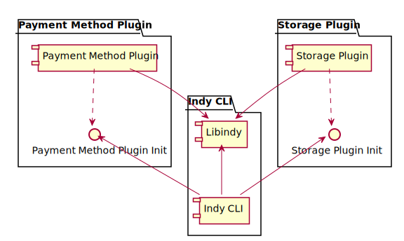

# CLI plugins

This design proposes the way to support plugins in Indy CLI.

## Goals and ideas

* Libindy now allows to plug 2 type of functionality for the moment:
  * Custom wallet storage
  * Custom payment methods
* To register plugins libindy provides API calls that allows to register C-handlers for each type of plugged operation
* In current vision libraries that implement libindy plugins should provide some kind of public "init" function that will call internally libindy API to register handlers. So registration of plugin is just calling of C function.
* "Init" function should have just one param. It is callback that returns libindy error code.
* CLI can provide command line option that will allow to point the name of plugin dynamic library and the name of "init" function. On start CLI will call dlopen (or LoadLibrary) with right options to perform names linking. CLI will lookup for init function by name and call it.
* Also we need to provide CLI command to load plugin similar way

## Linking



## Command line param to load plugins on start

```bash
indy-cli --plugins <lib-1-name>:<init-func-1-name>,...,<lib-n-name>:<init-func-n-name>
```

Example:

```bash
indy-cli --plugins libnullpay:nullpay_init,libstorage:storage_init
```

## Command to load plugin

```bash
indy> load-plugin library=<library-name> initializer=<init-func-name>
```

Example:

```bash
indy> load-plugin library=libnullpay initializer=nullpay_init
```