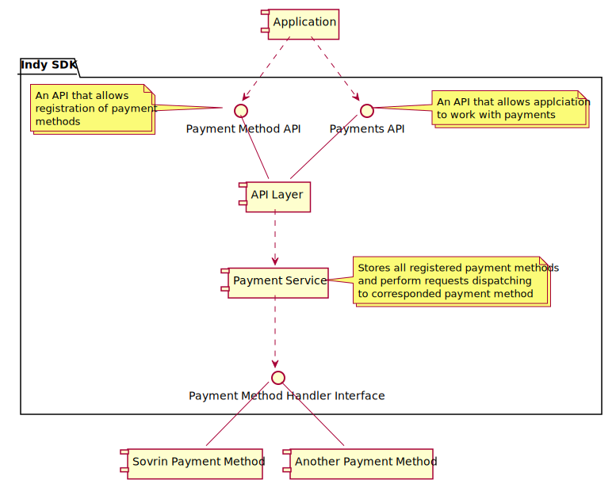

# Tokens Interface

This design proposes to make libindy aware about payments and tokens that can be implemented with Indy infrastructure.

## Goals and ideas

* Libindy should be aware about some details of payments in Indy infrastructure:
  * The idea of payments in general. Transactions might need to be paid for, transactions
    can be used for money/tokens transfer.
  * Concept of different Payment Methods that can be plugged to libindy
    (like Sovrin tokens, Bitcoins tokens and etc...). A payment method in libindy might be
    identified by prefix: “pay:sov” could be the prefix for the Sovrin token payment method,
    and “pay:xyz” could be the prefix for a different payment method.
  * Concept of Payment Address that is common for supported Payment Methods. Different
    payment use different format of Payment Address, but there is agreement on fully resolvable
    payment address format.  This is very much like the notion of the general DID spec with
    sub-specs called DID method specs that are associated with a name.
    Payment addresses would be things like “pay:sov:12345”.
  * The idea of UTXO and that payments take inputs and outputs.
  * General payment errors that might happen (e.g., “insufficient funds”).
* Out-of-box libindy will not provide support of any payment method, but there will be
  API to register payment methods.
* Each payment method should be aware about:
  * Its payment method prefix, and the format of its payment addresses.
  * How to create pure payment transactions, such as those that transfers tokens, mint tokens,
    or lookup balances.
  * How to modify an unsigned non-payment transaction (e.g., NYM) to pay fees.
  * How to modify transaction signing in a way that satisfies its payment method.
  * Possibly, special payment addresses that are significant to its method
    (e.g., the payment address at which the Sovrin Foundation receives fees).
* Libindy should provide generic API for payment addresses creation, building of payment-related transactions,
  assigning fees to transactions. This API will look to registered payment methods and call corresponded
  handlers.
* Payments interface must be interoperable as possible between different payment methods.



## Payment Method API and Payment Method Handler Interface

Payment Method API will allow to register custom payment method implementation
by calling ```indy_register_payment_method``` call:

```Rust
/// Register custom payment implementation.
///
/// It allows library user to provide custom payment method implementation as set of handlers.
///
/// #Params
/// command_handle: Command handle to map callback to caller context.
/// payment_method: The type of payment method also used as sub-prefix for fully resolvable payment address format ("sov" - for example)
/// create_payment_address: "create_payment_address" operation handler
/// add_request_fees: "add_request_fees" operation handler
/// build_get_utxo_request: "build_get_utxo_request" operation handler
/// parse_get_utxo_response: "parse_get_utxo_response" operation handler
/// build_payment_req: "build_payment_req" operation handler
/// build_mint_req: "build_mint_req" operation handler
///
/// #Returns
/// Error code
#[no_mangle]
pub extern fn indy_register_payment_method(command_handle: i32,
                                           payment_method: *const c_char,

                                           /// Create the payment address for this payment method.
                                           ///
                                           /// This method generates private part of payment address
                                           /// and stores it in a secure place. Ideally it should be
                                           /// secret in libindy wallet (see crypto module).
                                           ///
                                           /// Note that payment method should be able to resolve this
                                           /// secret by fully resolvable payment address format.
                                           ///
                                           /// #Params
                                           /// command_handle: command handle to map callback to context
                                           /// config: payment address config as json:
                                           ///   {
                                           ///     seed: <str>, // allows deterministic creation of payment address
                                           ///   }
                                           ///
                                           /// #Returns
                                           /// payment_address - public identifier of payment address in fully resolvable payment address format
                                           create_payment_address: Option<extern fn(command_handle: i32,
                                                                                    config: *const c_char,
                                                                                    cb: Option<extern fn(command_handle_: i32,
                                                                                                         err: ErrorCode,
                                                                                                         payment_address: *const c_char)>) -> ErrorCode>,

                                           /// Modifies Indy request by adding information how to pay fees for this transaction
                                           /// according to this payment method.
                                           ///
                                           /// This method consumes set of UTXO inputs and outputs. The difference between inputs balance
                                           /// and outputs balance is the fee for this transaction.
                                           ///
                                           /// Not that this method also produces correct fee signatures.
                                           ///
                                           /// Format of inputs is specific for payment method. Usually it should reference payment transaction
                                           /// with at least one output that corresponds to payment address that user owns.
                                           ///
                                           /// #Params
                                           /// req_json: initial transaction request as json
                                           /// inputs_json: The list of UTXO inputs as json array:
                                           ///   ["input1", ...]
                                           ///   Note that each input should reference paymentAddress
                                           /// outputs_json: The list of UTXO outputs as json array:
                                           ///   [{
                                           ///     paymentAddress: <str>, // payment address used as output
                                           ///     amount: <int>, // amount of tokens to transfer to this payment address
                                           ///     extra: <str>, // optional data
                                           ///   }]
                                           ///
                                           /// #Returns
                                           /// req_with_fees_json - modified Indy request with added fees info
                                           add_request_fees: Option<extern fn(req_json: *const c_char,
                                                                              inputs_json: *const c_char,
                                                                              outputs_json: *const c_char,
                                                                              cb: Option<extern fn(command_handle_: i32,
                                                                                                   err: ErrorCode,
                                                                                                   req_with_fees_json: *const c_char)>) -> ErrorCode>,

                                           /// Builds Indy request for getting UTXO list for payment address
                                           /// according to this payment method.
                                           ///
                                           /// #Params
                                           /// payment_address: target payment address
                                           ///
                                           /// #Returns
                                           /// get_utxo_txn_json - Indy request for getting UTXO list for payment address
                                           build_get_utxo_request: Option<extern fn(payment_address: *const c_char,
                                                                                    cb: Option<extern fn(command_handle_: i32,
                                                                                                         err: ErrorCode,
                                                                                                         get_utxo_txn_json: *const c_char)>) -> ErrorCode>,

                                           /// Parses response for Indy request for getting UTXO list.
                                           ///
                                           /// #Params
                                           /// resp_json: response for Indy request for getting UTXO list
                                           ///
                                           /// #Returns
                                           /// utxo_json - parsed (payment method and node version agnostic) utxo info as json:
                                           ///   [{
                                           ///      input: <str>, // UTXO input
                                           ///      amount: <int>, // amount of tokens in this input
                                           ///      extra: <str>, // optional data from payment transaction
                                           ///   }]
                                           parse_get_utxo_response: Option<extern fn(resp_json: *const c_char,
                                                                                     cb: Option<extern fn(command_handle_: i32,
                                                                                                          err: ErrorCode,
                                                                                                          utxo_json: *const c_char)>) -> ErrorCode>,

                                           /// Builds Indy request for doing tokens payment
                                           /// according to this payment method.
                                           ///
                                           /// This method consumes set of UTXO inputs and outputs.
                                           ///
                                           /// Format of inputs is specific for payment method. Usually it should reference payment transaction
                                           /// with at least one output that corresponds to payment address that user owns.
                                           ///
                                           /// #Params
                                           /// inputs_json: The list of UTXO inputs as json array:
                                           ///   ["input1", ...]
                                           ///   Note that each input should reference paymentAddress
                                           /// outputs_json: The list of UTXO outputs as json array:
                                           ///   [{
                                           ///     paymentAddress: <str>, // payment address used as output
                                           ///     amount: <int>, // amount of tokens to transfer to this payment address
                                           ///     extra: <str>, // optional data
                                           ///   }]
                                           ///
                                           /// #Returns
                                           /// payment_req_json - Indy request for doing tokens payment
                                           build_payment_req: Option<extern fn(req_json: *const c_char,
                                                                               inputs_json: *const c_char,
                                                                               outputs_json: *const c_char,
                                                                               cb: Option<extern fn(command_handle_: i32,
                                                                                                    err: ErrorCode,
                                                                                                    payment_req_json: *const c_char)>) -> ErrorCode>,

                                           /// Builds Indy request for doing tokens minting
                                           /// according to this payment method.
                                           ///
                                           /// #Params
                                           /// outputs_json: The list of UTXO outputs as json array:
                                           ///   [{
                                           ///     paymentAddress: <str>, // payment address used as output
                                           ///     amount: <int>, // amount of tokens to transfer to this payment address
                                           ///     extra: <str>, // optional data
                                           ///   }]
                                           ///
                                           /// #Returns
                                           /// mint_req_json - Indy request for doing tokens minting
                                           build_mint_req: Option<extern fn(req_json: *const c_char,
                                                                            outputs_json: *const c_char,
                                                                            cb: Option<extern fn(command_handle_: i32,
                                                                                                 err: ErrorCode,
                                                                                                 mint_req_json: *const c_char)>) -> ErrorCode>,

                                          cb: Option<extern fn(command_handle_: i32,
                                                               err: ErrorCode)>) -> ErrorCode
```

## Payment API

```Rust
/// Create the payment address for specified payment method
 //
///
/// This method generates private part of payment address
/// and stores it in a secure place. Ideally it should be
/// secret in libindy wallet (see crypto module).
///
/// Note that payment method should be able to resolve this
/// secret by fully resolvable payment address format.
///
/// #Params
/// command_handle: command handle to map callback to context
/// payment_method: Payment method to use (for example, 'sov')
/// config: payment address config as json:
///   {
///     seed: <str>, // allows deterministic creation of payment address
///   }
///
/// #Returns
/// payment_address - public identifier of payment address in fully resolvable payment address format
pub fn indy_create_payment_address(command_handle: i32,
                                   payment_method: *const c_char,
                                   config: *const c_char,
                                   cb: Option<extern fn(command_handle_: i32,
                                                        err: ErrorCode,
                                                        payment_address: *const c_char)>) -> ErrorCode> {}

/// Modifies Indy request by adding information how to pay fees for this transaction
/// according to selected payment method.
///
/// Payment selection is performed by looking to o
///
/// This method consumes set of UTXO inputs and outputs. The difference between inputs balance
/// and outputs balance is the fee for this transaction.
///
/// Not that this method also produces correct fee signatures.
///
/// Format of inputs is specific for payment method. Usually it should reference payment transaction
/// with at least one output that corresponds to payment address that user owns.
///
/// #Params
/// req_json: initial transaction request as json
/// inputs_json: The list of UTXO inputs as json array:
///   ["input1", ...]
///   Note that each input should reference paymentAddress
/// outputs_json: The list of UTXO outputs as json array:
///   [{
///     paymentAddress: <str>, // payment address used as output
///     amount: <int>, // amount of tokens to transfer to this payment address
///     extra: <str>, // optional data
///   }]
///
/// #Returns
/// req_with_fees_json - modified Indy request with added fees info
pub fn indy_add_request_fees(req_json: *const c_char,
                             inputs_json: *const c_char,
                             outputs_json: *const c_char,
                             cb: Option<extern fn(command_handle_: i32,
                                                  err: ErrorCode,
                                                  req_with_fees_json: *const c_char)>) -> ErrorCode> {}

/// Builds Indy request for getting UTXO list for payment address
/// according to this payment method.
///
/// #Params
/// payment_address: target payment address
///
/// #Returns
/// get_utxo_txn_json - Indy request for getting UTXO list for payment address
pub fn indy_build_get_utxo_request(payment_address: *const c_char,
                                   cb: Option<extern fn(command_handle_: i32,
                                                        err: ErrorCode,
                                                        get_utxo_txn_json: *const c_char)>) -> ErrorCode> {}

/// Parses response for Indy request for getting UTXO list.
///
/// #Params
/// resp_json: response for Indy request for getting UTXO list
///
/// #Returns
/// utxo_json - parsed (payment method and node version agnostic) utxo info as json:
///   [{
///      input: <str>, // UTXO input
///      amount: <int>, // amount of tokens in this input
///      extra: <str>, // optional data from payment transaction
///   }]
pub fn indy_parse_get_utxo_response(resp_json: *const c_char,
                                    cb: Option<extern fn(command_handle_: i32,
                                                         err: ErrorCode,
                                                         utxo_json: *const c_char)>) -> ErrorCode> {}

/// Builds Indy request for doing tokens payment
/// according to this payment method.
///
/// This method consumes set of UTXO inputs and outputs.
///
/// Format of inputs is specific for payment method. Usually it should reference payment transaction
/// with at least one output that corresponds to payment address that user owns.
///
/// #Params
/// inputs_json: The list of UTXO inputs as json array:
///   ["input1", ...]
///   Note that each input should reference paymentAddress
/// outputs_json: The list of UTXO outputs as json array:
///   [{
///     paymentAddress: <str>, // payment address used as output
///     amount: <int>, // amount of tokens to transfer to this payment address
///     extra: <str>, // optional data
///   }]
///
/// #Returns
/// payment_req_json - Indy request for doing tokens payment
pub fn indy_build_payment_req(req_json: *const c_char,
                              inputs_json: *const c_char,
                              outputs_json: *const c_char,
                              cb: Option<extern fn(command_handle_: i32,
                                                   err: ErrorCode,
                                                   payment_req_json: *const c_char)>) -> ErrorCode> {}

/// Builds Indy request for doing tokens minting
/// according to this payment method.
///
/// #Params
/// outputs_json: The list of UTXO outputs as json array:
///   [{
///     paymentAddress: <str>, // payment address used as output
///     amount: <int>, // amount of tokens to transfer to this payment address
///     extra: <str>, // optional data
///   }]
///
/// #Returns
/// mint_req_json - Indy request for doing tokens minting
pub fn indy_build_mint_req(req_json: *const c_char,
                           outputs_json: *const c_char,
                           cb: Option<extern fn(command_handle_: i32,
                                                err: ErrorCode,
                                                mint_req_json: *const c_char)>) -> ErrorCode> {}
```