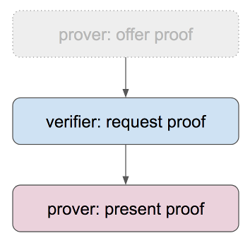

# Negotiate a Proof

Indy-SDK Developer Walkthrough #5, Python Edition

[ [Java](../java/README.md) | [.NET](../dotnet/README.md) | [Node.js](../node/README.md) | [Objective C](../objectivec/README.md) ]

## Prerequisites

Setup your workstation with an indy development virtual machine (VM). See [prerequisites](../../prerequisites).

## Steps

### Step 1

In your normal workstation operating system (not the VM), open a python editor of your
choice and paste the code from [template.py](template.py)
into a new doc. We will be modifying this code in later steps.

Save the doc as `negotiate_proof.py`.

This is a very simple app framework into which you'll plug the code
you'll be writing.

### Step 2

This how-to builds on the work in ["Issue Credential"](../issue-credential/python/README.md).
Rather than duplicate our explanation of those steps here, we will simply
copy that code as our starting point.

Copy the contents of [step2.py](step2.py) into
`negotiate_proof.py` on top of the `Step 2 code goes here` placeholder comment.

Save the updated version of `negotiate_proof.py`.

### Step 3

Proof negotiation typically begins when a *verifier* (also called a *relying party*)
requests proof. (As with credential issuance, the process has three logical
phases, but it is rare to begin with a proof offer. However, if an initial
proof request is met with a [counter-offer](https://github.com/TechWritingWhiz/indy-sdk/tree/master/doc/how-tos/negotiate-proof/python), the offering phase of the
sequence becomes relevant.)

A proof request is a JSON file that describes what sort of
proof would satisfy the relying party.

Once the proof request is received, a holder of credentials must scan their
*identity wallet* to find out which credentials could be used to satisfy
the request. (Wallet scanning is inefficient, but this does not cause
problems for dozens or hundreds of credentials. At higher scale, a new
mechanism is needed.
[Work is underway](https://docs.google.com/presentation/d/1X6F9QVG8M4PqQQLLL_5I6aQ5z7CCpYyYHBNKYMlsqXc/edit#slide=id.g31e3a419cd_0_67)
to add index-driven search to indy wallets. Visit
[#indy-sdk on Rocket.Chat](https://chat.hyperledger.org/channel/indy-sdk)
to learn more.)

Copy the contents of [step3.py](step3.py) into
`negotiate_proof.py` on top of the `Step 3 code goes here` placeholder comment.

Save the updated version of `negotiate_proof.py`.

### Step 4

At this point, the holder becomes a *prover* by generating and presenting
a proof. This is done by building some JSON that selects the credentials
(out of those identified as valid candidates in the previous step),
that the prover wishes to use to satisfy the request. The prover calls
`anoncreds.prover_create_proof()` with appropriate parameters, and the
proof is created.

Copy the contents of [step4.py](step4.py) into
`negotiate_proof.py` on top of the `Step 4 code goes here` placeholder comment.

Save the updated version of `negotiate_proof.py`.

### Step 6

Finally, the verifier needs to check to be sure the proof that's presented
satisfies their criteria. This is easy; just call `anoncreds.verifier_verify_proof()`.

Copy the contents of [step5.py](step5.py) into
`negotiate_proof.py` on top of the `Step 5 code goes here` placeholder comment.

Save the updated version of `negotiate_proof.py`.

### Step 6

Run the [finished code](negotiate_proof.py) and observe the whole sequence.

## More experiments

You might try the ["Send a Secure Message"](../../send-secure-msg/python/README.md)
how-to.
