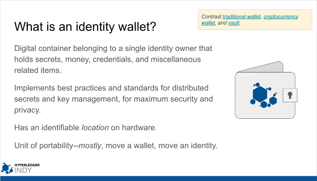

# Write a DID and Query Its Verkey

Indy-SDK Developer Walkthrough #1, Java Edition

[ [Python](../python/README.md) | [.NET](../dotnet/README.md) | [Node.js](../node/README.md) | [Objective C](../objectivec/README.md) ]

## Prerequisites

Setup your workstation with an indy development virtual machine (VM). See [prerequisites](../../prerequisites).

## Steps

### Step 1

In your normal workstation operating system (not the VM), open a java editor of your
choice and paste the code from [template.java](template.java)
into a new doc. We will be modifying this code in later steps.

Save the doc as `WriteDIDAndQueryVerkey.java`

This is a very simple app framework into which you'll plug the code
you'll be writing.

### Step 2

Now we need to give the SDK some context that it will need
to deal with an indy ledger. This requires us to point the SDK at some
*genesis transactions* that tell the SDK how to contact the ledger on
the network, and how to trust that the nodes it contacts possess
appropriate keys.

We also need to create an *[identity wallet](https://docs.google.com/presentation/d/1X6F9QVG8M4PqQQLLL_5I6aQ5z7CCpYyYHBNKYMlsqXc/edit#slide=id.g32295399e3_0_73)*, so the SDK can store the DID and key
material generated during the tutorial.

Copy the contents of [step2.java](step2.java) into
`WriteDIDAndQueryVerkey.java` on top of the `Step 2 code goes here` placeholder comment.

Save the updated version of `WriteDIDAndQueryVerkey.java`.

Study the changes. Scaffolding code like this is likely to appear in anything
that uses indy.

### Step 3

Now we need to put some DIDs and keys in our identity
wallet. Copy the contents of [step3.java](step3.java) into
`WriteDIDAndQueryVerkey.java` on top of the `Step 3 code goes here` placeholder comment.

Save the updated version of `WriteDIDAndQueryVerkey.java`.

Study the changes.

A few operations in indy [can only be done by identities (DIDs) with
special roles](https://docs.google.com/spreadsheets/d/1TWXF7NtBjSOaUIBeIH77SyZnawfo91cJ_ns4TR-wsq4/edit?usp=sharing). For example, an DID that is a *steward* can add a node (the one
they own) to the validator pool, and can create DIDs with a *trust anchor*
role. A trust anchor DID can add arbitrary DIDs to the ledger.

Here, we are populating our identity wallet with DID+keypair material for
one steward identity and one trust anchor identity. The steward identity is
a bootstrapping step, whereas the trust anchor DID is the one we will query
later.

Notice that the steward DID is created with a seed, but the trust anchor DID is not.
This is because the steward DID and its verkey are already in the ledger;
they were part of the genesis transactions we told the SDK to start with
in the previous step. But we have to also put the DID, verkey, and *private*
signing key (which the ledger doesn't know) into our wallet, so we can use
the signing key to submit an acceptably signed transaction to the ledger.
We will use this steward's signing key to create our *next* DID--the
one for our trust anchor, which is truly new. This is why we use a hard-coded seed
when creating the steward DID--it guarantees that the same DID and key
material are created that the genesis transactions expect. In a production indy pool
such as the Sovrin "live" network, the bootstrapping steward identities
would not have known the seeds.

## Step 4

Now that preparations are complete, we can finally write the DID and verkey
for our trust anchor identity to the ledger.

Copy the contents of [step4.java](step4.java) into
`WriteDIDAndQueryVerkey.java` on top of the `Step 4 code goes here` placeholder comment.

Save the updated version of `WriteDIDAndQueryVerkey.java`.

## Step 5

Once we have an identity on the ledger, we can query it.

Copy the contents of [step5.java](step5.java) into
`WriteDIDAndQueryVerkey.java` on top of the `Step 5 code goes here` placeholder comment.

Save the updated version of `WriteDIDAndQueryVerkey.java`.

Only a handful of lines of code matter to our goal here; the rest of
this block is comments and boilerplate cleanup **(which you should not omit!)**.
You should see similarities between the way this query "transaction" and
the preceding write transaction are bundled and sent.

## Step 6

Run the completed demo and observe the whole sequence.

## More experiments

Most of the code in this how-to exists to satisfy some preconditions.
Now that you have a trust anchor identity, you can write or query
any number of additional identities to the ledger, with just a handful of
lines of code. Try creating some.

You might try the ["Rotate a Key"](../../rotate-key/java/README.md)
how-to, which can be done in only once step one you complete this one.

You could also try to create a new steward identity without a seed, or
with a different seed, and see what kind of error you get. Only identities
with a trustee role can create stewards.
