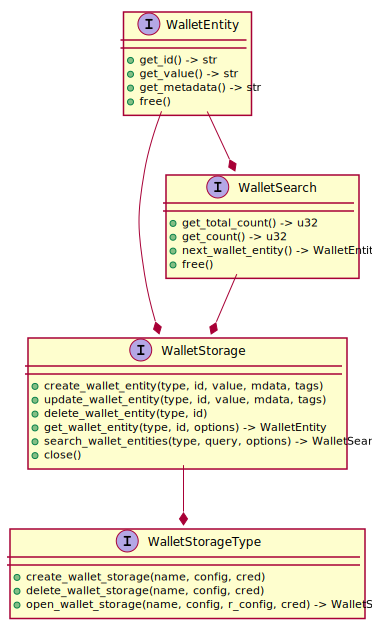

# Wallet Storage Design

In current state libindy allows to plug different wallet implementations. Plugged wallet now handles both security
and storage layers. This design proposes to restrict our plugged interface by handling only storage layer.
All encryption will be performed in libindy. It will simplify plugged wallets and warranty good security level
for 3d party wallets implementations.

Also proposals enhances our API for efficient and flexible search with paging support.

## Goals and ideas

* Simplify plugged wallets and warranty security level for 3d party wallets implementation
* Perform all encryption on libindy level:
  * Entity ids will be always encrypted
  * Entity values will be always encrypted
  * Entity metadata will be always encrypted
  * Tag names will be always encrypted
  * Tag values will be **optionally** encrypted. If user wants to perform some complex searches it can be possible
    to include some additional un-encrypted tags
* Allow plugging of different storages
* Allow efficient and flexible search for entities
* Allow pagination
* Native OpenSSL style object-oriented C interface
* Try to avoid unnecessary json and re-allocation

## Interface Entities



## C Interface

To plug wallet storage user should implement and register the following C callbacks:

### Wallet Storage Type API

```Rust
/// Create the wallet storage (For example, database creation)
///
/// name: wallet storage name (the same as wallet name)
/// config: wallet storage config (For example, database config)
/// credentials: wallet storage credentials (For example, database credentials)
extern fn create_wallet_storage(name: *const c_char,
                                config: *const c_char,
                                credentials: *const c_char) -> ErrorCode
```

```Rust
/// Delete the wallet storage (For example, database deletion)
///
/// name: wallet storage name (the same as wallet name)
/// config: wallet storage config (For example, database config)
/// credentials: wallet storage credentials (For example, database credentials)
extern fn delete_wallet_storage(name: *const c_char,
                                config: *const c_char,
                                credentials: *const c_char) -> ErrorCode
```

```Rust
/// Open the wallet storage (For example, opening database connection)
///
/// name: wallet storage name (the same as wallet name)
/// config: wallet storage config (For example, database config)
/// runtime_config: wallet storage runtime config (For example, connection config)
/// credentials: wallet storage credentials (For example, database credentials)
/// storage_handle_p: pointer to store opened storage handle
extern fn open_wallet_storage(name: *const c_char,
                              config: *const c_char,
                              runtime_config: *const c_char,
                              credentials: *const c_char,
                              storage_handle_p: *mut u32) -> ErrorCode
```

### Wallet Storage API

```Rust
/// Create a new entity in the wallet storage
///
/// storage_handle: opened storage handle (See open_wallet_storage)
/// type_: allows to separate different entity types collections
/// id: the id of entity
/// value: the value of entity
/// metadata: (optional) the entity metadata
/// tags: (optional) the entity tags used for search as json:
///  {
///    "tagName1": "tag value 1", // string value
///    "tagName2": 123, // numeric value
///  }
extern fn wallet_storage_create_wallet_entity(storage_handle: u32,
                                              type_: *const c_char,
                                              id: *const c_char,
                                              value: *const c_char,
                                              metadata: *const c_char,
                                              tags: *const c_char) -> ErrorCode
```

```Rust
/// Update an existing entity in the wallet storage
///
/// storage_handle: opened storage handle (See open_wallet_storage)
/// type_: allows to separate different entity types collections
/// id: the id of entity
/// value: (optional) the new value of entity
/// metadata: (optional) the new entity metadata
/// tags: (optional) the new entity tags (see wallet_storage_create_wallet_entity)
extern fn wallet_storage_update_wallet_entity(storage_handle: u32,
                                              type_: *const c_char,
                                              id: *const c_char,
                                              value: *const c_char,
                                              metadata: *const c_char,
                                              tags: *const c_char) -> ErrorCode
```

```Rust
/// Delete an existing entity in the wallet storage
///
/// storage_handle: opened storage handle (See open_wallet_storage)
/// type_: allows to separate different entity types collections
/// id: the id of entity
extern fn wallet_storage_delete_wallet_entity(storage_handle: u32,
                                              type_: *const c_char,
                                              id: *const c_char) -> ErrorCode
```

```Rust
/// Get an wallet entity by id
///
/// storage_handle: opened storage handle (See open_wallet_storage)
/// type_: allows to separate different entity types collections
/// id: the id of entity
/// options_json: //TODO: FIXME: Think about replacing by bitmaks
///  {
///    retrieveValue: (optional, true by default) Retrieve entity value,
///    retrieveMetadata: (optional, true by default) Retrieve entity metadata
///  }
/// entity_handle_p: pointer to store retrieved entity handle
extern fn wallet_storage_get_wallet_entity(storage_handle: u32,
                                           type_: *const c_char,
                                           id: *const c_char,
                                           options_json: *const c_char,
                                           entity_handle_p: *mut u32) -> ErrorCode
```

```Rust
/// Search for wallet entities
///
/// storage_handle: opened storage handle (See open_wallet_storage)
/// type_: allows to separate different entity types collections
/// id: the id of entity
/// query_json: MongoDB style query to wallet entity tags:
///  {
///    "tagName": "tagValue",
///    $or: {
///      "tagName2": { $regex: 'pattern' },
///      "tagName3": { $gte: 123 },
///    },
///  }
/// options_json: //TODO: FIXME: Think about replacing by bitmaks
///  {
///    skip: (optional, 0 by default) Skip first "skip" wallet entities,
///    limit: (optional, 100 by default) limit amount of entities to retrieve,
///    retrieveEntities: (optional, true by default) If false only "counts" will be calculated,
///    retrieveValue: (optional, true by default) Retrieve entity value,
///    retrieveMetadata: (optional, true by default) Retrieve entity metadata,
///  }
/// search_handle_p: pointer to store wallet search handle
extern fn wallet_storage_search_entities(storage_handle: u32,
                                         type_: *const c_char,
                                         query_json: *const c_char,
                                         options_json: *const c_char,
                                         search_handle_p: *mut u32) -> ErrorCode
```

```Rust
/// Close the wallet storage (For example, closing database connection)
///
/// storage_handle: opened storage handle (See open_wallet_storage)
extern fn wallet_storage_close(storage_handle: u32) -> ErrorCode
```

### Wallet Search API

```Rust
/// Get total count of entities that corresponds to wallet search query
///
/// storage_handle: opened storage handle (See open_wallet_storage)
/// search_handle: wallet search handle (See wallet_storage_search_entities)
wallet_search_get_total_count(storage_handle: u32,
                              search_handle: u32) -> u32
```

```Rust
/// Get count of entities that were actually retrieved
///
/// storage_handle: opened storage handle (See open_wallet_storage)
/// search_handle: wallet search handle (See wallet_storage_search_entities)
wallet_search_get_count(storage_handle: u32,
                              search_handle: u32) -> u32
```

```Rust
/// Get the next wallet entity handle retrieved by this wallet search.
/// If no more entities -1 will be returned.
///
/// storage_handle: opened storage handle (See open_wallet_storage)
/// search_handle: wallet search handle (See wallet_storage_search_entities)
wallet_search_next_wallet_entity(storage_handle: u32,
                                 search_handle: u32) -> u32
```

```Rust
/// Free wallet search (make search handle invalid)
///
/// storage_handle: opened storage handle (See open_wallet_storage)
/// search_handle: wallet search handle (See wallet_storage_search_entities)
wallet_search_free(storage_handle: u32,
                   search_handle: u32) -> ErrorCode
```

### Wallet Entity API

```Rust
/// Get an id for retrieved wallet entity
///
/// storage_handle: opened storage handle (See open_wallet_storage)
/// entity_handle: retrieved entity handle (See wallet_storage_get_wallet_entity)
wallet_entity_get_id(storage_handle: u32,
                     entity_handle: u32) -> *const c_char
```

```Rust
/// Get an value for retrieved wallet entity
///
/// storage_handle: opened storage handle (See open_wallet_storage)
/// entity_handle: retrieved entity handle (See wallet_storage_get_wallet_entity)
wallet_entity_get_value(storage_handle: u32,
                        entity_handle: u32) -> *const c_char
```

```Rust
/// Get an metadata for retrieved wallet entity
///
/// storage_handle: opened storage handle (See open_wallet_storage)
/// entity_handle: retrieved entity handle (See wallet_storage_get_wallet_entity)
wallet_entity_get_metadata(storage_handle: u32,
                           entity_handle: u32) -> *const c_char
```

```Rust
/// Free retrieved wallet entity (make retrieved entity handle invalid)
///
/// storage_handle: opened storage handle (See open_wallet_storage)
/// entity_handle: retrieved entity handle (See wallet_storage_get_wallet_entity)
wallet_entity_free(storage_handle: u32,
                   entity_handle: u32) -> ErrorCode
```
