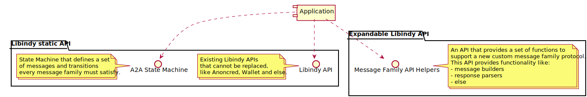
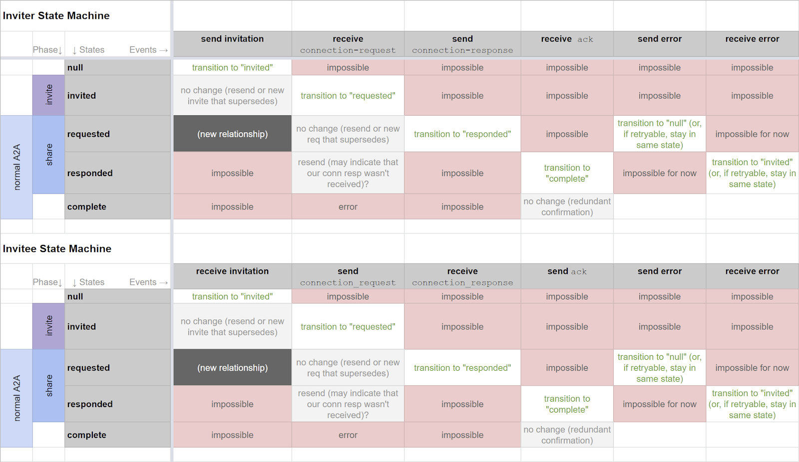
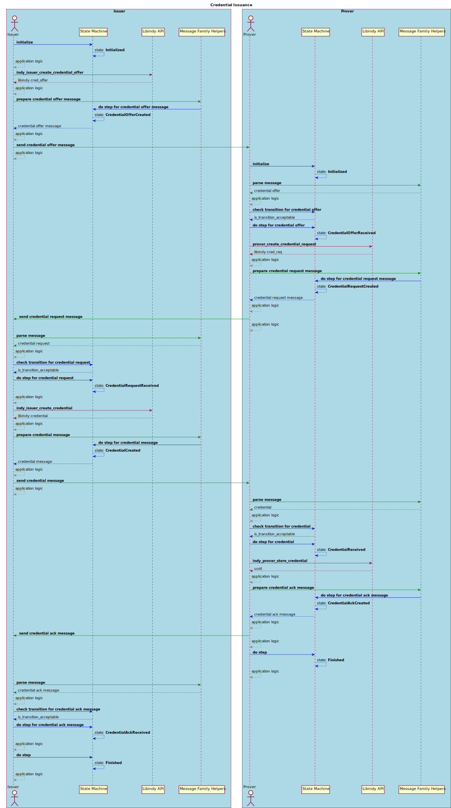
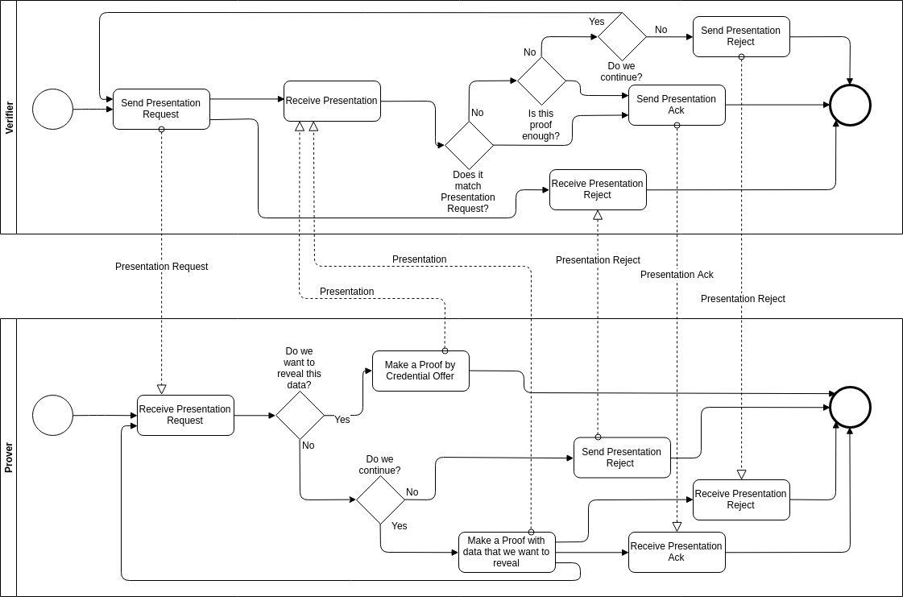
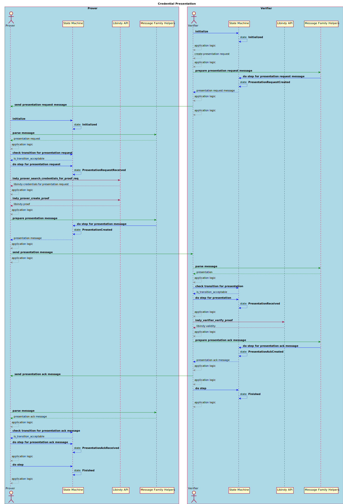

# A2A part of IndySDK 2.0

Author: Sergey Minaev, Matt Raffel, Artem Ivanov

## Table of contents

* [Motivation](#motivation)
* [Goals](#goals-and-ideas)
* [Overview](#overview)
* [Discussion points](#discussion-points)
* [Challenges](#challenges)
* [IndySDK 2.0 structure](#indySDK-2-0-structure)
* [Message Families & Messages](#message-families-&-messages)
    * [Connection](#connection)
    * [Credential Issuance](#credential-issuance)
    * [Credential Presentation](#credential-presentation)
* [API proposal](#api-proposal)
    * [Namespaces](#namespaces)
    * [Connection](#api-connection)
    * [Credential Issuance](#api-credential-issuance)
    * [Credential Presentation](#api-credential-presentation)
* [Additional References](#additional-references)

## Motivation
[See](https://docs.google.com/document/d/1TTwGUtZ3vMvi8dXGB5lprxVvt6Da2___QuqCiyntdXs)

## Goals and ideas

New API of IndySDK should provide functionality for A2A communication but should not make assumptions about app business logic, transport, storage, etc.

* Allow extending LibIndy to support new protocol message families and modifying the implementation.
* Simplify process of making new message family definitions available in the common Indy ecosystem.
* Simplify the process of support new agents.
* Define default protocol message families. 
* Define State Machine that developer have to follow to support new protocol message families.
* Define the way LibIndy can consume new API functions.
* Define the flow of communication Libindy static API, custom Libindy API helpers and an application.

## Overview
The main idea of new functionality of IndySDK is replace part of VCX library. 
As for now VCX provide powerful mechanisms for handling Credential Issuance and Exchange flow, 
but this library hardcode some FSM state transitions, transport flow, etc. New item should provide 
similar functionality but give the application some flexibility.
Internal states for particular message family should be more generic and must be aligned for the family definition. 
The library should not perform any automatic transitions between states. Instead of that it should allows
 application to perform validation of incoming message, check is it applicable to current state of the family flow. 
 Actual transition between states should be performed by explicit call from application side.

Current VCX will be moved out from HL/indy-sdk repo to Evernym or SF repo and most probably will have the same 
API as for now.


## Discussion points

* How to allow (for external developer) to extend the set of supported message families:
    * Proved some template files inside monolith library to copy paste, implement new message family and include to custom build.
* What is the right place for new functionality: 
    * Lbindy - suggested for start. It will simplify CI/CD flow significantly.
        Message families may be implemented under cargo features so it will be possible to configure set of API for particular application.
    * separate library
    * something else
* What is the right place for wrappers.
* What should the API does:
    * Should it include the ability to send reply messages?
        * There are three possible approaches for Transport:
            * Application calls framework specific functions.
            * Pluggable functions defined as a part of Libindy Helpers API.
            * Callbacks passed to `do step` state machine function and automatically called.
    * Provide a default transport by providing a restful service handler?
    * Should indy sdk manage A2A state? And Is state management something indy-sdk can really handle?
        * New API should cover base states, described in appropriate standards/HIPEs
* Naming of functions for particular message family helpers.
* Ways the SDK can help agents with messages: creation, validation, and processing (processing where appropriate, not all cases).


## Challenges

Agent-2-Agent communications is highly unstable at this time as most of the HIPEs are still in development.


## IndySDK 2.0 structure

* Libindy
    * Core namespace - current functionality
    * A2A messages: state machines and helpers
        * Connection message family
            * State machine validator
            * Message helpers (builders,parsers)
        * Credential Issuance message family
            * State machine validator
            * Message helpers (builders,parsers)
        * Credential Presentation message family
            * State machine validator
            * Message helpers (builders,parsers)
        * ....
        * Template message family
            * set of .rs files, excluded from cargo project
            * Guideline how to implement one more msg family
* VCX will be renamed and moved out from HL/indy-sdk
* Wrappers
* CLI

The proposal is to have set of helpers inside libindy to assists application (or agent framework). 
This scope will include states of flow for particular Message Family. 
API will allow to check is it possible to move forward from the flow point of view.
libindy will contain basic message families that will be used by the majority of agents.



## Message Families & Messages

### Connection

#### Message Family

The Connection Message Family consists of the following messages:

* Connection Invite - https://github.com/hyperledger/indy-hipe/pull/54
* Connection Request
* Connection Response
* Basic Message - https://github.com/hyperledger/indy-hipe/tree/master/text/0033-basic-message
* State
* State Request
* Trust Ping - https://github.com/hyperledger/indy-hipe/tree/master/text/0032-trust-ping
* (TBD) Ephemeral Challenge - https://github.com/hyperledger/indy-hipe/pull/95
* (TBD) Oauth ephemeral - https://github.com/hyperledger/indy-hipe/pull/96

##### Connection Invite
TBD

##### Connection Request
TBD

##### Connection Response
TBD

##### Basic Message
TBD

##### State
TBD

##### State Request
TBD

##### Trust Ping
TBD

##### Ephemeral Challenge

TBD

##### Oauth ephemeral

TBD

#### State Machine

Agents need to manage state.  
Especially between connection invites since connection invites is a multi-step process.   



TBD

#### Workflow

TBD

### Credential Issuance

#### Message Family

The Credential Issuance Message Family consists of the following messages:

* Credential Offer
* Credential Request
* Credential Reject
* Credential
* Credential Ack

##### Credential Offer
This message is sent by Issuer to Prover to initiate credential issuance process. 
Schema:
```json
{
    "@type": "did:sov:BzCbsNYhMrjHiqZDTUASHg;spec/credential-issuance/1.0/credential-offer",
    "@id": "<uuid-offer>",
    "cred_def_id": "KTwaKJkvyjKKf55uc6U8ZB:3:CL:59:tag1",
    "comment": "some comment",
    "~attach": [
        {
            "nickname": "libindy-cred-offer",
            "mime-type": "application/json",
            "content": {
                "base64": "<bytes for base64>"
            }
        },
        {
            "nickname": "credential-preview",
            "mime-type": "application/json",
            "content": {
                "base64": "<bytes for base64>"
            }
        }
    ]
}
```

Description of fields:
* `comment` - a field that provide some human readable information about this Credential Offer.
* `cred_def_id` - id cof credential definition for offered credential
* attachment `libindy-cred-offer` - libindy generated data about credential offer
* attachment `credential-preview` - preview of credential.

##### Credential Request
This message is sent in response to Credential Offer by Prover to give needed details for credential issuance.
Schema:
```json
{
    "@type": "did:sov:BzCbsNYhMrjHiqZDTUASHg;spec/credential-issuance/1.0/credential-request",
    "@id": "<uuid-request>",
    "cred_def_id": "2hoqvcwupRTUNkXn6ArYzs:3:CL:1766",
    "comment": "some comment",
    "~attach": [
        {
            "nickname": "libindy-cred-req",
            "mime-type": "application/json",
            "content": {
                "base64": "<bytes for base64>"
            }
        },
        {
            "nickname": "credential-preview",
            "mime-type": "application/json",
            "content": {
                "base64": "<bytes for base64>"
            }
        }
    ]
}
```

Description of Fields:
* `cred_def_id` - Credential Definition ID for requested credential
* `comment` - a field that provide some human readable information about this Credential Offer.
* attachment `libindy-cred-req` - libindy generated data that is needed to Issuer to issue a credential.
* attachment `credential-preview` - optional attachment with preview of credential that Prover wants to get.

##### Credential
This message contains the credential and sent in responce to Credential Request by Issuer. 
Schema:
```json
{
    "@type": "did:sov:BzCbsNYhMrjHiqZDTUASHg;spec/credential-issuance/1.0/credential",
    "@id": "<uuid-credential>",
    "rev_reg_def_id": "<rev_reg_def_id>",
    "cred_def_id": "2hoqvcwupRTUNkXn6ArYzs:3:CL:1766",
    "~attach": [
        {
            "nickname": "libindy-cred",
            "mime-type": "application/json",
            "content": {
                "base64": "<bytes for base64>"  
            }
        }
    ]
}
```

Description of fields:

* `rev_reg_def_id` - ID of Revocation Registry Definition this credential were issued to
* `cred_def_id` - ID of Credential Definition this credential were issued to
* attachment `libindy-cred` - an actual credential to store, it is a json encoded in base64

##### Credential Reject
This message can be sent by any side of the conversation to finish credential issuance process without any credential created. 
Schema:
```json
{
    "@type": "did:sov:BzCbsNYhMrjHiqZDTUASHg;spec/credential-issuance/1.0/reject",
    "@id": "id"
}
```

##### Credential Ack
This message is sent by Prover as he confirms that he had received the credential and everything is correct. 
Schema:
```json
{
    "@type": "did:sov:BzCbsNYhMrjHiqZDTUASHg;spec/credential-issuance/1.0/ack",
    "@id": "id"
}
```

#### State Machine

The Credential Issuance State Machine consists of the following states:

* Initialized
* Issuer related states:
    * CredentialOfferCreated
    * CredentialRequestReceived
    * CredentialCreated
    * CredentialAckReceived
* Prover related states:
    * CredentialOfferReceived
    * CredentialRequestCreated
    * CredentialReceived
    * CredentialAckCreated
* CredentialRejectCreated
* CredentialRejectReceived
* Finished

##### Initialized
Common state for both parties. Indicates initiation of issuance process.
Transitions:
* Issuer
    * CredentialOfferCreated - issuer acts as an initiator.
    * CredentialRequestReceived - prover already prepared credential request and sent to issuer (prover acts as an initiator). 
* Prover
    * CredentialOfferReceived - prover received Credential Offer message from issuer.
    * CredentialRequestCreated - prover already has data for request creation and acts as an initiator.

##### CredentialOfferCreated
Issuer specific state that means that Credential Offer message has been created and sent to Prover.
Transitions:
* CredentialRequestReceived - prover replied with Credential Request message.
* CredentialRejectReceived - prover replied woth Credential Reject message.
    
##### CredentialRequestReceived
Issuer specific state that means that Prover replied with Credential Request message on offer.
Transitions:
* CredentialCreated - credential created and sent to prover
* CredentialRejectCreated - issuer interrupted credential issuance process for some reason.

##### CredentialCreated
Issuer specific state that means that Credential message has been created and sent to Prover.
Transitions:
* CredentialAckReceived - prover accepted credential and replied with Credential Ack message.
* CredentialRejectReceived - prover rejected credential for some reason.
    
##### CredentialAckReceived
Issuer specific state that means that Prover replied with Credential Ack message on credential.
Transitions:
* Finished - credential issuance process is completed.

##### CredentialOfferReceived
Prover specific state that means that Credential Offer message has been received from Issuer.
Transitions:
* CredentialRequestCreated - prover accepted offer and replied with Credential Request message.
* CredentialRejectCreated - prover rejected credential offer for some reason.

##### CredentialRequestCreated
Prover specific state that means that Credential Offer message has been accepted and 
Credential Request message created and sent to Issuer.
Transitions:
* CredentialReceived - credential message received from Issuer.
* CredentialRejectReceived - issuer interrupted issuance process for some reason.

##### CredentialReceived
Prover specific state that means that Credential message has been received from Issuer.
Transitions:
* CredentialAckCreated - prover accepted credential and replied with Credential Ack message.
* CredentialRejectCreated - prover rejected credential and interrupted issuance process for some reason.

##### CredentialAckCreated
Prover specific state that means that Credential Ack message created and sent to Issuer.
Transitions:
* Finished - credential issuance process is completed.

##### CredentialRejectCreated
Common state for both parties. Indicates interruption of issuance process.
Transitions:
* Finished - credential issuance process is interrupted.

##### CredentialRejectReceived
Common state for both parties. Indicates interruption of issuance process by opposite side.
Transitions:
* Finished - credential issuance process is interrupted.

#### Choreography Diagram


#### Workflow

The Credential Issuance positive workflow is demonstrated on the following diagram:



### Credential Presentation

#### Message Family

The Credential Presentation Message Family consists of the following messages:

* Presentation Request
* Presentation
* Presentation Ack
* Presentation Reject

##### Presentation Request
Presentation Request is a message from Verifier to Prover that describes values that 
need to be revealed and predicates that need to be fulfilled. 
Schema:
```json
{
    "@type": "did:sov:BzCbsNYhMrjHiqZDTUASHg;spec/credential-presentation/1.0/presentation-request",
    "@id": "<uuid-request>",
    "comment": "some comment",
    "~attach": [
        {
            "nickname": "libindy-presentation-request",
            "mime-type": "application/json",
            "content":  {
                "base64": "<bytes for base64>"
            }
        }
    ]
}
```

Description of fields:

* `comment` -- a field that provide some human readable information about this Credential Offer.
* attachment `libindy-proof-request` -- base64-encoded data needed for libindy to process proof request.

##### Presentation
This message is a response to a Presentation Request message and contains signed presentations. 
Schema:
```json
{
    "@type": "did:sov:BzCbsNYhMrjHiqZDTUASHg;spec/credential-presentation/1.0/presentation",
    "@id": "<uuid-presentation>",
    "comment": "some comment",
    "~attach": [
        {
            "nickname": "libindy-presentation",
            "mime-type": "application/json",
            "content": {
                "base64": "<bytes for base64>"
            }
        },
        {
            "nickname": "presentation-request-preview",
            "mime-type": "application/json",
            "content": {
                "base64": "<bytes for base64>"
            }
        }
    ]
}
```

Decription of fields:

* `comment` -- a field that provide some human readable information about this Credential Offer.
* attachment `libindy-presentation` -- actual presentation for presentation request, represented by base64-encoded json.
* attachment `presentation-request-preview` -- preview of presentation request that prover is willing to fullfil. Used for negotiation purposes.

##### Presentation Reject
This message can be sent by any side of the conversation to finish credential presentation process without any proof provided. 
Schema:
```json
{
    "@type": "did:sov:BzCbsNYhMrjHiqZDTUASHg;spec/credential-presentation/1.0/reject",
    "@id": "id"
}
```

##### Presentation Ack
This message is sent by Verifier as he confirms that he had received the proof and validated it. 
Schema:
```json
{
    "@type": "did:sov:BzCbsNYhMrjHiqZDTUASHg;spec/credential-presentation/1.0/ack",
    "@id": "id"
}
```

#### State Machine

The Credential Presentation State Machine consists of the following states:

* Initialized
* Verifier related states:
    * PresentationRequestCreated
    * PresentationReceived
    * PresentationAckCreated
* Prover related states:
    * PresentationRequestReceived
    * PresentationCreated
    * PresentationAckReceived
* PresentationRejectCreated
* PresentationRejectReceived
* Finished

##### Initialized
Common state for both parties. Indicates initiation of presentation process.
Transitions:
* Verifier
    * PresentationRequestCreated - Presentation Request message sent to prover.
* Prover
    * PresentationRequestReceived - Presentation Request message received from verifier.

##### PresentationRequestCreated
Verifier specific state that means that Presentation Request message has been created and sent to Prover.
Transitions:
* PresentationReceived - prover accepted request and replied with Presentation message.
* PresentationRejectReceived - prover rejected request and replied with Presentation Reject message.
    
##### PresentationReceived
Verifier specific state that means that Prover accepted presentation request and replied with Presentation message.
Transitions:
* PresentationAckCreated - verifier accepted presentation and replied with Presentation Ack message.
* PresentationRejectCreated - verifier rejected presentation and replied with Presentation Reject message.
    
##### PresentationAckCreated
Verifier specific state that means that presentation has been accepted and Presentation Ack sent to Prover.
Transitions:
* Finished - credential presentation process is completed.

##### PresentationRequestReceived
Prover specific state that means that Presentation Request message has been received from Verifier.
Transitions:
* PresentationCreated - prover accepted presentation request, created a proof and replied with Presentation message.
* PresentationRejectCreated - prover rejected presentation request for some reason.

##### PresentationCreated
Prover specific state that means that Presentation message has been sent to Verifier.
Transitions:
* PresentationAckReceived - prover accepted presentation and replied with Presentation Ack message.
* PresentationRejectReceived -  prover rejected presentation and interrupted process for some reason.

##### PresentationAckReceived
Prover specific state that means that Presentation has been accepted and Presentation Ack message received from Verifier.
Transitions:
* Finished - credential presentation process is completed.

##### PresentationRejectCreated
Common state for both parties. Indicates interruption of presentation process.
Transitions:
* Finished - presentation process is interrupted.

##### PresentationRejectReceived
Common state for both parties. Indicates interruption of presentation process by opposite side.
Transitions:
* Finished - presentation process is interrupted.

#### Choreography Diagram



#### Workflow

The Credential Presentation positive workflow is demonstrated on the following diagram:



## API proposal

### Namespaces

All A2A functions will be in a namespace, to facilitate clear communication of what the functions do.

Namespaces include:
* Agent infrastructure
* DIDCom: basic message, connection, trust ping
* Agent credential exchange

Agent wallet messaging (synchronization, backup)

Next will be shown two variants of function name for each message:
* name across the C-API
* name in Rust

### Connection

#### Connection Invite

Given the inputs (TBD), returns a ConnectionInvite message.  
Optional: returns message in raw text rather than packed.

* C: `indy::didcomm::connection_create_invite`
* Rust: `indy_didcomm_connection_create_invite`

#### Connection Invite Reply

Given the inputs (ConnectionInvite message), returns a ConnectionResponse message.

* C: `indy::didcom::connection_create_invite_reply`
* RUST: `indy_didcom_connection_create_invite_reply`

#### Basic Message

Given the inputs (TBD) returns a BasicMessage.  The return will not be packed.

* C: `indy::didcom::basic_message_create_message`
* RUST: `indy_didcom_basic_message_create_message`

#### States management and sharing ???

Given the inputs (TBD), returns State message.  
Optional: returns message in raw text rather than packed.

* C: `indy::agent_infrastructure::get_state`
* RUST: `indy_agent_infrastructure_get_state`

Given the inputs (state message), returns state value.

* C: `indy::agent_infrastructure::read_state`
* RUST: `indy_agent_infrastructure_read_state`

#### Trust Ping

Given the inputs (TBD), returns State message. 
Optional: returns message in raw text rather than packed.

* C: `indy::agent_infrastructure::create_trustping`
* RUST: `indy_agent_infrastructure_create_trustping`

#### Trust Ping Reply

Given the inputs (TrustPing), returns TrustPing reply message.  Optional: returns message in raw text rather than packed.

* C: `indy::agent_infrastructure::create_trustping_reply`
* RUST: `indy_agent_infrastructure_create_trustping_reply`

#### Feature Discovery

See https://github.com/hyperledger/indy-hipe/pull/73

* C:`indy::agent_infrastructure::create_feature_discovery`
* RUST: `indy_agent_infrastructure_create_feature_discovery`

TBD

### Credential Issuance

TBD

### CredentialPresentation

TBD

## Additional References

* [Needs](https://docs.google.com/document/d/1TTwGUtZ3vMvi8dXGB5lprxVvt6Da2___QuqCiyntdXs)
* [A2A Protocol Implementation](https://docs.google.com/document/d/1mW25BfZF9CGmPUoB9MlujmT9u5Ip7tZ4IzAV_QTVdCM)
* [The connection protocol](https://github.com/hyperledger/indy-hipe/pull/54)
* [Relationship State](https://github.com/hyperledger/indy-hipe/pull/31)
* [Agent Mesage Structure](https://github.com/hyperledger/indy-hipe/tree/master/text/0017-agent-message-structure)
* [Basic Message Structure](https://github.com/hyperledger/indy-hipe/pull/81)
* [Raw file formats](https://github.com/hyperledger/indy-hipe/tree/master/text/0026-agent-file-format)