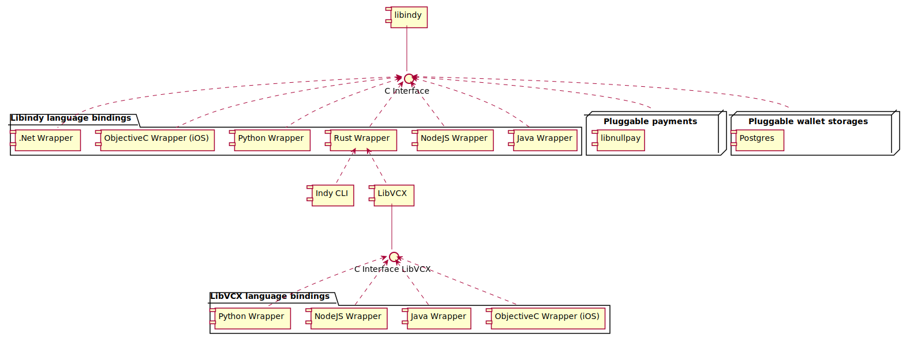

# Language Bindings in SDK

Libindy has these wrappers:
* Python -- Docs -- Sources
* Java -- Docs -- Sources
* Rust -- Docs -- Sources
* iOS -- Docs -- Sources
* NodeJS -- Sources
* .NET (not supported right now)

