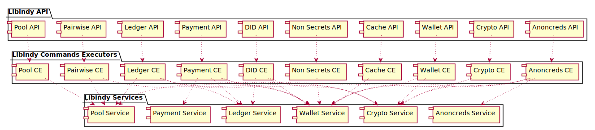

There are 3 layers in libindy code organization:
* [API layer](#api-layer)
* [Commands Executors layer](#commands-executors-layer)
* [Services layer](#services-layer)

Each of them contains multiply modules devoted to particular part of the flow, like "wallet", "pool", "crypto", etc.

API layer is the smallest one and contains minimal logic. Commands Executors layer splits complex commands to atomic actions.
Services are isolated and process atomic operations without "vertical" dependencies between them. 

## Layers purposes

### API layer

* Library interface layer
* Basic validation
* Conversion of C types to Rust types
* JSONs conversion to [Domain](#domain) types and basic validation
* Propagation of execution to commands layer

### Commands Executors layer

* Splitting complex commands to atomic operations
* Working threads management
    * "main" thread of libindy is hosted by Root Command Executor. Majorty of libindy logic is run in this thread.
    * [Threads Pool](#pool-thread) is managed by this layer as well. These threads are used for CPU-heavy operations.
* Propagation of atomic operations execution to service layer
* Joining atomic operations results to complex result
* Execution of user defined callbacks

### Services layer

* Services provide isolation in codebase
* Implements operations business logic and extended validation
* Management of sockets polling threads for network IO

## Layers interaction

### API -> API
There is no dependencies or calls between different API modules.

### API -> Commands Executor
Root Commands Executor contains "main" thread of the library. It accepts Commands from API via standard Rust mechanism `std::sync::mpsc::channel`.
A command contains user callback wrapped to Rust closure. It will be called with a result of the processing.
Incoming commands are queued by `Reciver` in this channel synchronization.

### Command Executor X -> Command Executor Y
Commands Executors can communicate to each other using various Commands. These commands will be put into the same queue as incoming from API.

### Command Executor -> Services
Command Executor has access to all services required for the flow.
It calls public function of the services, gather partial results from them and aggregate the final result.
The final result is returned to the user via appropriate closure.
Sometime service may have async API.
In this case Command Executor stores the closure and wait "Ack" command from the service.

### Service -> Command Executor
In majority of cases services return result as the output of public functions from it.
For async responses "Ack" commands are used.

### Service -> Service
Services are completely isolated against each other, so no direct interaction between them is allowed. 

## Miscellaneous 

### Threads Pool
It is used by Command Executors for CPU-heavy operations. The Command Executor prepare isolated data to be computed and pass a closure to pool thread.
At the end of computation the closure generates "Ack" command with a result.
While execution this closure Command Executors thread are free to process other commands.

### Domain
A set of structures definitions used while parsing incoming JSON from API of the library.

### Secure Enclave
Secrets from libindy wallet are never escape from it.
Private keys are available only at wallet service and for Command Executors which are consuming wallet service directly.
Anoncreds and Crypto services consume some secrets as input for their API.
As a result no secrets are available above Commands Executor layer.
