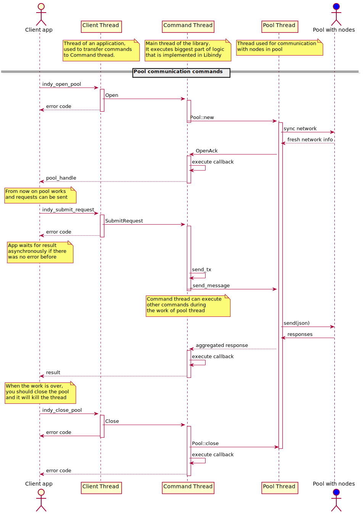

# Threading model

Libindy uses four threads during its lifecycle -- client thread, command thread, pool thread and thread for expensive operations. Beneath you can see diagrams with explanation of these threads' work.

