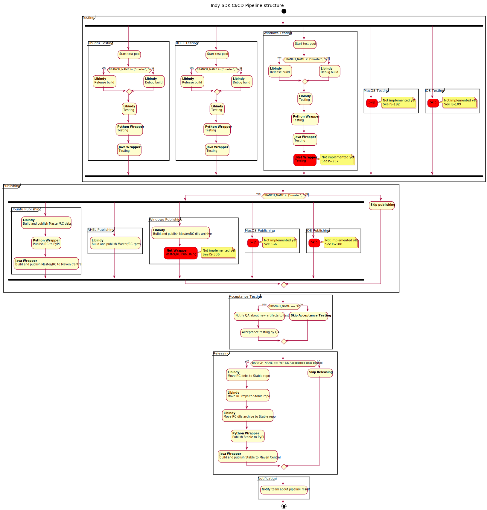

# Release process

## Indy SDK components
Indy SDK contains the following components managed as dedicated packages:
* Libindy
* Wrappers for programming languages:
  * Python
  * Java
  * ObjectiveC (iOS)
  * .Net
* Indy CLI

## Release artifacts
Indy SDK release process produces the following artifacts for components:
* Libindy
  * Ubuntu deb package. Available in https://repo.sovrin.org/sdk/lib/apt/xenial/{master|stable|rc}/libindy_{version}.deb
  * Windows binaries as zip-archive with dependencies. Available in https://repo.sovrin.org/windows/libindy/{master,stable,rc}/{version}/libindy_{version}.zip
  * iOS Cocoapods package. Available in https://repo.sovrin.org/ios/libindy/{master|stable}/libindy-core/{version}/libindy.tar.gz. No support in CD pipeline now, but we perform manual builds periodically.
  * MacOS binaries planned, but no support in CD pipeline now.
  * RHEL binaries planned, but no support in CD pipeline now.
* Wrappers for programming languages:
  * Python wrapper PyPy package. Available in PyPi as python3-indy package.
  * Java wrapper maven package. Available as org.hyperledger/indy package in https://repo.sovrin.org/repository/maven-public maven repo.
  * ObjectiveC (iOS) Cocoapods package. Available in https://repo.sovrin.org/ios/libindy/{master|stable}/libindy-objc/{version}/libindy-objc.tar.gz.
  * .Net. Packages planned, but no support in CD pipeline now.
* Indy CLI tool
  * Ubuntu deb package. Available in https://repo.sovrin.org/sdk/lib/apt/xenial/{master|stable|rc}/indy-cli_{version}.deb
  * Windows binaries as zip-archive with dependencies. Available in https://repo.sovrin.org/windows/indy-cli/{master,stable,rc}/{version}/indy-cli_{version}.zip
  * MacOS binaries planned, but no support in CD pipeline now.
  * RHEL binaries planned, but no support in CD pipeline now.

## Release channels
Indy SDK release process defines the following release channels:
* master - development builds for each push to master branch
* rc - release candidates
* stable - stable releases
These channels don't correspond exactly to branches; the stable channel is just tags in the rc branch, right now.
In the future, this may change.

## Compatibility with indy-node
It's important to understand the relationship between indy-sdk and indy-node as it relates to releases.
The SDK generally focuses on adding new features at about the same time that indy-node does, and it spends
most of its compatibility testing effort on proving that its new features work with the corresponding
features in a newly evolved ledger. Sometimes the SDK may also be released with bug fixes, without the ledger changing--
but this flow is less common.
For this reason, the most important release sequence is one where the ledger (indy-node) gets a new feature,
and the SDK gets the new feature very soon thereafter. The SDK has to prove that it is compatible with the
new capability the ledger is exposing.

Thus, the SDK's master branch may depend on either the latest stable build of indy-node,
or on a recent (latest or close-to-latest) master build of indy-node. This means it is a bad idea for
consumers of indy-sdk to use the latest master build, because that build might not be compatible with
the version of indy-node that's currently in stable production. Use indy-sdk master branch at your own risk.  
  
## Versioning
* All components are always released together and for simplicity have the same version. It can be changed in the future.
* Version has format {major}.{minor}.{patch}. We plan to follow Semver rules, but there are exceptions for few first releases to avoid major version increasing too much.
* RC builds have rc number suffix that will be removed after making build stable
* Master builds have version of the latest stable release with build number suffix. Note that master builds doesn't follow Semver. Version increase according to Semver performed in the moment of rc creation.
* Indy CLI and wrappers depend on libindy. For simplicity, we use exact libindy version that was produced during components release to describe this dependency. In the future after switching to strong Semver we can use less strong dependency to libindy based on Semver.

## CI/CD pipelines
Builds creation is automated with deterministic CI/CD pipeline.

## Releases process
* The team uses GitHub flow process with 2 main branches:
  * master - development branch
  * rc - branch for release candidates. Some of release candidates will become stable.
* The development is performed in GitHub forks with rising of PRs to the master branch. 
* For each PR to the master branch the team performs code review and CI pipeline executes unit and integration tests for all components. Merging is only available if all tests passed on the same commit that will be merged to the master branch.
* After merge PR to master CD pipeline executes on merged commit. It executes the tests and build new package with increased build number suffix for master channel.
* When we decide to perform release we:
  * Fork master branch
  * Analyse changes
  * Increment versions for all components. Note that version (at least patch) will be always incremented even if there were no changes in this component.
  * Update release notes
  * Rise the PR (master + versions changes) to rc branch
* For each PR to rc team performs code review and CI pipeline executes unit and integration tests for all components. Merging is only available if all tests passed on the same commit that will be merged to rc.
* After merge PR to rc CD pipeline executes on merged commit. It executes the tests and build new package with increased rc number suffix for rc channel. After this CD pipeline is paused and wait for approve to complete.
* Team executes acceptance testing use created artifacts in release channel. 
* If there is no problems found team approves the release. CD pipeline resumes, moves artifacts to stable release channel and creates Git release tag on corresponded commit.
* If some problems were found team declines the release and starts creation of hot-fix PR to rc branch. After PR is created release process resumes from rc PR stage.
* After release performed the team back merges the rc branch to the master branch.
