# DKMS (Decentralized Key Management System) Design and Architecture V3

2018-04-02

**Authors:** Drummond Reed, Jason Law, Daniel Hardman, Mike Lodder

**Contributors:** Christopher Allen, Devin Fisher, Lovesh Harchandani, Dmitry Khovratovich, Corin Kochenower

**Advisors**: Stephen Wilson

**STATUS:** This design and architecture for a decentralized key management system (DKMS) has been developed by Evernym Inc. under [a contract with the U.S. Department of Homeland Security Science & Technology Directorate](https://www.dhs.gov/science-and-technology/news/2017/07/20/news-release-dhs-st-awards-749k-evernym-decentralized-key). This third draft is being released on 3 April 2018 to begin an open public review and comment process in preparation for DKMS to be submitted to a standards development organization such as [OASIS](http://www.oasis-open.org/) for formal standardization.

**Acknowledgements:** 

* Work on DKMS Design and Architecture has been funded in part by a Small Business Innovation Research (SBIR) grant from the **U.S. Department of Homeland Security Science and Technology Directorate**. The content of this specification does not necessarily reflect the position or the policy of the U.S. Government and no official endorsement should be inferred.

* **The Internet Security Research Lab at Brigham Young University** gathered feedback on decentralized key management and recovery from user surveys and UX usability studies. They also provided feedback on earlier drafts of this document. Contributions were made by Kent Seamons (faculty), Daniel Zappala (faculty), Ken Reese, Brad Spendlove, Trevor Smith, and Luke Dickinson.

**Table of Contents**

[[TOC]]

# 1. Introduction

## 1.1. Overview

DKMS (Decentralized Key Management System) is a new approach to cryptographic key management intended for use with blockchain and distributed ledger technologies (DLTs) where there are no centralized authorities. DKMS inverts a core assumption of conventional [PKI (public key infrastructure)](https://en.wikipedia.org/wiki/Public_key_infrastructure) architecture, namely that public key certificates will be issued by centralized or federated [certificate authorities](https://en.wikipedia.org/wiki/Certificate_authority) (CAs). With DKMS, the initial "root of trust" for all participants is any distributed ledger that supports a new form of root identity record called a DID (decentralized identifier).

A DID is a globally unique identifier that is generated cryptographically and self-registered with the identity owner’s choice of a DID-compatible distributed ledger so no central registration authority is required. Each DID points to a DID document—a JSON or JSON-LD object containing the associated public verification key(s) and addresses of services such as off-ledger agent(s) supporting secure peer-to-peer interactions with the identity owner. For more on DIDs, see the [DID Primer](https://github.com/WebOfTrustInfo/rebooting-the-web-of-trust-spring2018/blob/master/topics-and-advance-readings/did-primer.md).

Since no third party is involved in the initial registration of a DID and DID document, it begins as "trustless". From this starting point, trust between DID-identified peers can be built up through the exchange of [verifiable credentials](https://www.w3.org/2017/vc/charter.html)—credentials about identity attributes that include cryptographic proof of authenticity of authorship. These proofs can be verified by reference to the issuer’s DID and DID document. For more about verifiable credentials, see the [Verifiable Credentials Primer](https://github.com/WebOfTrustInfo/rebooting-the-web-of-trust-spring2018/blob/master/topics-and-advance-readings/verifiable-credentials-primer.md). 

This decentralized [web of trust model](https://en.wikipedia.org/wiki/Web_of_trust) leverages the security, immutability, availability, and resiliency properties of distributed ledgers to provide highly scalable key distribution, verification, and recovery. This inversion of conventional [public key infrastructure](https://en.wikipedia.org/wiki/Public_key_infrastructure) (PKI) into [decentralized PKI (DPKI)](https://github.com/WebOfTrustInfo/rebooting-the-web-of-trust/blob/master/final-documents/dpki.pdf) removes centralized gatekeepers, making the benefits of PKI accessible to everyone. However this lack of centralized authorities for DKMS shifts the majority of responsibility for key management directly to participating identity owners. This demands the decentralized equivalent of the centralized cryptographic key management systems (CKMS) that are the current best practice in most enterprises. The purpose of this document is to specify a design and architecture that fulfills this market need.

## 1.2. Market Need

[X.509 public key certificates](https://en.wikipedia.org/wiki/X.509), as used in the TLS/SSL protocol for HTTPS secure Web browsing, have become the most widely adopted PKI in the world. However this system requires that all certificates be obtained from a relatively small list of trusted authorities—and that any changes to these certificates also be approved by someone in this chain of trust.

This creates political and structural barriers to establishing and updating authoritative data. This friction is great enough that only a small fraction of Internet users are currently in position to use public/private key cryptography for their own identity, security, privacy, and trust management. This inability for people and organizations to interact privately as independent, verifiable peers on their own terms has many consequences:

1. It forces individuals and smaller organizations to rely on large federated identity providers and certificate authorities who are in a position to dictate security, privacy and business policies.

2. It restricts the number of ways in which peers can discover each other and build new trust relationships—which in turn limits the health and resiliency of the digital economy.

3. It discourages the use of modern cryptography for increased security and privacy, weakening our cybersecurity infrastructure.

Distributed ledger technology can remove these barriers and make it much easier to share and verify public keys. This enables each entity to manage its own authoritative key material without requiring approval from other parties. Furthermore, those changes can be seen immediately by the entity’s peers without requiring them to change their software or "certificate store".

The use of DLTs for this purpose will bring DPKI into the mainstream—a combination of DIDs for decentralized identification and DKMS for decentralized key management. DPKI will provide a simple, secure, way to generate strong public/private key pairs, register them for easy discovery and verification, and rotate and retire them as needed to maintain strong security and privacy.

## 1.3. Benefits

DKMS architecture and DPKI provides the following major benefits:

1. **No single point of failure.** With DKMS, there is no central CA or other registration authority whose failure can jeopardize large swaths of users.

2. **Interoperability.** DKMS will enable any two identity owners and their applications to perform key exchange and create encrypted P2P connections without reliance on proprietary software, service providers, or federations.

3. **Resilient trust infrastructure.** DKMS incorporates all the advantages of distributed ledger technology for decentralized access to cryptographically verifiable data. It then adds on top of it a distributed web of trust where any peer can exchange keys, form connections, and issue/accept verifiable credentials from any other peer.

4. **Key recovery.** Rather than app-specific or domain-specific key recovery solutions, DKMS can build robust key recovery directly into the infrastructure, including agent-automated encrypted backup, DKMS key escrow services, and social recovery of keys, for example by backing up or sharding keys across trusted DKMS connections and agents.

# 2. Design Goals and Requirements

## 2.1. Conventional CKMS Requirements: NIST 800-130 Analysis

As a general rule, DKMS requirements are a derivation of CKMS requirements, adjusted for the lack of centralized authorities or systems for key management operations. Evernym’s DKMS team and subcontractors performed an extensive analysis of the applicability of conventional CKMS requirements to DKMS using [NIST Special Publication 800-130: A Framework for Designing Cryptographic Key Management Systems](http://nvlpubs.nist.gov/nistpubs/SpecialPublications/NIST.SP.800-130.pdf). For a summary of the results, see:

* [Evernym HSHQDC-17-C-00018 - DKMS Requirements Spreadsheet Based On NIST 800-130](../005-dkms/pdf/DKMS%20Requirements%20Spreadsheet%20Based%20On%20NIST%20800-130%20-%20Sheet1.pdf)

* [Evernym HSHQDC-17-C-00018 - DKMS Requirements Text Based on NIST 800-130](../005-dkms/pdf/DKMS%20Requirements%20Text%20Based%20on%20NIST%20800-130.pdf)

* [Evernym HSHQDC-17-C-00018 - DKMS Requirements Report - 30 June 2017](../005-dkms/pdf/DKMS%20Requirements%20Report%20-%2030%20June%202017.pdf)

The most relevant special requirements are highlighted in the following sections.

## 2.2. Decentralization

The DKMS design MUST NOT assume any reliance on a centralized authority for the system as a whole. The DKMS design MUST assume all participants are independent actors identified with DIDs conformant with the Decentralized Identifiers (DID) specification but otherwise acting in their own decentralized security and privacy domains. The DKMS design MUST support options for decentralized key recovery.

What distinguishes DKMS from conventional CKMS is the fact that the entire design assumes decentralization: outside of the "meta-policies" established by the DKMS specification itself, there is no central authority to dictate policies that apply to all users. So global DKMS infrastructure must achieve interoperability organically based on a shared set of specifications, just like the Internet.

Note that the need to maintain decentralization is most acute when it comes to key recovery: the advantages of decentralization are nullified if key recovery mechanisms reintroduce centralization.

## 2.3. Privacy and Pseudonymity

The DKMS design MUST NOT introduce new means of correlating participants by virtue of using the DKMS standards. The DKMS design SHOULD increase privacy and security by enabling the use of pseudonyms, selective disclosure, and encrypted private channels of communication.

Conventional PKI and CKMS rarely have anti-correlation as a primary requirement. DKMS should ensure that participants will have more, not less, control over their privacy as well as their security. This facet of DKMS requires an vigilant application of all the principles of [Privacy by Design](https://en.wikipedia.org/wiki/Privacy_by_design).

## 2.4. Usability

DIDs and DKMS components intended to be used by individual identity owners MUST be safely usable without any special training or knowledge of cryptography or key management.

In many ways this follows from decentralization: in a DKMS, there is no central authority to teach everyone how to use it or require specific user training. It must be automated and intuitive to a very high degree, similar to the usability achieved by modern encrypted OTT messaging products like Whatsapp, iMessage, and Signal.

According to the BYU Internet Security Research Lab, this level of usability is a necessary property of any successfully deployed system. "We spent the 1990s building and deploying security that wasn’t really needed, and now that it’s actually desirable, we’re finding that nobody can use it" [[Guttman and Grigg, IEEE Security and Privacy, 2005](https://researchspace.auckland.ac.nz/bitstream/handle/2292/262/262.pdf)]. The DKMS needs to be able to support a broad spectrum of applications, with both manual and automatic key management, in order to satisfy the numerous security and usability requirements of those applications.

Again, this requirement is particularly acute when it comes to key recovery. Because there is no central authority to fall back on, the key recovery options must not only be anticipated and implemented in advance, but they must be easy enough for a non-technical user to employ while still preventing exploitation by an attacker.

## 2.5. Automation

To maximize usability, the DKMS design SHOULD automate as many key management functions as possible while still meeting security and privacy requirements.

This design principle follows directly from the usability requirement, and also from the inherent complexity of maintaining the security, privacy, and integrity of cryptographic primitives combined with the general lack of knowledge of most Internet users about any of these subjects.

## 2.6. Key Derivation

In DKMS design it is NOT RECOMMENDED to copy private keys directly between wallets, even over encrypted connections. It is RECOMMENDED to use derived keys whenever possible to enable agent-specific and device-specific revocation.

This design principle is based on security best practices, and also the growing industry experience with the [BIP32 standard](https://en.bitcoin.it/wiki/BIP_0032) for management of the large numbers of private keys required by Bitcoin and other cryptocurrencies. However DKMS architecture can also accomplish this goal in other ways, such as using key signing keys ("key endorsement").

## 2.7. Delegation and Guardianship

The DKMS design MUST enable key management to be delegated by one identity owner to another, including the DID concept of delegation.

Although DKMS infrastructure enables "self-sovereign identity"—digital identifiers and identity wallets that are completely under the control of an identity owner and cannot be taken away by a third-party—not all individuals have the ability to be self-sovereign. They may be operating at a physical, economic, or network disadvantage that requires another identity owner (individual or org) to act as an agent on their behalf. 

Other identity owners may simply prefer to have others manage their keys for purposes of convenience, efficiency, or safety. In either case, this means DKMS architecture needs to incorporate the concept of **delegation** as defined in the [Decentralized Identifiers (DID) specification](https://w3c-ccg.github.io/did-spec/).

## 2.8. Portability

The DKMS design MUST enable an identity owner’s DKMS-compliant key management capabilities to be portable across multiple DKMS-compliant devices, applications, and service providers.

While the NIST 800-130 specifications have an entire section on interoperability, those requirements are focused primarily on interoperability of CKMS components with each other and with external CKMS systems. They do not encompass the need for a decentralized identity owner to be able to port their key management capabilities from one CKMS device, application, or service provider to another.

This is the DID and DKMS equivalent of [telephone number portability](https://en.wikipedia.org/wiki/Local_number_portability), and it is critical not only for the general acceptance of DKMS infrastructure, but to support the ability of DID owners to act with full autonomy and independence. As with telephone number portability, it also helps ensure a robust and competitive marketplace for DKMS-compliant products and services. (NOTE:  Note that "portability" here refers to the ability of a DID owner to use the same DID across multiple devices, software applications, service providers, etc. It does not mean that a particular DID that uses a particular DID method is portable across different distributed ledgers. DID methods are ledger-specific.)

## 2.9. Extensibility

The DKMS design SHOULD be capable of being extended to support new cryptographic algorithms, keys, data structures, and modules, as well as new distributed ledger technologies and other security and privacy innovations.

Section 7 of NIST 800-130 includes several requirements for conventional CKMS to be able to transition to newer and stronger cryptographic algorithms, but it does not go as far as is required for DKMS infrastructure, which must be capable of adapting to evolving Internet security and privacy infrastructure as well as rapid advances in distributed ledger technologies.

It is worth noting that the DKMS specifications will not themselves include a trust framework; rather, one or more trust frameworks can be layered over them to formalize certain types of extensions. This provides a flexible and adaptable method of extending DKMS to meet the needs of specific communities.

## 2.10. Simplicity

Given the inherent complexity of key management, the DKMS design SHOULD aim to be as simple and interoperable as possible by pushing complexity to the edges and to extensions.

Simplicity and elegance of design are common traits of most successful decentralized systems, starting with the packet-based design of the Internet itself. The less complex a system is, the easier it is to debug, evaluate, and adapt to future changes. Especially in light of the highly comprehensive scope of NIST 800-130, this requirement highlights a core difference with conventional CKMS design: the DKMS specification should NOT try to do everything, e.g., enumerate every possible type of key or role of user or application, but let those be defined locally in a way that is interoperable with the rest of the system.

## 2.11. Open System and Open Standard

The DKMS design MUST be an open system based on open, royalty-free standards.

While many CKMS systems are deployed using proprietary technology, the baseline DKMS infrastructure must, like the Internet itself, be an open, royalty-free system. It may, of course, have many proprietary extensions and solutions built on top of it.

# 3. High-Level Architecture

At a high level, DKMS architecture consists of three logical layers:

1. **The DID layer** is the foundational layer consisting of DIDs registered and resolved via distributed ledgers.

2. **The cloud layer** consists of server-side agents and wallets that provide a means of communicating and mediating between the DID layer and the edge layer. This layer enables encrypted peer-to-peer communications for exchange and verification of DIDs, public keys, and verifiable credentials.

3. **The edge layer** consists of the local devices, agents, and wallets used directly by identity owners to generate and store most private keys and perform most key management operations.

Figure 1 is an overview of this three-layer architecture:

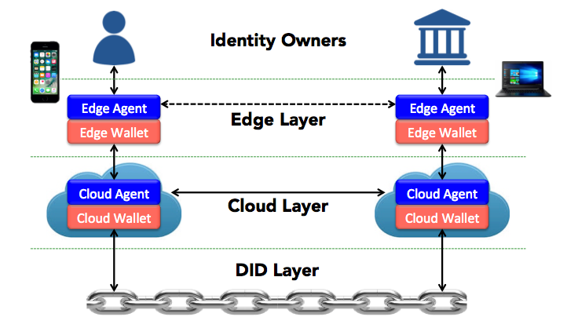

Figure 1: The high-level three-layer DKMS architecture

## 3.1. The DID (Decentralized Identifier) Layer

The foundation for DKMS is laid by the [DID specification](https://w3c-ccg.github.io/did-spec/). DIDs can work with any DLT (distributed ledger technology) for which a DID method—a way of creating, reading, updating, and revoking a DID—has been specified. As globally unique identifiers, DIDs are patterned after URNs (Uniform Resource Names): colon-delimited strings consisting of a scheme name followed by a DID method name followed by a method-specific identifier. Here is an example DID that uses the Sovrin DID method:

**did:sov:21tDAKCERh95uGgKbJNHYp**

Each DID method specification defines:

1. The specific distributed ledger against which the DID method operates;

2. The format of the method-specific identifier;

3. The CRUD operations (create, read, update, delete) for DIDs and DID documents on that ledger.

DID resolver code can then be written to perform these CRUD operations on the target ledger with respect to any DID conforming to that DID method specification. Note that some distributed ledger technologies (DLTs) and distributed networks are better suited to DIDs than others. The DID specification itself is neutral with regard to DLTs; it is anticipated that those DLTs that are best suited for the purpose of DIDs will see the highest adoption rates.there will be Darwinian selection of the DLTs that are best fit for the purpose of DIDs.

From a digital identity perspective, the primary problem that DIDs and DID documents solve is the need for a universally available, decentralized root of trust that any application or system can rely upon to discover and verify credentials about the DID subject. Such a solution enables us to move "beyond federation" into a world where any peer can enter into trusted interactions with any other peer, just as the Internet enabled any two peers to connect and communicate.

## 3.2. The Cloud Layer: Cloud Agents and Cloud Wallets

While the DID specification covers the bottom layer of a decentralized public key infrastructure, the DKMS spec will concentrate on the two layers above it. The first of these, the cloud layer, is the server-side infrastructure that mediates between the ultimate peers—the edge devices used directly by identity owners—and the DID layer.

While not strictly necessary from a pure logical point-of-view, in practice this server-side DKMS layer plays a similar role in DID infrastructure as email servers play in SMTP email infrastructure or Web servers play in Web infrastructure. Like email or Web servers, cloud agents and cloud wallets are designed to be available 24 x 7 to send and receive communications on behalf of their identity owners. They are also designed to perform communications, encryption, key management, data management, and data storage and backup processes that are not typically feasible for edge devices given their typical computational power, bandwidth, storage capacity, reliability and/or availability.

Cloud agents and wallets will typically be hosted by a service provider called an **agency**. Agencies could be operated by any type of service provider—ISPs, telcos, search engines, social networks, banks, utility companies, governments, etc. A third party agency is not a requirement of DKMS architecture—any identity owner can also host their own cloud agents.

From an architectural standpoint, it is critical that the cloud layer be designed so that it does not "recentralize" any aspect of DKMS. In other words, even if an identity owner chooses to use a specific DKMS service provider for a specific set of cloud agent functions, the identity owner should be able to substitute another DKMS service provider at a later date and retain complete portability of her DKMS keys, data and metadata.

Another feature of the cloud layer is that cloud agents can use DIDs and DID documents to automatically negotiate mutually authenticated secure connections with each other using [DID TLS](https://github.com/WebOfTrustInfo/rebooting-the-web-of-trust-fall2017/blob/master/draft-documents/did-primer.md), a protocol being designed for this purpose.

## 3.3. The Edge Layer: Edge Agents and Edge Wallets

The edge layer is vital to DKMS because it is where identity owners interact directly with computing devices, operating systems, and applications. This layer consists of  and have direct control over DKMS edge agents and edge wallets that are under the direct control of identity owners. When designed and implemented correctly, edge devices, agents, and wallets are also the safest place to store private keys and other cryptographic material. They are the least accessible for network intrusion, and even a successful attack on any single client device would yield the private data for only a single user or at most a small family of users.

Therefore, the edge layer is where most DKMS private keys and link secrets are generated and where most key operations and storage are performed. To meet the security and privacy requirements, DKMS architecture makes the following two assumptions:

1. A DKMS agent is always installed in an environment that includes a [secure element](https://www.globalplatform.org/mediaguideSE.asp) or [Trusted Platform Module](https://en.wikipedia.org/wiki/Trusted_Platform_Module) (for simplicity, this document will use the term "secure element" or “SE” for this module).

2. Private keys used by the agent never leave the secure element. 

By default edge agents are always paired with a corresponding cloud agent due to the many DKMS operations that a cloud agent enables, including communications via the DKMS protocol to other edge and cloud agents. However this is not strictly necessary. As shown in Figure 1, edge agents could also communicate directly, peer-to-peer, via a protocol such as Bluetooth, NFC, or another mesh network protocol. Edge agents may also establish secure connections with cloud agents or with others using DID TLS.

## 3.4. Verifiable Credentials

By themselves, DIDs are "trustless", i.e., they carry no more inherent trust than an IP address. The primary difference is that they provide a mechanism for resolving the DID to a DID document containing the necessary cryptographic keys and endpoints to bootstrap secure communications with the associated agent.

To achieve a higher level of trust, DKMS agents may exchange digitally signed credentials called [verifiable credentials](https://www.w3.org/2017/vc/). Verifiable credentials are being standardized by the W3C Working Group of the same name. The purpose is summarized in the [charter](https://www.w3.org/2017/vc/charter.html):

*It is currently difficult to express banking account information, education qualifications, healthcare data, and other sorts of machine-readable personal information that has been verified by a 3rd party on the Web. These sorts of data are often referred to as ***_verifiable credentials_***. The mission of the Verifiable Credentials Working Group is to make expressing, exchanging, and verifying credentials easier and more secure on the Web.*

The following diagram from the Verifiable Credentials Working Group illustrates the primary roles in the verifiable credential ecosystem and the close relationship between DIDs and verifiable credentials.

Figure 2: The W3C Verifiable Credentials ecosystem

Note that what is being verified in a verifiable credential is the signature of the credential issuer. The strength of the actual credential depends on the degree of trust the verifier has in the issuer. For example, if a bank issues a credential saying that the subject of the credential has a certain credit card number, a merchant can rely on the credential if the merchant has a high degree of trust in the bank.

The Verifiable Credentials Working Group is standardizing both the format of credentials and of digital signatures on the credentials. Different digital signature formats require different cryptographic key material. For example, credentials that use a zero-knowledge signature format such as [Camenisch-Lysyanskaya (CL) signatures](http://groups.csail.mit.edu/cis/pubs/lysyanskaya/cl02b.pdf) require a "master secret" or “link secret” that enables the prover (the identity owner) to make proofs about the credential without revealing the underlying data or signatures in the credential (or the provers DID with respect to the credential issuer). This allows for "credential presentations" that are unlinkable to each other. Link secrets are another type of cryptographic key material that must be stored in DKMS wallets.

# 4. Ledger Architecture

A fundamental feature of DIDs and DKMS is that they will work with any modern blockchain, distributed ledger, distributed database, or distributed file system capable of supporting a DID method (which has a relatively simple set of requirements—see the [DID specification](https://w3c-ccg.github.io/did-spec/)). For simplicity, this document will refer to all of these systems as "ledgers".

There are a variety of ledger designs and governance models as illustrated in Figure 3. 

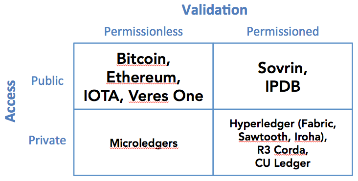

Figure 3: Blockchain and distributed ledger governance models

**Public ledgers** are available for anyone to access, while **private ledgers** have restricted access. **Permissionless ledgers** allow anyone to run a validator node of the ledger (a node that participates in the [consensus protocol](https://en.wikipedia.org/wiki/Consensus_(computer_science)#Some_consensus_protocols)), and thus require proof-of-work, proof-of-stake, or other protections against [Sybil attacks](https://en.wikipedia.org/wiki/Sybil_attack). **Permissioned ledgers** restrict who can run a validator node, and thus can typically operate at a higher transaction rate.

For decentralized identity management, a core requirement of DIDs and DKMS is that they can interoperate with any of these ledgers. However for privacy and scalability reasons, certain types of ledgers play specific roles in DKMS architecture.

## 4.1. Public Ledgers

Public ledgers, whether permissionless or permissioned, are crucial to DKMS infrastructure because they provide an open global root of trust. To the extent that a particular public ledger has earned the public’s trust that it is strong enough to withstand attacks, tampering, or censorship, it is in a position to serve as a strong, universally-available root of trust for DIDs and the DID documents necessary for decentralized key management.

Such a publicly available root of trust is particularly important for:

1. **Public DIDs** that need to be recognized as trust anchors by a large number of verifiers.

2. **Schema and credential definitions** needed for broad semantic interoperability of verifiable credentials.

3. **Revocation registries** needed for revocation of verifiable credentials that use proofs.

4. **Policy registries** needed for authorization and revocation of DKMS agents (see section 7.2).

5. **Anchoring transactions** posted for verification or coordination purposes by smart contracts or other ledgers, including microledgers (below).

## 4.2. Private Ledgers

Although public ledgers may also be used for **private DIDs**—DIDs that are intended for use only by a restricted audience—this requires that their DID documents be carefully provisioned and managed to avoid any information that can be used for attack or correlation. This threat is lessened if private DIDs are registered and managed on a private ledger that has restricted access. However the larger the ledger, the more it will require the same precautions as a public ledger.

## 4.3. Microledgers

From a privacy perspective—and particularly for compliance with privacy regulations such as the EU General Data Protection Regulation (GDPR)—the ideal identifier is a **pairwise pseudonymous DID**. This DID (and its corresponding DID document) is only known to the two parties to a relationship.

Because pairwise pseudonymous DID documents contain the public keys and service endpoints necessary for the respective DKMS agents to connect and send encrypted, signed messages to each other, there is no need for pairwise pseudonymous DIDs to be registered on a public ledger or even a conventional private ledger. Rather they can use **microledgers**. 

A microledger is essentially identical to a conventional private ledger except it has only as many nodes as it has parties to the relationship. The same cryptographic steps are used:

1. Transactions are digitally signed by authorized private key(s).

2. Transactions are cryptographically ordered and tamper evident.

3. Transactions are replicated efficiently across agents using a simple consensus protocol.

Microledgers are effectively permissionless because anyone can operate one in cooperation with anyone else—only the parties to the microledger relationship need to agree. If there is a danger of the parties to the microledger getting "out of sync" (e.g., if both of them needed to move to different agencies at the same time, so that neither is able to push a change-of-endpoint to the other), the party’s agents can register a [dead drop point](https://en.wikipedia.org/wiki/Dead_drop) on a public ledger. This is an encrypted value both parties can read to negotiate a temporary location where they can re-sync their microledgers to restore their connection.

Microledgers play a special role in DKMS architecture because they are used to maintain pairwise pseudonymous connections between DKMS agents. The use of microledgers also helps enormously with the problems of scale—they can significantly reduce the load on public ledgers by moving management of pairwise pseudonymous DIDs and DID documents directly to DKMS agents.

# 5. Key Management Architecture

DKMS adheres to the principle of key separation where keys for different purposes should be cryptographically separated. This avoids use of the same key for multiple purposes. Keys are classified based on usage and the nature of information being protected. Any change to a key requires that the relevant DID method ensure that the change comes from the identity owner or her authorized delegate. All requests by unauthorized entities must be ignored or flagged by the DKMS agent. If anyone else can change any key material, the security of the system is compromised. 

DKMS architecture addresses what keys are needed, how they are used, where they should be stored and protected, how long they should live, and how they are revoked and/or recovered when lost or compromised.

## 5.1. Key Types and Key Descriptions

NIST 800-130 framework requirement 6.1 requires a CKMS to specify and define each key type used. The following key layering and policies can be applied.

1. Master keys:				

    1. Keys at the highest level, in that they themselves are not cryptographically protected. They are distributed manually or initially installed and protected by procedural controls and physical or electronic isolation.

    2. MAY be used for deriving other keys;

    3. MUST NOT ever be stored in cleartext.

    4. SHOULD never be stored in a single encrypted form, but only:

        1. Saved in secure [offline storage](https://en.bitcoin.it/wiki/Cold_storage);

        2. Saved in a highly secure encrypted vault, such as a [secure element](https://en.wikipedia.org/wiki/Near-field_communication), [TPM](https://en.wikipedia.org/wiki/Trusted_Platform_Module), or [TEE](https://en.wikipedia.org/wiki/Trusted_execution_environment). 

        3. Sharded using a technique such as [Shamir secret sharing](https://en.wikipedia.org/wiki/Shamir%27s_Secret_Sharing);

        4. Derived from [secure multiparty computation](https://en.wikipedia.org/wiki/Secure_multi-party_computation).

        5. Saved somewhere that requires secure interactions to access (which could mean slower retrieval times).

    5. SHOULD be used only for creating signatures as proof of delegation for other keys.

    6. MUST be forgotten immediately after use–securely erased from memory, disk, and every location that accessed the key in plain text. 

2. Key encrypting keys				

    7. Symmetric or public keys used for key transport or storage of other keys.

    8. MAY themselves be secured under other keys.

    9. If they are not ephemeral, they SHOULD be stored in secure access-controlled devices, used in those devices and never exposed.

3. Data keys	

    10. Used to provide cryptographic operations on user data (e.g., encryption, authentication). These are generally short-term symmetric keys; however, asymmetric signature private keys may also be considered data keys, and these are usually longer-term keys.

    11. SHOULD be dedicated to specific roles, such as authentication, securing communications, protecting storage, proving authorized delegation, constructing credentials, or generating proofs.

The keys at one layer are used to protect items at a lower level. This constraint is intended to make attacks more difficult, and to limit exposure resulting from compromise of a specific key. For example, compromise of a key-encrypting-key (of which a master key is a special case) affects all keys protected thereunder. Consequently, special measures are used to protect master keys, including severely limiting access and use, hardware protection, and providing access to the key only under shared control. 	

In addition to key layering hierarchy, keys may be classified based on temporal considerations:	

1. *Long-term keys*. These include master keys, often key-encrypting keys, and keys used to facilitate key agreement.	

2. *Short-term keys*. These include keys established by key transport or key agreement, often used as data keys or session keys for a single communications session.

In general, communications applications involve short-term keys, while data storage applications require longer-term keys. Long-term keys typically protect short-term keys. 

The following policies apply to key descriptions:

1. Any DKMS-compliant key SHOULD use a DID-compliant key description.

2. This key description MUST be published at least in the governing DID method specification.

3. This key description SHOULD be aggregated in the **Key Description Registry** maintained by the W3C Credentials Community Group.

DKMS key management must encompass the keys needed by different DID methods as well as different verifiable credentials exchange protocols and signature formats. The following list includes the initial key types required by the Sovrin DID Method Spec and the Sovrin protocol for verifiable credentials exchange:

1. **Link secret:** (one per entity) A high-entropy 256-bit integer included in every credential in blinded form. Used for proving credentials were issued to the same logical identity. A logical identity only has one link secret. The first DKMS agent provisioned by an identity owner creates this value and stores it in an encrypted wallet or in a secure element if available. Agents that receive credentials and present proofs must know this value. It can be transferred over secure channels between agents as necessary. If the link secret is changed, credentials issued with the new link secret value cannot be correlated with credentials using the old link secret value.

2. **DID keys:** (one per relationship per agent) Ed25519 keys used for non-repudiation signing and verification for DIDs. Each agent manages their own set of DID keys.

3. **Agent policy keys:** (one per agent) Ed25519 key pairs used with the agent policy registry. See section 7.2. The public key is stored with the agent policy registry. Transactions made to the policy registry are signed by the private key. The keys are used in zero-knowledge during proof presentation to show the agent is authorized by the identity owner to present the proof. Unauthorized agents MUST NOT be trusted by verifiers.

4. **Agent recovery keys:** (a fraction per trustee) Ed25519 keys. A public key is stored by the agent and used for encrypting backups. The private key is saved to an offline medium or split into shares and given to trustees. To encrypt a backup, an ephemeral X25519 key pair is created where the ephemeral private key is used to perform a Diffie-Hellman agreement with the public recovery key to create a wallet encryption key. The private ephemeral key is forgotten and the ephemeral public key is stored with the encrypted wallet backup. To decrypt a backup, the private recovery key performs a Diffie-Hellman agreement with the ephemeral public key to create the same wallet encryption key.

5. **Wallet encryption keys:** (one per wallet segment) 256 bit symmetric keys for encrypting wallets and backups.

## 5.2. Key Generation

NIST 800-130 framework requirement 6.19 requires that a CKMS design shall specify the key-generation methods to be used in the CKMS for each type of key. The following policies can be applied.

1. For any key represented in a DID document, the generation method MUST be included in the key description specification.

2. Any parameters necessary to understand the generated key MUST be included in the key description.

3. The key description SHOULD NOT include any metadata that enables correlation across key pairs.

4. DKMS key types SHOULD use derivation functions that simplify and standardize key recovery. 

A secure method for key creation is to use a seed value combined with a derivation algorithm. Key derivation functions (KDF), pseudo random number generators (PRNG), and Bitcoin’s [BIP32 standard](https://en.bitcoin.it/wiki/BIP_0032) for hierarchical deterministic (HD) keys are all examples of key creation using a seed value with a derivation function or mapping. 

If KDFs or PRNGs are used, a passphrase, biometric input, or social data from multiple users combined with random salt SHOULD be used as the input to create the seed. Alternately a QR code or words from a list such as the [PGP word list](https://en.wikipedia.org/wiki/PGP_word_list) can be used. In either case, the input MUST NOT be stored anywhere connected to the Internet.

## 5.3. Multi-Device Management

Each device hosts an edge agent and edge wallet. All keys except for the link secret are unique per device. This allows for fine-grained (e.g., per relationship) control of authorized devices, as well as remote revocation. As part of the process for provisioning an edge agent, owners must choose what capabilities to grant. Capabilities must be flexible so owners can add or remove them depending on their needs.

It is recommended that private keys never be reused across agents. If a secret is shared across agents, then there must be a way to remotely revoke the agent using a distributed ledger such that the secret is rendered useless on that agent. The DKMS architecture uses ledgers and diffused trust to enable fine grained control over individual keys and entire devices. An agent policy registry located on a ledger allows an owner to define agent authorizations and control over those authorizations. (See 9.2 Policy Registries). Agents must notify each other when a new agent is added to an authorized pool or removed in order to warn identity owners of unauthorized or malicious agents with a cloud agent acting as the synchronization hub.

## 5.4. Key Portability and Migration

As mentioned in section 2.8, portability of DKMS wallets and keys is an important requirement—if agencies or other service providers could "lock-in" identity owners, DIDs and DKMS would no longer be decentralized. Thus the DKMS protocol MUST support identity owners migrating their edge agents and cloud agents to the agency of their choice (including self-hosting). Agency-to-agency migration is not fully defined in this version of DKMS architecture, but it will be specified in a future version. See section 11.

# 6. Recovery Methods

In key management, key recovery specifies how keys are reconstituted in case of loss or compromise. In decentralized identity management, recovery is even more important since identity owners have no "higher authority" to turn to for recovery.

In this version of DKMS architecture, two recovery methods are recommended:

1. **Offline recovery** uses physical media or removable digital media to store recovery keys. 

2. **Social recovery** employs "trustees" who store encrypted recovery data on an identity owners behalf—typically in the trustees own agent(s).

These methods are not exclusive, i.e., both can be employed for additional safety.

Both methods operate against encrypted backups of the identity owner’s digital identity wallet. Backups are encrypted by the edge agent with a backup recovery key. See section 5.1. While such backups may be stored in many locations, for simplicity this version of DKMS architecture assumes that cloud agents will provide an automated backup service for their respective edge agents.

Future versions of this specification MAY specify additional recovery methods, include remote biometric recovery and recovery cooperatives.

## 6.1. Offline Recovery

Offline recovery is the conventional form of backup. It can be performed using many different methods. In DKMS architecture, the standard strategy is to store an encrypted backup of the identity owner’s wallet at the owner’s cloud agent, and then store a private backup recovery key offline. The private backup recovery key can be printed to a paper wallet as one or more QR codes or text strings. It can also be saved to a file on a detachable media device such as a removable disk, hardware wallet or USB key. 

The primary downside to offline recovery is that the identity owner must not only safely store the offline copy, but remember the location and be able to able to access the offline copy when it is needed to recover.

## 6.2. Social Recovery

Social recovery has two advantages over offline recovery:

1. The identity owner does not have to create an offline backup—the social recovery setup process can be accomplished entirely online.

2. The identity owner does not have to safely store and remember the location of the offline backup.

However it is not a panacea:

1. The identity owner still needs to remember her trustees.

2. Social recovery opens the opportunity, however remote, for an identity owner’s trustees to collude to take over the identity owner’s digital identity wallet.

A trustee is any person, institution, or service that agrees to assist an identity owner during recovery by (1) securely storing recovery material (called a "share") until a recovery is needed, and (2) positively identifying the identity owner and the authenticity of a recovery request before authorizing release of their shares.

This second step is critical. Trustees MUST strongly authenticate an identity owner during recovery so as to detect if an attacker is trying exploit them to steal a key or secret. Software should aid in ensuring the authentication is strong, for example, confirming the trustee actually conversed with Alice, as opposed to getting an email from her.

For social recovery, agents SHOULD split keys into shares and distribute them to trustees instead of sending each trustee a full copy. When recovery is needed, trustees can be contacted and the key will be recovered once enough shares have been received. An efficient and secure threshold secret sharing scheme, like [Shamir](https://en.wikipedia.org/wiki/Shamir%27s_Secret_Sharing)['s](https://en.wikipedia.org/wiki/Shamir%27s_Secret_Sharing)[ Secret Sharing](https://en.wikipedia.org/wiki/Shamir%27s_Secret_Sharing), SHOULD be used to generate the shares and recombine them. The number of trustees to use is the decision of the identity owner, however it is RECOMMENDED to use at least three with a threshold of at least two. 

The shares may be encrypted by a key derived from a KDF or PRNG whose input is something only the identity owner knows, has, or is or any combination of these.

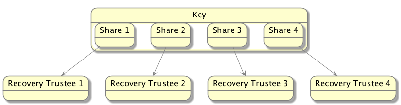

Figure 4: Key sharing using Shamir Secret Sharing

# 7. Recovery From Key Loss

Key loss as defined in this document means the owner can assume there is no further risk of compromise. Such scenarios include devices unable to function due to water, electricity, breaking, fire, hardware failure, acts of God, etc.  

## 7.1. Agent Policy Key Loss

Loss of an agent policy key means the agent no longer has proof authorization and cannot make updates to the agent policy registry on the ledger. Identity owners SHOULD have backup agent policy keys that can revoke the current active agent policy key from the agent policy registry and issue a new agent policy key to the replacement agent.

## 7.2. DID Key Loss

Loss of a DID key means the agent can no longer authenticate over the channel and cannot rotate the key. This key MUST be recoverable from the encrypted backup.

## 7.3. Link Secret Loss

Loss of the link secret means the owner can no longer generate proofs for the verifiable credentials in her possession or be issued credentials under the same identity. The link secret MUST be recoverable from the encrypted backup.

## 7.4. Credential Loss

Loss of credentials requires the owner to contact his credential issuers, reauthenticate, and request the issuers revoke existing credentials, if recovery from a backup is not possible. Credentials SHOULD be recoverable from the encrypted backup. 

# 8. Recovery From Key Compromise

Key compromise means that private keys and/or master keys have become or can become known either passively or actively. 

1. **"Passively" means the identity owner is not aware of the compromise.** An attacker may be eavesdropping or have remote communications with the agent but has not provided direct evidence of intrusion or malicious activity, such as impersonating the identity owner or committing fraud.

2. **"Actively" means the identity owner knows her keys have been exposed.** For example, the owner is locked out of her own devices and/or DKMS agents and wallets, or becomes aware of abuse or fraud.

To protect from either, there are techniques available: **rotation,** **revocation, **and quick **recovery**. Rotation helps to limit a passive compromise, while revocation and quick recovery help to limit an active one.

## 8.1. Key Rotation

Keys SHOULD be changed periodically to limit tampering. When keys are rotated, the previous keys are revoked and new ones are added. It is RECOMMENDED for keys to expire for the following reasons:

* **Technology advances.** Encryption (and encryption breaking) technologies are constantly advancing.  Expiring keys helps enforce migrating to better technologies.

* **Mitigation of compromises.** Keys that change often prevent attackers from using them even if they are able to steal them. Expiring keys spreads this immunity.

* **Changing needs.** Key owners may only use certain secrets while performing a specific task. The task may end after a certain date and all secrets tied to that task should also be terminated. Expiring keys helps enforce this this policy.

## 8.2. Key Revocation

DKMS keys MUST be revocable. Verifiers MUST be able to determine the revocation status of a DKMS key. It is not good enough to simply forget a key because that does not protect against key compromise. Control over who can update a revocation list MUST be enforced so attackers cannot maliciously revoke user keys. (Note that a key revoked by an attacker reveals that the attacker knows a secret.)

## 8.3. Agent Policy Key Compromise

Compromise of an agent’s policy key means an attacker can use the agent to impersonate the owner for proof presentation and make changes to the agent policy registry. Owners must be able to revoke any of their devices to prevent impersonation. For example, if the owner knows her device has been stolen, she will want to revoke all device permissions so even if the thief manages to break into the agent the DKMS data value is limited. Identity owners SHOULD have backup agent policy keys that are authorized to revoke the compromised key from the agent policy registry and issue a new agent policy key to the replacement agent.

## 8.4. DID Key Compromise

Compromise of a DID key means an attacker can use the channel to impersonate the owner as well as potentially lock the owner out from further use if the attacker rotates the key before the owner realizes what has happened. This attack surface is minimized if keys are rotated on a regular basis. An identity owner MUST also be able to trigger a rotation manually upon discovery of a compromise. Owners SHOULD implement a diffuse trust model among multiple agents where a single compromised agent is not able to revoke a key because more than one agent is required to approve the action. 

## 8.5. Link Secret Compromise

Compromise of the owner link secret means an attacker may impersonate the owner when receiving verifiable credentials or use existing credentials for proof presentation. Note that unless the attacker is also able to use an agent that has "PROVE" authorization, the verifier will be able to detect an unauthorized agent. At this point the owner SHOULD revoke her credentials and request for them to be reissued with a new link secret.

## 8.6. Credential Compromise

Compromise of a verifiable credential means an attacker has learned the attributes of the credential. Unless the attacker also manages to compromise the link secret and an authorized agent, he is not able to assert the credential, so the only loss is control of the underlying data.

# 9. DKMS Protocol

## 9.1. Microledger Transactions

DKMS architecture uses microledgers to represent the state of the authorized keys in a relationship. Just as with conventional ledgers, the structure is such that the parties to a relationship can verify it at any moment in time, as can a third party for auditing purposes. Microledgers are used between two parties where each party signs transactions using their DID keys. This allow changes to DID keys to be propagated in a secure manner where each transaction is signed with an existing key authorized in earlier transactions. 

## 9.2. Policy Registries

Each Identity Owner creates a Policy on the ledger. Each of the Identity Owner's agents has an agent policy key pair that will be used with that Policy. The policy allows a key to have some combination of authorizations defined by the DID method spec. This is a public record, but no information in this public record is ever shared with any other party. Its purpose is to allow for key management of devices in a flexible way, while allowing for agents to prove in zero knowledge that they are using an agent that is authorized by the owner. This zero knowledge proof is possible because the ledger maintains a global registry for all keys with PROVE authorization for all identity owners. When a key is added to a Policy, and that key is given the PROVE authorization, the ledger adds a commitment to the Prover Registry. When a key loses its PROVE authorization, the ledger removes the associated commitment from the Prover Registry. The ledger can enforce sophisticated owner defined rules like requiring multiple signatures to authorize updates to the Policy.

## 9.3. Authenticated Encryption

The use of DIDs and microledgers allows communication between agents to use **authenticated encryption**. Agents use their DID verification keys for authenticating each other whenever a communication channel is established. Microledgers allow DID keys to have rooted mutual authentication for any two parties with a DID. In the sequence diagrams in section 10, all agent-to-agent communications that uses authenticated encryption is indicated by bold blue arrows.

# 9.4 Recovery connection

Each Identity Owner begins a recovery operation by requesting their respective recovery information from trustees. After a trustee has confirmed the request originated with the identity owner and not a malicious party, a recovery connection is formed. This connection type is special–it is only meant for recovery purposes. Recovery connections are decommissioned when the minimum recovery shares have been received and the original data has been restored. Identity owners can resume normal connections because their keys have been recovered. Trustee’s SHOULD only send recovery shares to identity owners over a recovery connection.  

# 10. Protocol Flows

This section contains the UML sequence diagrams for all standard DKMS key management operations that use the DKMS protocol. Diagrams are listed in logical order of usage but may be reviewed in any order. Cross-references to reusable protocol sequences are represented as notes in **blue**. Other comments are in **yellow**.

Table 1 is a glossary of the DKMS key names and types used in these diagrams.

<table>
  <tr>
    <td>Key Name</td>
    <td>Description</td>
  </tr>
  <tr>
    <td>Apx-pk</td>
    <td>Agent Policy Public Key for agent x</td>
  </tr>
  <tr>
    <td>Apx-sk</td>
    <td>Agent Policy Private (Secret) Key for agent x</td>
  </tr>
  <tr>
    <td>AAx-ID</td>
    <td>Alice's Agent to Agent Identifier for agent x</td>
  </tr>
  <tr>
    <td>AAx-vk</td>
    <td>Alice's Agent to Agent Public Verification Key for agent x</td>
  </tr>
  <tr>
    <td>AAx-sk</td>
    <td>Alice's Agent to Agent Private Signing Key for agent x</td>
  </tr>
  <tr>
    <td>ABDID</td>
    <td>Alice’s DID for connection with Bob</td>
  </tr>
  <tr>
    <td>ABx</td>
    <td>Alice’s key pair for connection with Bob for agent x</td>
  </tr>
  <tr>
    <td>ABx-vk</td>
    <td>Alice’s Public Verification Key for connection with Bob for agent x</td>
  </tr>
  <tr>
    <td>ABx-sk</td>
    <td>Alice’s Private Signing Key for connection with Bob for agent x</td>
  </tr>
  <tr>
    <td>AWx-k</td>
    <td>Wallet Encryption Key for agent x</td>
  </tr>
  <tr>
    <td>ALS</td>
    <td>Alice's Link Secret</td>
  </tr>
</table>

Table 1: DKMS key names used in this section

## 10.1. Edge Agent Start

An identity owner’s experience with DKMS begins with her first installation of a DKMS edge agent. This startup routine is reused by many other protocol sequences because it is needed each time an identity owner installs a new DKMS edge agent.

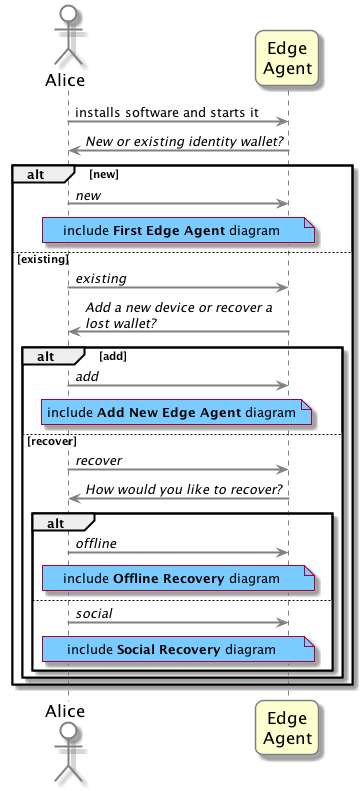

The first step after successful installation is to prompt the identity owner whether he/she already has a DKMS identity wallet or is instantiating one for the first time. If the owner already has a wallet, the owner is prompted to determine if the new edge agent installation is for the purpose of adding a new edge agent, or recovering from a lost or compromised edge agent. Each of these options references another protocol pattern.

## 10.2. Provision New Agent

Any time a new agent is provisioned—regardless of whether it is an edge agent or a cloud agent—the same sequence of steps are necessary to set up the associated wallet and secure communications with the new agent.

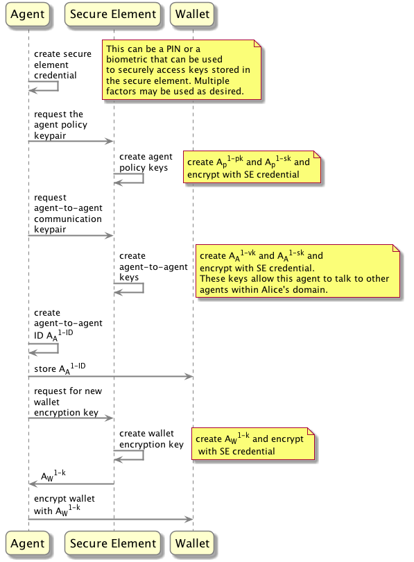

As noted in section 3.3, DKMS architecture recommends that a DKMS agent be installed in an environment that includes a secure element. So the first step is for the edge agent to set up the credential the identity owner will use to unlock the secure element. On modern smartphones this will typically be a biometric, but it could be a PIN, passcode, or other factor, or a combination of factors.

The edge agent then requests the secure element to create the key pairs necessary to establish the initial agent policies and to secure agent-to-agent communications. The edge agent also generates a ID to uniquely identify the agent across the identity owner’s set of DKMS agents.

Finally the edge agent requests the secure element to create a wallet encryption key and then uses it to encrypt the edge wallet.

## 10.3. First Edge Agent

The first time a new identity owner installs an edge agent, it must also set up the DKMS components that enable the identity owner to manage multiple separate DIDs and verifiable credentials as if they were from one logically unified digital identity. It must also lay the groundwork for the identity owner to install additional DKMS agents on other devices, each of which will maintain its own DKMS identity wallet while still enabling the identity owner to act as if they were all part of one logically unified identity wallet.

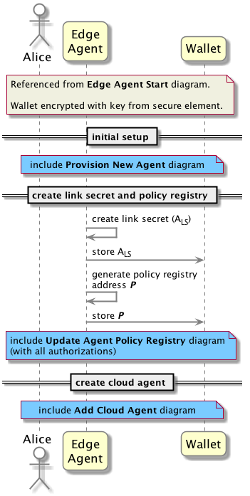

Link secrets are defined in section 5.1 and policy registries in section 7.2. The edge agent first needs to generate and store the link secret in the edge wallet. It then needs to generate the policy registry address and store it in the edge wallet. Now it is ready to update the agent policy registry.

## 10.4. Update Agent Policy Registry

As explained in section 9.2, an agent policy registry is the master control point that an identity owner uses to authorize and revoke DKMS agent proof authorization (edge or cloud).

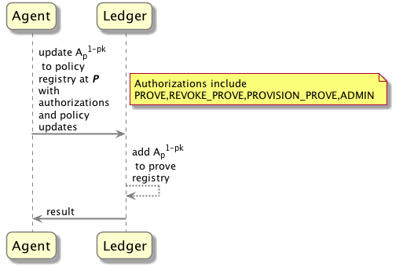

Each time the identity owner takes an action to add, revoke, or change the permissions for an agent, the policy registry is updated. For example, at the end of the protocol sequence in section 10.3, the action is to write the first policy registry entries that authorize the first edge agent.

## 10.5. Add Cloud Agent

The final step in first-time setup of an edge agent is creation of the corresponding cloud agent. As explained in section 3.3, the default in DKMS architecture is to always pair an edge agent with a corresponding cloud agent due to the many different key management functions this combination can automate.

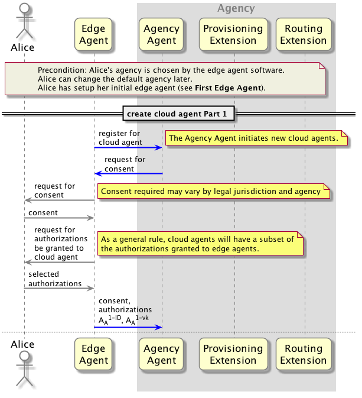

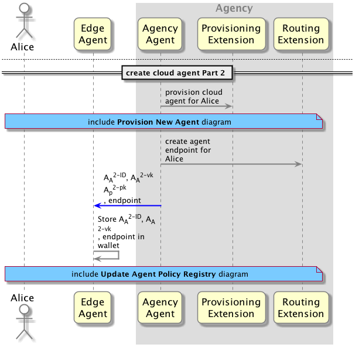

The process of registering a cloud agent begins with the edge agent contacting the **agency agent**. For purposes of this document, we will assume that the edge agent has a relationship with one or more agencies, and has a trusted method (such as a pre-installed DID) for establishing a secure connection using authenticated encryption.

The target agency first returns a request for the consent required from the identity owner to register the cloud agent together with a request for the authorizations to be granted to the cloud agent. By default, cloud agents have no authorizations other than those granted by the identity owner. This enables identity owners to control what tasks a cloud agent may or may not perform on the identity owner’s behalf.

Once the identity owner has returned consent and the selected authorizations, the agency agent provisions the new cloud agent and registers the cloud agent’s service endpoint using the agency’s routing extension. Note that this service endpoint is used only in agent-to-agent communications that are internal to the identity owner’s own agent domain. Outward-facing service endpoints are assigned as part of adding connections with their own DIDs.

Once these tasks are performed, the results are returned to the edge agent and stored security in the edge wallet.

## 10.6. Add New Edge Agent

Each time an identity owner installs a new edge agent after their first edge agent, the process must initialize the new agent and grant it the necessary authorizations to begin acting on the identity owner’s behalf.

Provisioning of the new edge agent (Edge Agent 2) starts by the identity owner installing the edge agent software (section 10.2) and then receiving instructions about how to provision the new edge agent from an existing edge agent (Edge Agent 1). Note that Edge Agent 1 must the authorization to add a new edge agent (not all edge agents have such authorization). The identity owner must also select the authorizations the edge agent will have (DKMS agent developers will compete to make such policy choices easy and intuitive for identity owners).

There are multiple options for how the Edge Agent 2 may receive authorization from Edge Agent 1. One common method is for Edge Agent 1 to display a QR code or other machine-readable code scanned by Edge Agent 2. Another way is for Edge Agent 1 to provide a passcode or passphrase that the identity owner types into Edge Agent 2. Another method is sending an SMS or email with a helper URL. In all methods the ultimate result is that Edge Agent 2 must be able to connect via authenticated encryption with Edge Agent 1 in order to verify the connection and pass the new agent-to-agent encryption keys that will be used for secure communications between the two agents.

Once this is confirmed by both agents, Edge Agent 1 will then use the Update Agent Policy Registry sequence (section 10.4) to add authorizations to the policy registry for Edge Agent 2.

Once that is confirmed, provisioning of Edge Agent 2 is completed when Edge Agent 1 send the link secret and any verifiable credentials that the identity owner has authorized Edge Agent 2 to handle to Edge Agent 2, which securely stores them in Edge Agent 2’s wallet.

## 10.7. Add Connection to Public DID

The primary purpose of DIDs and DKMS is to enable trusted digital connections. One of the most common use cases is when an identity owner needs to create a connection to an entity that has a public DID, for example any website that wants to support trusted decentralized identity connections with its users (for registration, authentication, verifiable credentials exchange, secure communications, etc.)

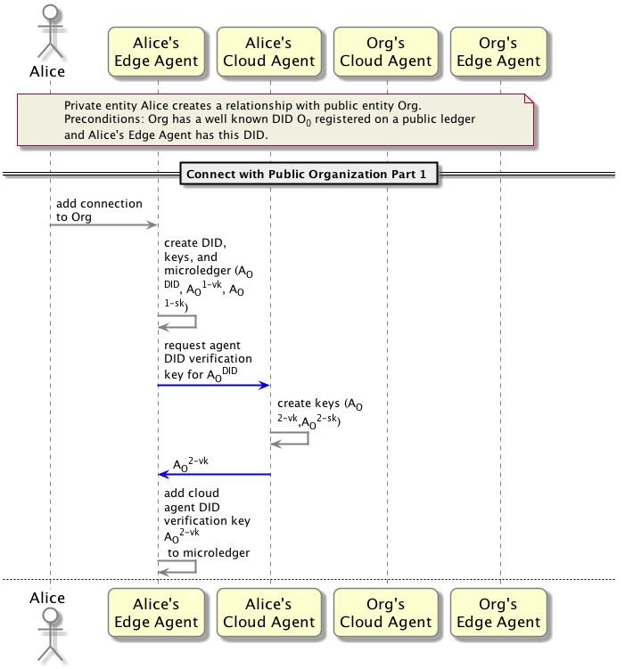

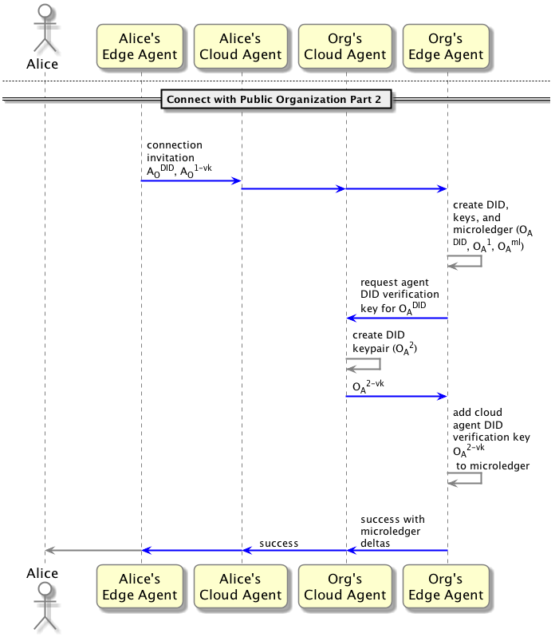

Note that this sequence is entirely about agent-to-agent communications between DKMS agents to create a shared microledger and populate it with the pairwise pseudonymous DIDs that Alice and Org assign to each other together with the public keys and service endpoints they need to enable their agents to use authenticated encryption.

First Alice’s edge agent creates the key pair and DID that it will assign to Org and uses those to initialize a new microledger. It then sends a request for Alice’s cloud agent to add its own key pair that Alice authorizes to act on that DID. These are returned to Alice’s edge agent who adds them to the microledger.

Next Alice’s edge agent creates and sends a connection invitation to Alice’s cloud agent. Alice’s cloud agent resolves Org’s DID to its DID document to discover the endpoint for Org’s cloud agent (this resolution step is not shown in the diagram above). It then forwards the invitation to Org’s cloud agent who in turn forwards it to the system operating as Org’s edge agent.

Org’s edge agent performs the mirror image of the same steps Alice’s edge agent took to create its own DID and key pair for Alice, adding those to the microledger, and authorizing its cloud agent to act on its behalf in this new relationship. 

When that is complete, Org’s edge agent returns its microledger updates via authenticated encryption to its cloud agent which forwards them to Alice’s cloud agent and finally to Alice’s edge agent. This completes the connection and Alice is notified of success.

## 10.8. Add Connection to Private DID (Provisioned)

The other common use case for trusted connections is private peer-to-peer connections between two parties that do not initially connect via one or the other’s public DIDs. These connections can be initiated any way that one party can share a unique **invitation address**, i.e., via a URL sent via text, email, or posted on a blog, website, LinkedIn profile, etc.

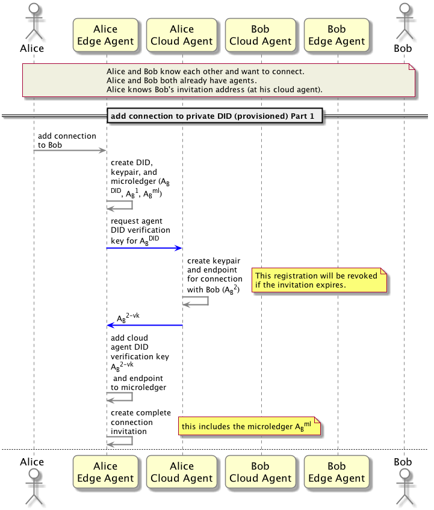

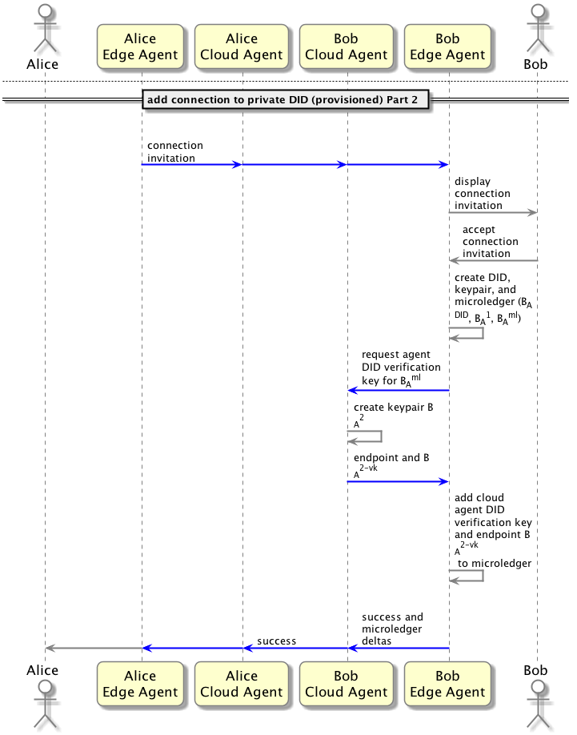

The flow in this sequence diagram is very similar to the flow in section 10.8 where Alice is connecting to a public organization. The only difference is that rather than beginning with Alice’s edge agent knowing a public DID for the Org, Alice’s edge agent knows Bob’s invitation address. This is a service, typically provided by an agency, that enables Bob’s cloud agent to accept connection invitations (typically with appropriate spam protections and other forms of connection invitation filtering).

The end result is the same as in section 10.8: Alice and Bob have established a shared microledger with the pairwise pseudonymous DIDs and the public keys and endpoints they need to maintain their relationship. Note that with DIDs and DKMS, this is the first connection that Alice and Bob can maintain for life (and beyond) that is not dependent on any centralized service provider or registry. And this connection is available for Alice and Bob to use with any application they wish to authorize.

## 10.9. Add Connection to Private DID (Unprovisioned)

This sequence is identical to section 10.8 except that Bob does not yet have a DKMS agent or wallet. So it addresses what is necessary for Alice to invite Bob to both start using a DKMS agent and to form a connection with Alice at the same time.

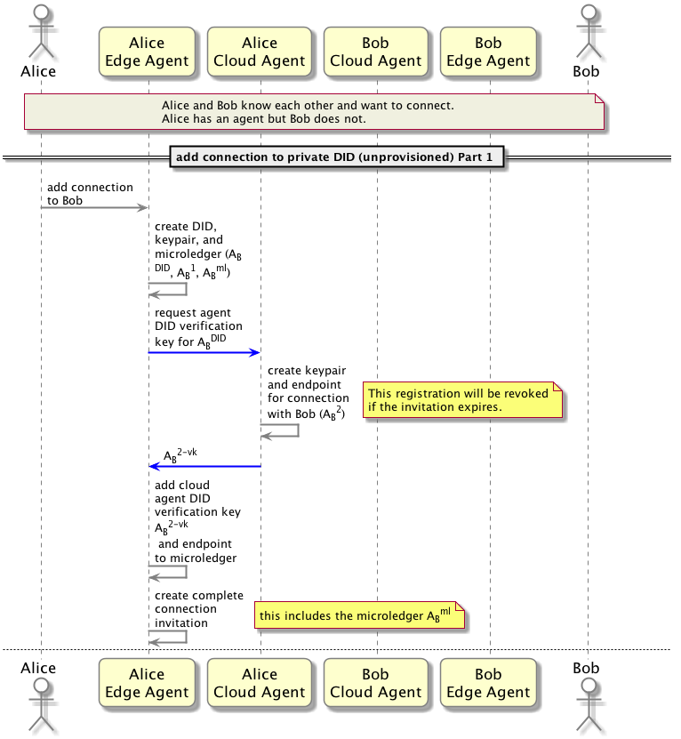

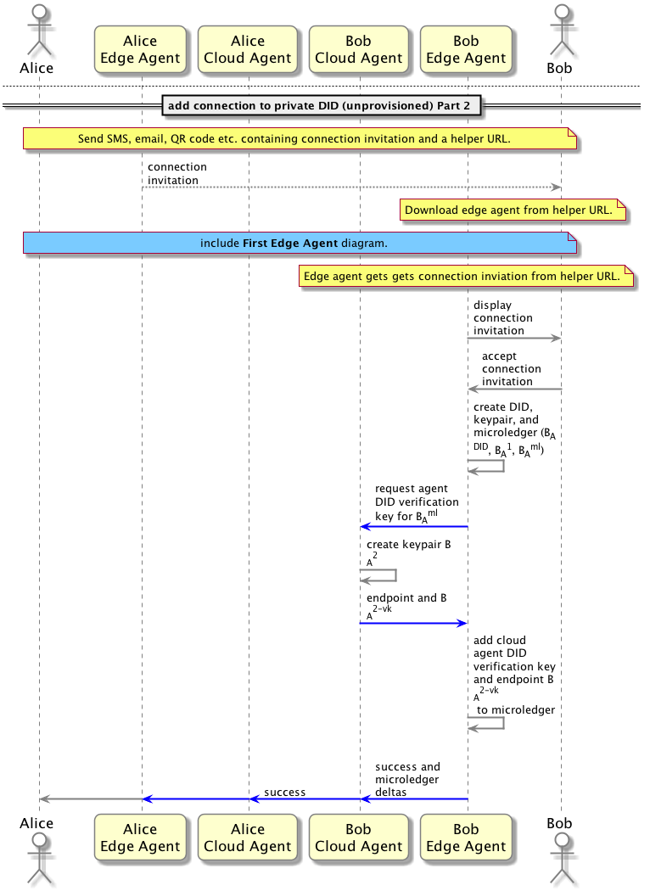

The only difference between this sequence diagram and section 10.8 is the invitation delivery process. In 10.8, Bob already has a cloud agent, so the invitation can be delivered to an invitation address established at the hosting agency. In this sequence, Bob does not yet have cloud agent, so the invitation must be: a) anchored at a helper URL (typically provided by an agency), and b) delivered to Bob via some out-of-band means (typically an SMS, email, or other medium that can communicate a helper URL).

When Bob receives the invitation, Bob clicks on the URL to go to the helper page and receive instructions about the invitation and how he can download a DKMS edge agent. He follows the instructions, installs the edge agent, which in turn provisions Bob’s cloud agent. When provisioning is complete, Bob’s edge agent retrieves Alice’s connection invitation from the helper URL. Since Bob is now fully provisioned, the rest of the sequence proceeds identically to section 10.8.

## 10.10. Rotate DID Keys

As described in section 8.1, key rotation is a core security feature of DKMS. This diagram illustrates athe protocol for key rotation.

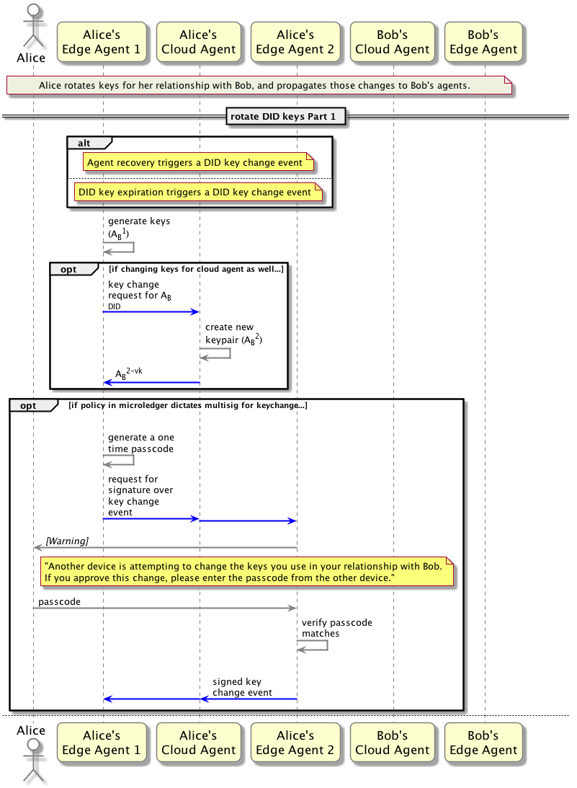

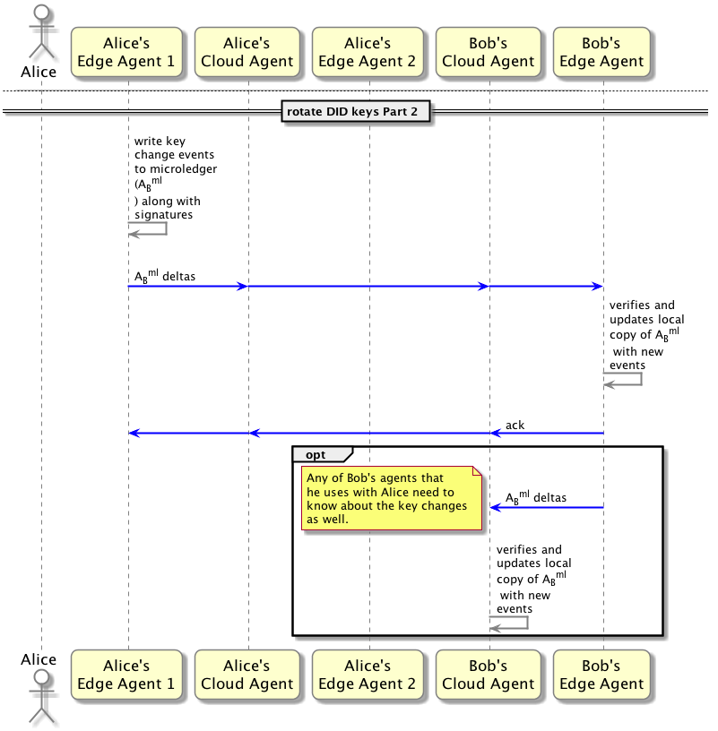

Key rotation may be triggered by expiration of a key or by an another event such as agent recovery. The process begins with the identity owner’s edge agent generating its own new keys. If keys also need to be rotated in the cloud agent, the edge agent sends a key change request.

The identity owner’s agent policy may require that key rotation requires authorization from two or more edge agents. If so, the first edge agent generates a one time passcode or QR code that the identity owner can use to authorize the key rotation at the second edge agent. Once the passcode is verified, the second edge agent signs the key rotation request and sends it to the first edge agent.

Once the necessary authorizations have been received, the first edge agent writes the changes to the microledger for that DID. It then sends the updates to the microledger to the cloud agent for the other party to the DID relationship (Bob), who forwards it to Bob’s edge agent. Bob’s edge agent verifies the updates and adds the changes to its copy of the microledger.

Bob’s edge agent then needs to broadcast the changes to Bob’s cloud agent and any other edge agent that Bob has authorized to interact with Alice. Once this is done, Alice and Bob are "in sync" with the rotated keys, and their connection is at full strength.

## 10.11. Delete Connection

In decentralized identity, identity owners are always in control of their relationships. This means either party to a connection can terminate the relationship by deleting it. This diagram illustrates Alice deleting the connection she had with Bob.

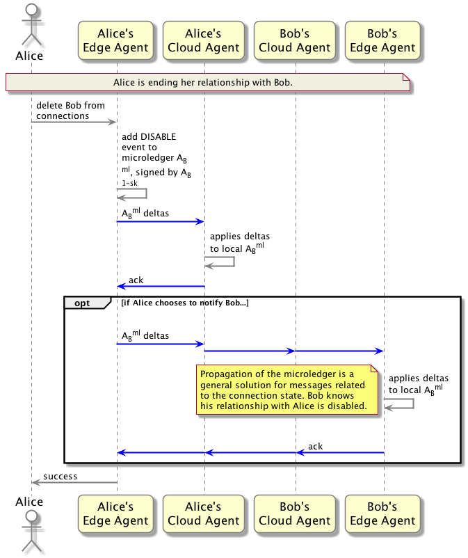

All that is required to delete a connection is for the edge agent to add a DISABLE event to the microledger she established with Bob. As always, this change is propagated to Alice’s cloud agent and any other edge agents authorized to interact with the DID she assigned to Bob.

Note that, just like in the real world, it is optional for Alice to notify Bob of this change in the state of their relationship. If she chooses to do so, her edge agent will propagate the DISABLE event to Bob’s copy of the microledger. If, when, and how Bob is notified by his edge agent(s) depends on Bob’s notification policies.

## 10.12. Revoke Edge Agent

Key revocation is also a required feature of DKMS architecture as discussed in section 8.2. Revocation of keys for a specific DID is accomplished either through rotation of those keys (section 10.10) or deletion of the connection (section 10.11). However in certain cases, an identity owner may need to revoke an entire edge agent, effectively disabling all keys managed by that agent. This is appropriate if a device is lost, stolen, or suspected of compromise.

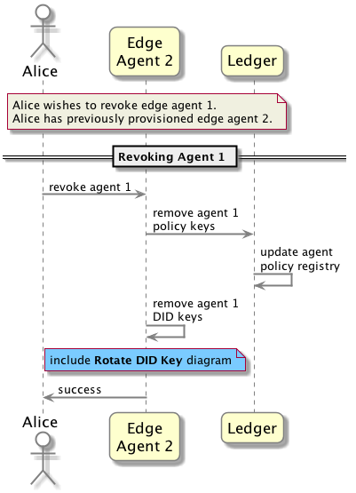

Revoking an edge agent is done from another edge agent that is authorized to revoke agents. If a single edge agent is authorized, the process is straightforward. The revoking edge agent sends a signed request to the policy registry address (section 9.2) on the ledger holding the policy registry. The ledger performs the update. The revoking edge agent then "removes" the keys for the revoked edge agent by disabling them.

As a best practice, this event also should trigger key rotation by the edge agent.

Note that an identity owner may have a stronger revocation policy, such as requiring two edge agents to authorize revocation of another edge agent. This sequence is very similar to requiring two edge agents to authorize a key rotation as described in section 10.10. However it could also cause Alice to be locked out of her edge agents if an attacker can gain control of enough devices. In this case Alice could use one of her recovery options (sections 10.16 and 10.17).

## 10.13. Recovery Setup

As discussed in section 6, recovery is a paramount feature of DKMS—in decentralized key management, there is no "forgot password" button (and if there were, it would be a major security vulnerability). So it is particularly important that it be easy and natural for an identity owner to select and configure recovery options.

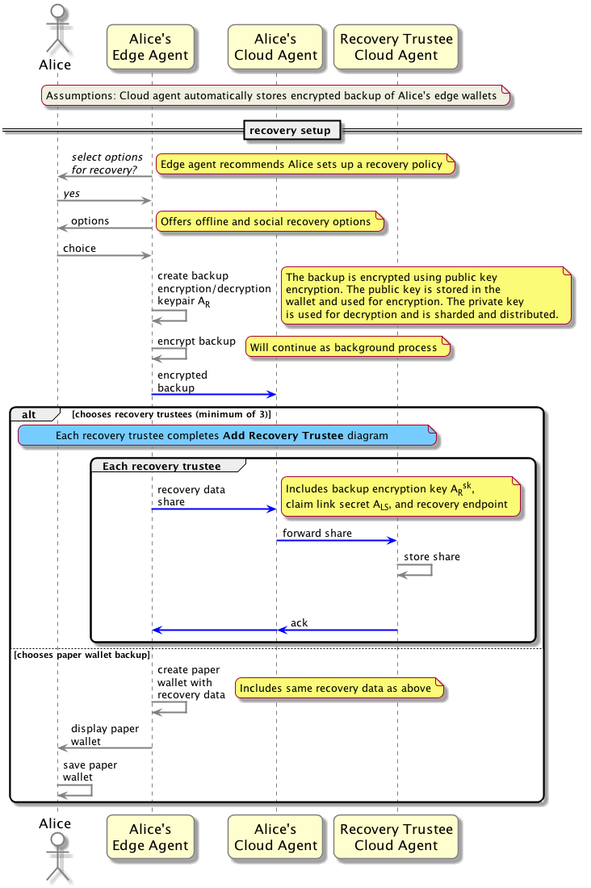

The process begins with Alice’s edge agent prompting Alice to select among the two recovery options described in section 6: offline recovery and social recovery. Her edge agent then creates a key pair for backup encryption, encrypts a backup of her edge wallet, and stores it with her cloud agent.

If Alice chooses social recovery, the next step is for Alice to add **trustees** as described in section 10.14. Once the trustee has accepted Alice’s invitation, Alice’s edge agent creates and shares a **recovery data share** for each trustee. This is a shard of a file containing a copy of her backup encryption key, her link secret, and the special recovery endpoint that was set up by her cloud agent when the recovery invitation was created (see section 10.14).

Alice’s edge agent sends this recovery data share to her cloud agent who forwards it to the cloud agent for each of her trustees. Each cloud agent securely stores the share so its identity owner is ready in helping Alice to recover should the need arise. (See sections 10.17 and 10.18 for the actual social recovery process.)

If Alice chooses offline recovery, her edge agent first creates a "paper wallet", which typically consists of a QR code or string of text that encodes the same data as in a recovery data share. Her edge agent then displays that paper wallet data to Alice for printing and storing in a safe place. Note that one of the primary usability challenges with offline recovery methods is Alice:

1. Following through with storage of the paper wallet.

2. Properly securing storage of the paper wallet over long periods of time.

3. Remembering the location of the paper wallet over long periods of time.

To some extent these can be addressed if the edge agent periodically reminds the identity owner to verify that his/her paper wallet is securely stored in a known location.

## 10.14. Add Trustee

The secret to implementing social recovery in DKMS is using DKMS agents to automate the process of securely storing, sharing, and recovering encrypted backups of DKMS wallets with several of the identity owner’s connections. In DKMS architecture, these connections are currently called trustees. (Note: this is a placeholder term pending further usability research on the best name for this new role.)

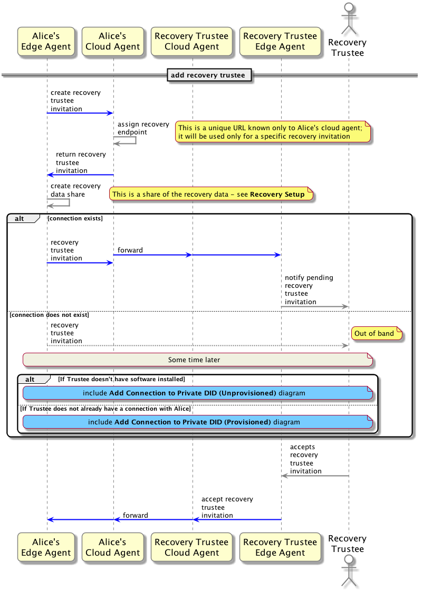

Trustees are selected by the identity owner based on the owner’s trust. For each trustee, the edge agent requests the cloud agent to create a trustee invitation. The cloud agent generates and registers with the agency a unique URL that will be used only for this purpose. The edge agent then creates a recovery data share (defined in 10.13) and shards it as defined by the identity owner’s recovery policy.

At this point there are two options for delivering the trustee invitation depending on whether the identity owner already has a connection with the trustee or not. If a connection exists, the edge agent sends the invitation to the cloud agent who forwards it to the trustee’s cloud agent who forwards it to an edge agent who notifies the trustee of the invitation.

If a connection does not exist, the recovery invitation is delivered out of band in a process very similar to adding a connection to a private DID (sections 10.8 and 10.9).

Once the trustee accepts the invitation, the response is returned to identity owner’s edge agent to complete the recovery setup process (section 10.13).

## 10.15. Update Recovery Setup

With DKMS infrastructure, key recovery is a lifelong process. A DKMS wallet filled with keys, DIDs, and verifiable credentials is an asset constantly increasing in value. Thus it is critical that identity owners be able to update their recovery methods as their circumstances, devices, and connections change.

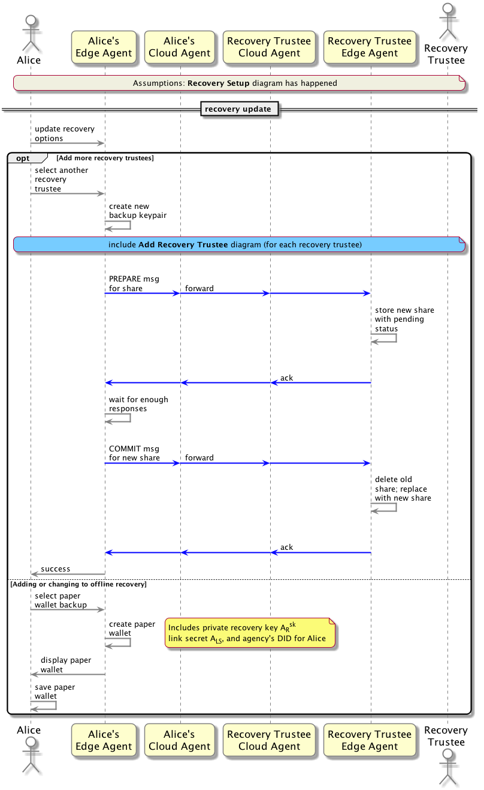

For social recovery, an identity owner may wish to add new trustees or delete existing ones. Whenever this happens, the owner’s edge agent must recalculate new recovery data shares to shard among the new set of trustees. This is a two step process: the new share must first be sent to all trustees in the new set and an acknowledgement must be received from all of them. Once that it done, the edge agent can send a commitment message to all trustees in the new set to complete the process.

Updating offline recovery data is simply a matter of repeating the process of creating and printing out a paper wallet. An edge agent can automatically inform its identity owner of the need to do this when circumstances require it as well as automatically remind its owner to keep such offline information safe and accessible.

## 10.16. Offline Recovery

One advantage of the offline recovery process is that it can be performed very quickly by the identity owner because it has no dependencies on outside parties.

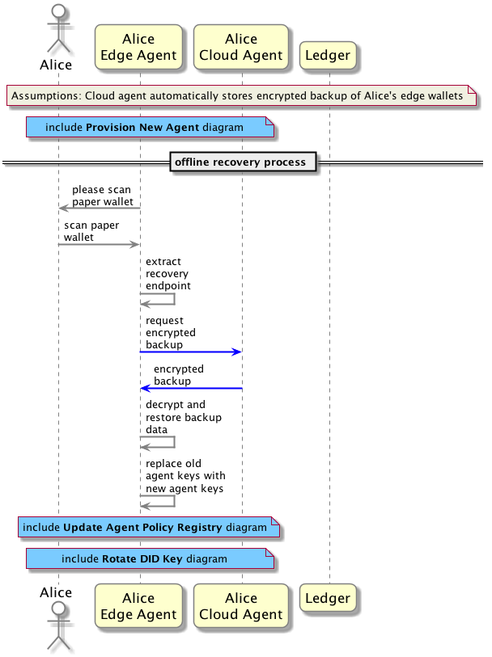

The identity owner simply initiates recovery on a newly installed edge agent. The edge agent prompts to scan the paper wallet (or input the text). From this data, it extracts the special recovery endpoint registered in the recovery setup process (section 10.13) and the backup decryption key. It then requests the encrypted backup from the recovery endpoint (which routes to the identity owner’s cloud agent), decrypts it, restores the edge wallet, and replaces the agent keys with new keys. The final steps are to update the agent policy registry and, as a best practice, rotate all DID keys.

## 10.17. Social Recovery

Social recovery, while more complex than offline recovery, is also more automated, flexible, and resilient. The secret to making it easy and intuitive for identity owners is using DKMS agents to automate every aspect of the process except for the most social step: verification of the actual identity of the identity owner by trustees.

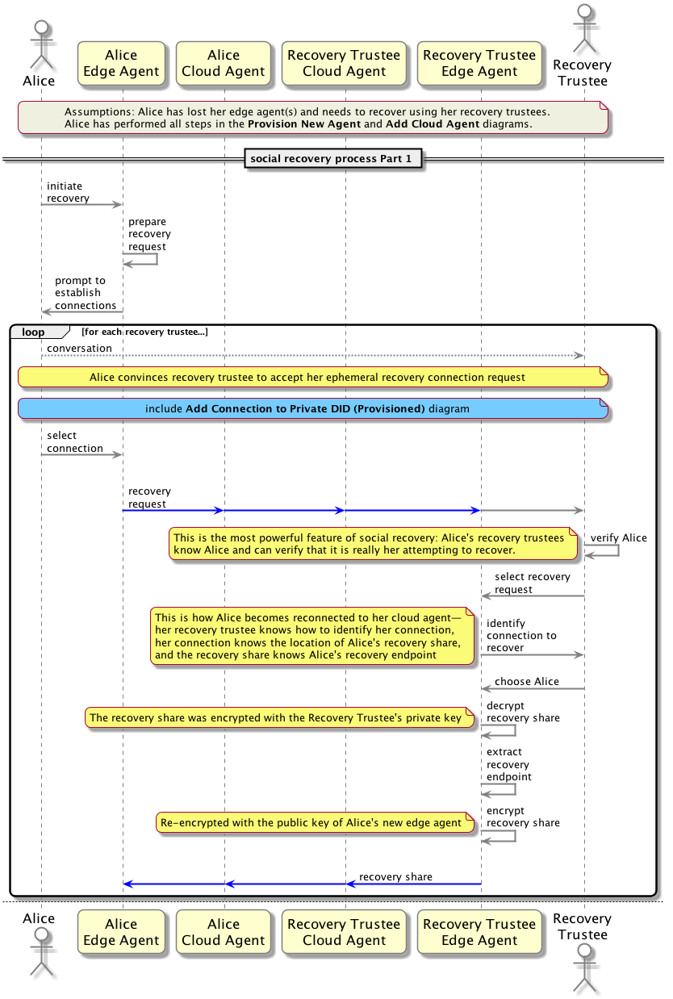

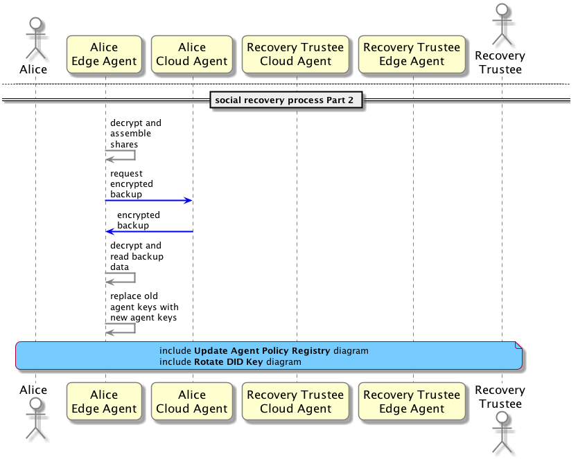

Social recovery, like offline recovery, begins with the installation of a fresh edge agent. The identity owner selects the social recovery option and is prompted for the contact data her edge agent and cloud agent will need to send special new connection requests to her trustees. These special connection requests are then issued as described in section 10.8.

These special connection requests are able to leverage the same secure DKMS infrastructure as the original connections while at the same time carrying the metadata needed for the trustee’s edge agent to recognize it is a recovery request. At that point, the single most important step in social recovery happens: **the trustee verifying that it is really Alice making the recovery request**, and not an impersonator using social engineering.

Once the trustee is satisfied with the verification, the edge agent prompts the trustee to perform the next most important step: **select the existing connection with Alice** so that the trustee edge agent knows which connection is trying to recover. Only the trustee—a human being—can be trusted to make this association.

At this point, the edge agent can correlate the old connection to Alice with the new connection to Alice, so it knows which recovery data share to select (see section 10.13). It can then decrypt the recovery data share with the identity owner’s private key, extracts the recovery endpoint, and re-encrypt the recovery data share with the public key of Alice’s new edge agent.

Now the trustee’s edge agent is ready to return the recovery data share to Alice’s new cloud agent via the recovery endpoint. The cloud agent forwards it to Alice’s new edge agent. Once Alice’s new edge agent has the required set of recovery data shares, it decrypts and assembles them. It then uses that recovery data to complete the same final steps as offline recovery described in section 10.16.

# 11. Open Issues

1. **DID specification.** The DKMS specification has major dependencies on the DID specification which is still in progress at the W3C Credentials Community Group. Although we are not concerned that the resulting specification will not support DKMS requirements, we cannot be specific about certain details of how DKMS will interact with DIDs until that specification is finalized. 

2. **DID methods.** Different DID methods may support different levels of assurance about DKMS keys. Thus we may need to address more about the role of ledgers as a decentralized source of truth and the requirements of the ledger for the hosting of DIDs and DID documents.

3. **DID TLS.** It is an open issue whether this should be defined as a separate but adjacent specification.

4. **Verifiable credentials interoperability.** We may need to say more about how different DKMS wallets and agents from different vendors can support interoperable verifiable credentials, including those with zero-knowledge credentials and proofs. Again, this may need to extend to an adjacent protocol.

5. **DKMS wallet and agent portability. **As mentioned in section 5.4, this aspect of the DKMS protocol is not fully specified and needs to be addressed in a subsequent version.

6. **Secure elements, TPMs, and TEEs.** Since DKMS is highly dependent on secure elements, we need to decide how a device can communicate or verify its own security capabilities or its ability to attest to authentication factors for the identity owner.

7. **Biometrics.** While they can play a special role in the DKMS architecture because of their ability to intrinsically identify a unique individual, this same quality means a privacy breach of biometric attributes could be disastrous because they may be unrecoverable. So determining the role of biometrics and biometric service providers is a major open question.

8. **Spam and DDOS attacks.** There are several areas where this must be considered, particularly on connection requests (section 10.7).

9. **DID phishing.** DKMS can only enable security, it cannot by itself prevent a malicious actor or agency sending malicious invitations to form malicious connections that appear to be legitimate connection invitations (section 10.9).

