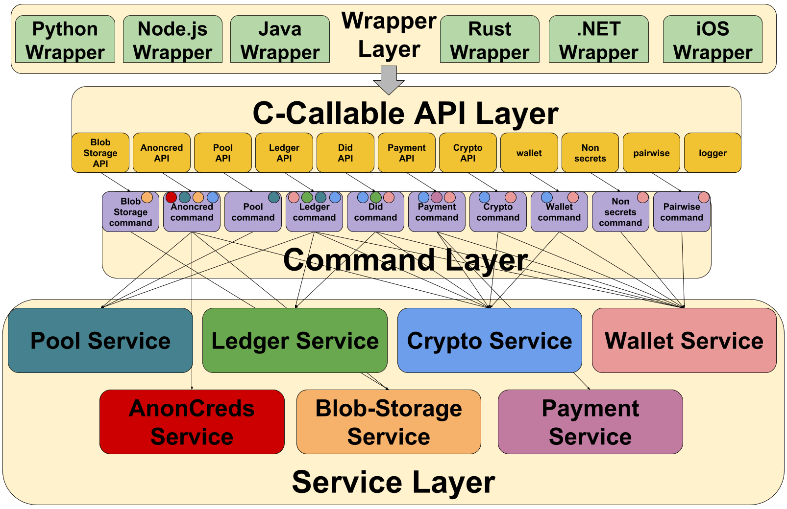

# Architecture

## Summary
At a high level the IndySDK is designed to be a software development kit that has many components to support and grow the Indy ecosystem. Two of the main functionalities that the IndySDK supports is communication with the Indy Ledger and formation of Indy Agents. At a deeper level, IndySDK contains a few libraries, but the primary focus of the IndySDK has been around libindy. Other additional libraries include vcx and libnullpay.

Libindy is the primary library intended to serve as a foundation for all things Hyperledger Indy. The core functionality of the ledger includes functionality to:

* Use anonymous credentials
* Store arbitrary data in a wallet
* Core cryptographic functionality like encrypting and decrypting messages for other users
* Perform CRUD operations with both on ledger and pairwise (off-ledger) DIDs
* Communicate with the Indy Ledger
* Support payment functionality
* Support a standard wallet API to interact with different DBs

Since this library was written in rust with a C-Callable API layer, it's also supports easier porting to other languages that support calling a C interface such as Python, Java, Objective C, and Node.js.

At a high level the architecture has been designed in an extensible way to support the use of high level commands. A visual diagram of the architecture is provided below.

### Wrapper Layer

The wrapper layer is for wrapping the C-Callable APIs to allow functionality to be supported in many different programming languages. If you'd like to learn more about using the SDK wrappers there's [How-to guides](docs/how-tos), [samples](samples), and [reference agents](https://github.com/hyperledger/indy-agent) that can help. Here's some links to the different wrappers available.

* [Python](wrappers/python/README.md)
* [NodeJS](wrappers/nodejs/README.md)
* [Java](wrappers/java/README.md)
* [iOS](wrappers/ios/README.md)
* [.Net](wrappers/dotnet/README.md)
* [Rust](wrappers/rust/README.md)

If you'd like to begin working on the SDK, a good place to start is making sure all of the wrappers support all of the APIs exposed by the C-Callable layer. This is done by adding foreign function interface (FFI) calls to the wrappers. Examples of this can be found in already supported APIs listed. Additionally, providing how-to guides and samples showing how to consume the wrappers is another good place to help contribute.

### API Layer

Next up, we've got the C-Callable API layer which is where we expose functionality and logic which can be consumed by the wrapper layers. The API layer and below is written in Rust but supports only simple native C types like integers, strings, and byte arrays. Complex data structures are intentional avoided to allow for a boarder support between the API layer and the Wrapper layer. Since most languages support the use of FFI functions (e.g. C interfaces called in a Python program) this allows us to keep functionality in lockstep by writing it in Rust and then porting it to other languages.

In this layer we expose 11 different modules which group together similar functionality. The modules are listed in the image above with descriptions, parameter usage, and other details of the specific API calls being commented in the wrappers and the API layer. The primary purpose of this layer is to convert the c types to rust types and to call commandExecutor to communicate with the command layer.

Some other important aspects that should be considered between the functional side of libindy (code written in rust) and the wrapper is around memory management. One of the important boundaries that was set when architecting this SDK is that memory that is created in the wrapper layer is managed and closed by the wrapper layer. Similarly any memory that is allocated to the functional side is closed out by the functional side. This allows for cleaner management of memory and  

### Command Layer

In the command layer, this is where functions combine the the majority of their logic. The command layer consumes the service layers and passes data between different services as is needed rather than allowing services to communicate directly with each other. When a particular command is called by the API layer by the CommandExecutor which then calls internal commands for each individual function. A command module will call one or many services to execute a function and then return the results back up to the API layer and then passed back up to the wrapper layer. Along with routing the commands to their respective module calls, the CommandExecutor also handles the creation of the services that are consumed by the command modules.

### Service Layer

Within the service layer we have very low level functions that can be consumed by the command layer. These low level functions are common functions which may be needed in many different command modules. For example within the crypto service, there is a common function to create a cryptographic key with a common interface to allow for key creation to happen for many different cryptographic material. The current implementation supports the creation of ed25519 keys, but could easily add support for secp256k1 keys as well.

Another example of the functions supported at the wallet service layer is the ability to take a key that was created and to be able to add it to a database that's exposed through a common wallet interface. This common wallet interface allows for different DBs to be plugged in to the wallet interface depending on the needs of the application.

In summary, the service layer can be thought of as a suite of helper primitives that will be consumed many times by the command layer. This helps libindy to adhere to the DRY (Don't repeat yourself) programming paradigm. Another advantage of the service layer is that it creates a clean, modular approach to quickly add new functionality at the API and command layers.

### Errors

This is where errors are specified in rust types which get translated at the API layer into errorcodes. Since only simple native c-types are used, libindy opts to pass integer error codes along the C-callable layer if some action fails in libindy. This allows wrapper consumers to gracefully detect errors that occurred in the SDK. A list of the errors can be found [here](../../../libindy/src/api/mod.rs). The comments give a short description of why the error may have occurred, but they won't help with debugging much. To get more information about the last error happened you can use a special call `get_current_error` -- more information about it can be found in documentation [here](https://github.com/hyperledger/indy-sdk/blob/d4df8e133e76708ceb6f2b663814b0618679656f/libindy/src/api/mod.rs#L288).

### Domains

This is where command specific structs are maintained which can be consumed by the command layer and the service layer.

### Utils

This is the directory that contains additional utility functions that may be useful. Usually their wrapping other functions, while also handling the transition to Indy specific Errors rather than using the errors provided by the functions that are wrapped. Some examples of utilities that are included are base64 encoding functions, base cryptographic primitives, and other support functionality.

### Tests

Given that one of the general principles of development within the core Indy team is to use [TDD](http://www.agiledata.org/essays/tdd.html) Within the tests directory, our medium level and high level integration tests of libindy live here. These are excellent places to look at usage of libindy as they make calls in the same way as you would in a wrapper. For more details around testing, checkout out this [doc](/docs/contributors/test-design.md).