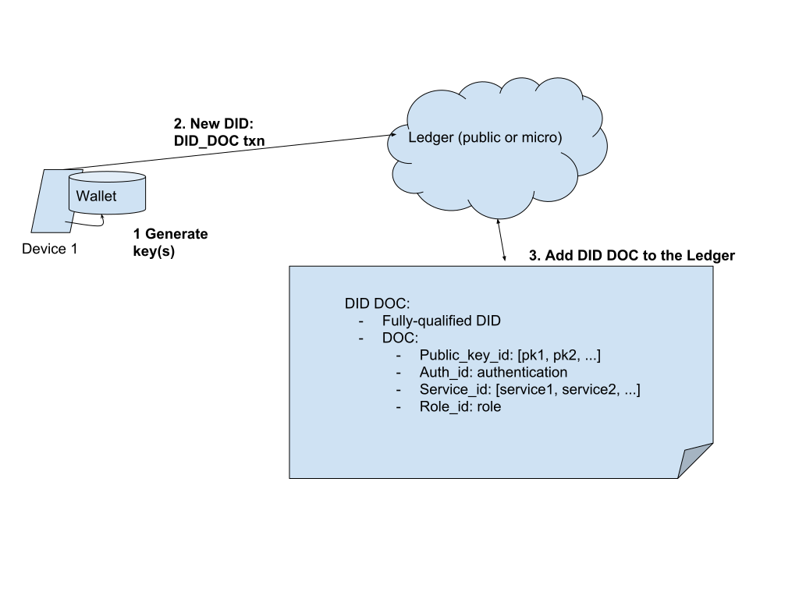
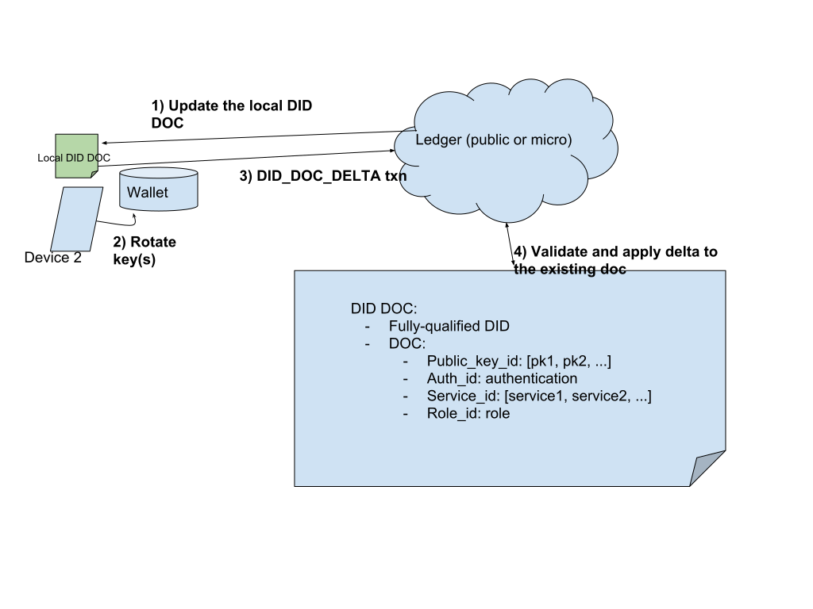
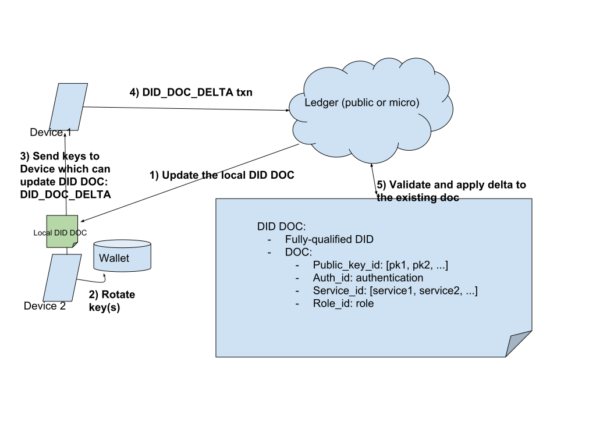
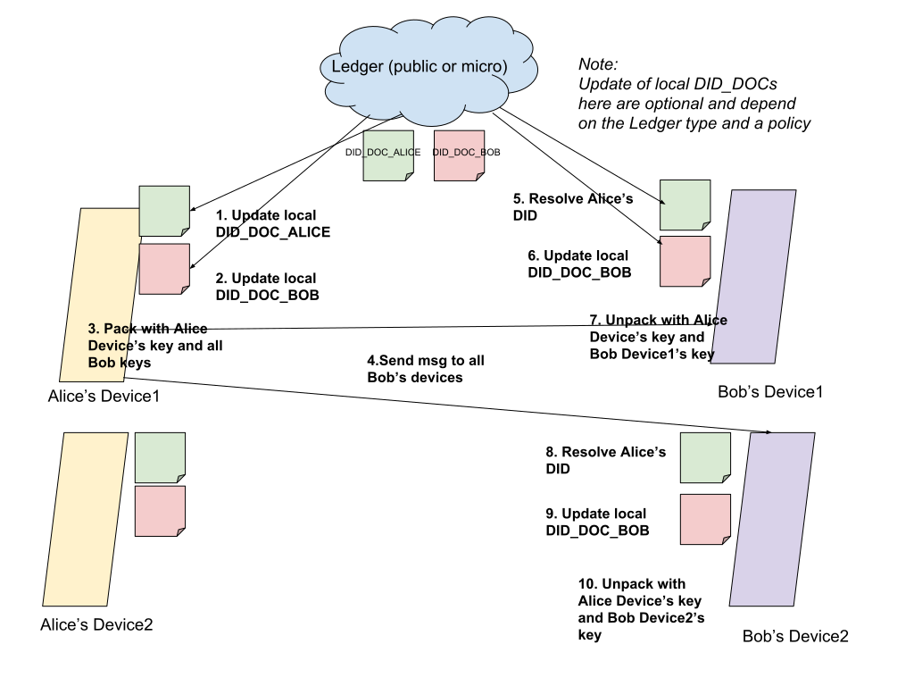

# DID Doc Support in Indy

## Purpose

The purpose of this document is to provide vision how we can integrate w3c DIDDoc specification to Indy
infrastructure and potentially achieve some level of interoperability with 3d party solutions that also
follow this specification.

## Use Cases

As an identity owner i want to:

1. create a new DID and 1 or multiple related keys
1. publish corresonded DID Doc to Public Ledger if i have sufficient rights
1. provide DID Doc to 3d party (Trust Ancher) for publishing to Public Ledger if i have no sufficient rights
1. publish new DID Doc to microledger
1. add second key to the DID DOC from a different edge device
1. rotate a key from an edge device
1. change authentication/authorization policies from one of the devices
1. change service endpoints from an edge device
1. support of multiple endpoints, each working with multiple edge devices
1. know the recent key for this edge device to be used for signature and A2A communication using this edge device
1. know if the key on the edge device can be used to perform modification of DID Doc on the ledger/microledger
1. have multiple keys associated with same DID on edge device
1. know the most recent DID DOC for the other side of communication
1. communicate if other side of communication uses a different did method:
    - For example, communication between entities from STN and SLN
    - For example, Communication between Indy/Sovrin and UPort
1. know what key(s) to use for signing/packing/A2A
1. know what key(s) to use for verification/unpacking/A2A
1. be able to publish existing DID Doc (maybe not as is) into a different ledger/microledger
1. be able to re-use existing crypto material in the new approach
1. communicate with clients using old (existing) approach
1. use different keys for A2A and client-to-ledger communication

### Create new DID and DID DOC



### Create key on 2nd Edge Device


### Rotate a key by an Edge Device who is authenticated to do the update



### Rotate a key by an Edge Device who is not authenticated to do the update



### A2A Communication



## Identity structure

On Indy SDK level DID-related identity has the following structure:

- DID Method
- Id string
- Keys (private and public) on different edge devices
  - Private keys are not shared between devices (the only possible exception is backup)
- Authorization, authentication and discovery meta information:
  - Public copy on ledger as DID DOC
  - Optional local copy or cache

## Design principles

1. Each edge device stores the following information for every owned DID:
    - Fully-qualified Did - Identifies data in storages
    - Private and public keys associated with the DID from this edge device - in Wallet
2. Each edge device can optionally store cached local copy of DID Doc for owned DID:
    - The current DID Doc copy is used for signing/pack.
    - The current DID Doc copy is synchronized between devices only through the Ledger (Public or microledger).
    - DID Doc is never sent from one device to another.
    - Local DID Doc copy is never updated explicitly.
    - If a change to DID Doc is needed, the corresponding txn is created and sent to the Ledger.
    - Different policies can be supported for updating the current DID DOC copy:
      - The default one may just go to the Ledger every time before accessing the DID/DIDDoc. For example, if edge wants
        to pack a message, it goes to the Ledger, gets the latest DID Doc, updates the local copy, and uses the local copy
        for packing.
      - Other policies may update it by timeout, or update by getting notifications from the Ledger/microledger
3. In communication between Agents:
    - DID Doc is never passed from one Agent (Alice) to another (Bob)
    - DID is the only thing which is passed
    - The receiver resolves the DID looking at the did method and going to the corresponding ledger (public or micro)
    - This will allow communication between old agents (not supporting DID Doc) and new ones using the new approach
4. The Ledger level is opaque. It doesn’t matter if this is public or micro ledger. Exact publishing and resolving strategy are
   defined by a pluggable Resolvers and doesn’t affect workflows.
5. To support DID Doc new transactions will be added to Indy Ledger:
    - DID_DOC
      - Consists of `did` and `doc`
      - The ‘doc’ fields is a map of the form {field_id -> field} where field_id is a unique identifier of a field in the doc, and field is one of the fields (either array or a single-value)
      - The following fields will be there (see [sovrin-did-method](https://sovrin-foundation.github.io/sovrin/spec/did-method-spec-template.html#sovrin-did-method):
         - Public keys
         - Services
         - Authentication
         - etc.
    - DID_DOC_DELTA
       - An array of the following values:
       - Field_id
       - Operation (ADD/REMOVE/EDIT)
       - New value (or id of removed value)
6. DID DOC Updates
    - Will be done incrementally as requests to the Ledger via DID DOC Deltas
    - Ledger will be responsible for validation (authentication and authorizations checks) and merging the incremental updates (DID DOC Deltas) to the DID DOC state
7. Support of multiple did methods
    - Will be done via Resolvers that can be registered by applications
    - There will be default resolver for 'peer' (microledger based) method
    - There will be out-of-the-box support of methods based on Indy ledgers with minumum configuration (SLN, STN and etc...)
8. Publishing existing DID/DID DOC to another Ledger/microledger
    - Will be done via explicit export method
9. Procedure that performs resolving DID will fallback to old wallet structure to allow using existing crypto materials with the new approach
10. The old (current) DID API will be deprecated
11. The new DID API will be created to allow:
     - Registering of DID methods
     - Creation of DIDs
     - Building of DID Docs and DID Doc deltas with builder pattern
     - Publishing of DID Doc and DID Doc deltas
     - Resolving of DID Docs

## Libindy API

### DID resolver configuration

#### Create DID Resolver instance

```Rust
// Create DID resolver instance
//
// By default supports peer method only. To support additional did methods
// indy_register_indy_did_method or indy_register_did_method can be called.
//
// options: - some options like cache policies
// returns - did_resolver_handle: handler ot DID Resolver instance
pub fn indy_create_did_resolver(options) -> Future<did_resolver_handle>
```

#### Register did method based on Indy pool with did resolver

```Rust
// Register did method based on Indy pool with did resolver.
//
// did_resolver_handle: resolver handle
// method: method name, for example, 'sov'
// pool_handle: pool_handle
// options: some options
// returns - ()
pub fn indy_register_indy_did_method(did_resolver_handle,
                                     method,
                                     pool_handle,
                                     options) -> Future<()>
```

#### Register custom did method with did resolver

```Rust
// Register custom did method with did resolver.
//
// did_resolver_handle: resolver handle
// method: method name, for example, 'custom'
// ..callbacks: list of callbacks that define method behaviour
// options: some options
// returns - ()
pub fn indy_register_did_method(did_resolver_handle,
                                method,
                                ..callbacks,
                                options) -> Future<()>
```

#### Close did resolver and releases all related resources

```Rust
// Close did resolver and releases all related resources.
//
// did_resolver_handle: resolver handle
// returns - ()
pub fn indy_close_did_resolver(did_resolver_handle) -> Future<()>
```

### Resolving DID Doc

#### Resolve DID Doc for DID

```Rust
// Resolve DID Doc for DID.
//
// did_resolver_handle: resolver handle
// did: did to resolve
// options: some options, like cache behaviour
// returns - did_doc: resolved DID Doc
pub fn indy_resolve_did_doc(did_resolver_handle,
                            did,
                            options) -> Future<did_doc>
```

### DID and DID keys creation

#### Creates a new DID

```Rust
// Create a new DID.
//
// Note: It doesn't create any records in the wallet.
//
// did_resolver_handle: resolver handle
// method: did method to use
// options: some options
// returns - did: Generated DID
pub fn indy_create_did(did_resolver_handle,
                       method,
                       options) -> Future<did>
```

#### Create a new key pair associated with DID

```Rust
// Create a new key pair associated with DID.
//
// It verifies that key options are compatible with method,
// creates and stores key in the wallet, creates and stores association
// of this key with did.
//
// Note: It can produce the same data as indy_create_my_did.
//
// did_resolver_handle: resolver handle
// did: did to associate with this key
// options: some options like key type and seed
// returns - key_json: json that describes the key. Can be passed to did
//                     doc builder
pub fn indy_create_did_key(did_resolver_handle,
                           did,
                           options) -> Future<key_json>
```

### DID Doc creation, updating and publishing

#### Create a new DID Doc builder instance

```Rust
// Create a new DID Doc builder instance.
//
// It tries to resolve did doc for provided did and creates builder that
// allows to modify did doc and publish it. If did doc isn't exists it
// starts building from scratch
//
// did_resolver_handle: resolver handle
// did: did to associate did doc
// options: some options like key type and seed
// returns - ddoc_builder_handle: did doc builder handle
pub fn indy_create_did_doc_builder(did_resolver_handle,
                                   did,
                                   options) -> Future<ddoc_builder_handle>
```

#### Add new public key item to DID Doc builder

```Rust
// Add new public key item to DID Doc builder.
//
// Note: id can be full DID Doc reference or fragment.
// In case of fragment reference will be related to current DID.
//
// ddoc_builder_handle: builder handle
// id: identifier of key
// key_json: key_json in format compatible with did method
// returns - ():
pub fn indy_did_doc_add_public_key(ddoc_builder_handle,
                                   id,
                                   key_json) -> Future<()>
```

#### Update public key item in DID Doc builder

```Rust
// Update public key item in DID Doc builder.
//
// Note: id can be full DID Doc reference or fragment.
// In case of fragment reference will be related to current DID.
//
// ddoc_builder_handle: builder handle
// id: identifier of key
// key_json: key_json in format compatible with did method
// returns - ():
pub fn indy_did_doc_update_public_key(ddoc_builder_handle,
                                      id,
                                      key_json) -> Future<()>
```

#### Delete public key item in DID Doc builder

```Rust
// Delete public key item in DID Doc builder.
//
// Note: id can be full DID Doc reference or fragment.
// In case of fragment reference will be related to current DID.
//
// Note: If key is referenced inside of DID Doc validation error will
// be returned.
//
// ddoc_builder_handle: builder handle
// id: identifier of key
// returns - ():
pub fn indy_did_doc_remove_public_key(ddoc_builder_handle,
                                      id) -> Future<()>
```

#### Add new authorization item to DID Doc builder

```Rust
// Add new authorization item to DID Doc builder.
//
// Note: id can be full DID Doc reference or fragment.
// In case of fragment reference will be related to current DID.
//
// If no key_json is present and id references current DID this reference
// must be exists. Otherwise validation error will be returned.
//
// ddoc_builder_handle: builder handle
// id: identifier of key
// key_json: key_json in format compatible with did method.
// returns - ():
pub fn indy_did_doc_add_authorization(ddoc_builder_handle,
                                      id,
                                      Option<key_json>) -> Future<()>
```

#### Update embedded authorization item with DID Doc builder

```Rust
// Update embedded authorization item with DID Doc builder.
//
// Note: id can be full DID Doc reference or fragment.
// In case of fragment reference will be related to current DID.
//
// ddoc_builder_handle: builder handle
// id: identifier of key
// key_json: key_json in format compatible with did method
// returns - ():
pub fn indy_did_doc_update_authorization(ddoc_builder_handle,
                                         id,
                                         Option<key_json>) -> Future<()>
```

#### Delete authorization item with DID Doc builder

```Rust
// Delete authorization item with DID Doc builder.
//
// Note: id can be full DID Doc reference or fragment.
// In case of fragment reference will be related to current DID.
//
// ddoc_builder_handle: builder handle
// id: identifier of key
// returns - ():
pub fn indy_did_doc_remove_authorization(ddoc_builder_handle,
                                         id) -> Future<()>
```

#### Add new service endpoint item to DID Doc builder

```Rust
// Add new service endpoint item to DID Doc builder.
//
// Note: id can be full DID Doc reference or path.
// In case of path reference will be related to current DID.
//
// ddoc_builder_handle: builder handle
// id: identifier of service endpoint
// endpoint_json: endpoint_json in format compatible with did method.
// returns - ():
pub fn indy_did_doc_add_service_endpoint(ddoc_builder_handle,
                                         id,
                                         endpoint_json) -> Future<()>
```

#### Update service endpoint item with DID Doc builder

```Rust
// Update service endpoint item with DID Doc builder.
//
// Note: id can be full DID Doc reference or path .
// In case of path reference will be related to current DID.
//
// ddoc_builder_handle: builder handle
// id: identifier of key
// endpoint_json: endpoint_json in format compatible with did method.
// returns - ():
pub fn indy_did_doc_update_service_endpoint(ddoc_builder_handle,
                                            id,
                                            endpoint_json) -> Future<()>
```

#### Delete service endpoint item with DID Doc builder

```Rust
// Delete service endpoint item with DID Doc builder.
//
// Note: id can be full DID Doc reference or path.
// In case of path reference will be related to current DID.
//
// ddoc_builder_handle: builder handle
// id: identifier of key
// returns - ():
pub fn indy_did_doc_remove_service_endpoint(ddoc_builder_handle,
                                            id) -> Future<()>
```

#### Finalize DID Doc builder and return corresonded DID Doc or DID Doc delta

```Rust
// Finalize DID Doc builder and return corresonded DID Doc or DID Doc delta.
//
// Note: Format of delta can be method specific.
// In case of path reference will be related to current DID.
//
// ddoc_builder_handle: builder handle
// id: identifier of key
// returns - did_doc_delta: DID Doc or DID Doc delta
pub fn indy_did_doc_finalize(ddoc_builder_handle) -> Future<did_doc_delta>
```

#### Publish DID Doc or DID Doc delta in distributed network

```Rust
// Publish DID Doc or DID Doc delta in distributed network.
//
// did_resolver_handle: resolver handle
// did_doc_delta: did doc or delta json
// options: Publish options specific for did method. For indy methods
//          it should at least contains:
//          - optional publisher did (can be current DID by default)
//          - optional keys to sign transaction (can be determined
//                         automatically)
// returns - ():
pub fn indy_did_doc_publish(did_resolver_handle,
                            did_doc_delta,
                            options) -> Future<did_doc_json>
```

## API Example

```Python
# This python example discovers the following use case:
#
# * Alice on Edge Device 1 creates DID and key pair for this DID
# * Alice on Edge Device 1 builds corresponded DID Doc
# * Alice on Edge Device 1 sends the DID Doc to Trust Anchor
# * Trust Anchor signs and publishes this DID Doc on Sovrin pool and Alice
#   on Edge Device 1 gets the control over DID
# * Alice on Edge Device 2 generates new key pair for DID
# * Alice on Edge Device 2 generates corresponded DID Doc delta and sends
#   it to Edge Device 1
# * Alice on Edge Device 1 signs and publishes this DID Doc Delta
#   on Sovrin pool
# * Alice shares DID with Bob. Bob can resolve DID Doc and trust both keys


# ------------ Alice on Edge Device 1 ----------------

# 1. Connect to Sovrin pool
let pool_handle = ... # open Sovrin pool

# 2. Create DID resolver instance
let did_resolver_handle = await did.create_did_resolver()

# 3. Register 'sov' DID method with DID resolver
await did.register_indy_did_method(did_resolver_handle,
                                   'sov',
                                    pool_handle, '{}')

# 4. Create new DID with 'sov' method
let did = await did.create_did(did_resolver_handle, 'sov', '{}')

# 5. Create new key pair associated with DID
let key_info = await did.create_did_key(did_resolver_handle,
                                        did,
                                        '{}')

# 5. Create new instance of DID Doc builder
let ddoc_builder_hanle =
     await did.create_did_doc_builder(did_resolver_handle,
                                      did)

# 6. Add public key to DID Doc with builder
await did.did_doc_add_public_key(ddoc_builder_hanle,
                                 'key-0',
                                 key_info)

# 7. Use this key for authorization
await did.did_doc_add_authorization(ddoc_builder_hanle,
                                    'key-0')

# 8. Add optional extra 'role' field to DID Doc
await did.did_doc_add_extra(ddoc_builder_hanle,
                            'role',
                            'TRUST_ANCHOR')

# 9. Finalize builder and get corresponded DID Doc
let did_doc = await did.did_doc_finalize(ddoc_builder_hanle)

# 10. Send DID Doc to Trust Anchor and DID to Edge Device 2
# ...

# ------------ Trust Anchor ----------------

# 11. Receive DID Doc from Alice
let did_doc = ... # Receive DID Doc from Alice

# 12. Create DID Resolver and register 'sov' method
let did_resolver_handle = ... # Create DID Resolver and register 'sov'
                              # method

# 13. Publish DID Doc
await did.did_doc_publish(did_resolver_handle,
                          did_doc,
                          toJson({
                            publisher: 'sov:sadfasasd12323qwe',
                            signatures: ['key-1']
                          }))

# ------------ Alice on Edge Device 2 ----------------

# 14. Receive DID from Alice on Edge Device 1
let did = ... # Receive DID from Alice

# 15. Create DID Resolver and register 'sov' method
let did_resolver_handle = ... # Create DID Resolver and register 'sov'
                              # method

# 16. Create new key pair associated with DID
let key_info = await did.create_did_key(did_resolver_handle,
                                        did,
                                        '{}')

# 17. Create new instance of DID Doc builder
let ddoc_builder_hanle =
     await did.create_did_doc_builder(did_resolver_handle,
                                      did)

# 18. Add public key to DID Doc with builder
await did.did_doc_add_public_key(ddoc_builder_hanle,
                                 'key-1',
                                 key_info)

# 19. Use this key for authorization
await did.did_doc_add_authorization(ddoc_builder_hanle,
                                    'key-1')

# 20. Finalize builder and get corresponded DID Doc delta
let did_doc_delta = await did.did_doc_finalize(ddoc_builder_hanle)

# 21. Send DID Doc delta to Edge Device 1
# ...

# ------------ Alice on Edge Device 1 ----------------

# 22. Receive DID Doc delta from Edge Device 2
let did_doc_delta = ... # Receive DID Doc from Edge Device 2

# 23. Publish DID Doc
await did.did_doc_publish(did_resolver_handle,
                          did_doc_delta ,
                          toJson({
                            publisher: did,
                            signatures: ['key-0']
                          }))

# 24. Send DID to Bob
# ...

# ------------ Bob ----------------

# 25. Receive DID from Alice
let did = ... # Receive DID from Alice

# 26. Create DID Resolver and register 'sov' method
let did_resolver_handle = ... # Create DID Resolver and register 'sov'
                              # method

# 27. Resolves Alice's DID Doc
let did_doc = did.resolve_did_doc(did_resolver_handle,
                                  did,
                                  '{}')
```

## Indy Node changes

TODO: FIXME: Provide here the link to Indy Node design as soon it will be available