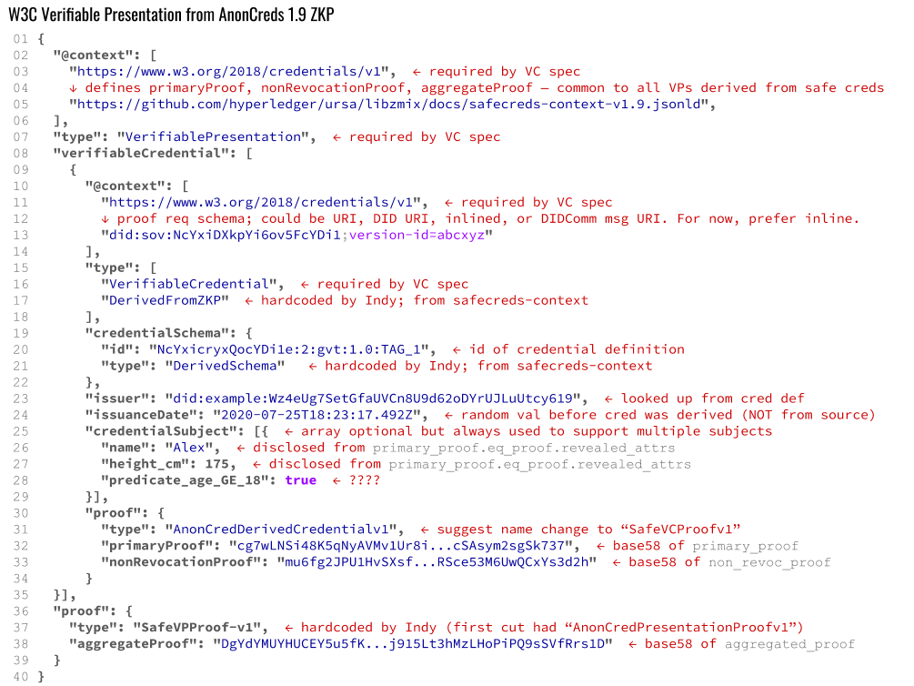

# Mapping between a Safe Creds Proof and W3C VP

## Introduction

This document describes the mappings between an Indy-style proof (hereafter, a “SafeCreds proof”[[1]](#footnote-1)) and a W3C Verifiable Presentation.

The source data is stored in the [domain::anoncreds::proof::Proof](https://github.com/hyperledger/indy-sdk/blob/98551d58176b58b9123720699e2e247cb9398e71/libindy/src/domain/anoncreds/proof.rs#L11) structure in libindy. This structure has a member named proof which is the actual ZKP of type [ursa::cl::Proof](https://github.com/hyperledger/ursa/blob/021a19d0a01d393dad5bfbea21c888eec18d502c/libursa/src/cl/mod.rs#L984); it also has some other fields which are not as important.

The target data has never been fully described in a public document. It is partially described in [Example 25 from the VC spec](https://www.w3.org/TR/vc-data-model/#example-25-a-verifiable-presentation-that-supports-cl-signatures), but the example is incomplete and non-normative.[[2]](footnote 2) It is also partially described by [tests written by Ken Ebert](https://github.com/ken-ebert/vc-test-generator).

## Versions of Mapping

These mappings need to be versioned. The Ursa structures may be updated; the W3C structures may be updated as well. In addition, the actual values plugged in to different places in the source and target data may evolve, and the technical ecosystems that expose these features are in significant flux at the same time. Thus, it’s important to filter everything in this doc through the lens of a specific version. The following version labels are used:

* **Anoncreds structures v1.9**: the version of structures in Ursa (crate version 0.3.2) and Indy (crate version 1.15.0) codebases in June 2020. Anoncreds 1.x features are actively supported, including tails-and-accumulator-based revocation. The number “1.9” doesn’t show up in release notes or library names; it’s intended to suggest that we’re talking about Anoncreds 1 technology late in its lifecycle, not long before “SafeCreds 2.0” (Anoncreds 2.x, renamed) features begin to be available in production releases.

* **VC 1.0**: the version of the VC spec that is currently a W3C Technical Recommendation.

* **Safecreds 2.x**: a loose cover term for a partly connected, partly independent set of features that includes new and improved merkle-tree-based revocation, rich schemas, and so forth. Many features from this generation of code already exist in some form in Ursa, but are not yet exposed in libindy, in Aries, or in products built atop these stacks. Features from this generation of code will be delivered piecemeal. The BBS+ signatures work that Mattr recently demoed overlaps significantly with the scope of Anoncreds 2.x and may end up being described with that label in Aries circles. The first Anoncreds 2.x feature to be delivered is likely to be enhanced revocation.

## Source Data (Anoncreds 1.9 ZKP)
Here is an example Indy ZKP from June 2020. The proof request it addresses is:

```jsonc
{
    "nonce": “2934823091873049823740198370q23984710239847”, 
    "name":"proof_req_1",
    "w3c": true,
    "version":"0.1",
    "requested_attributes":{
        "attr1_referent": {"name":"name"},
        "attr2_referent": {"name":"sex"},
        "attr3_referent": {"name":"phone"},
        "attr4_referent": {"names": ["name", "height"]}
    },
    "requested_predicates":{
        "predicate1_referent":{"name":"age","p_type":">=","p_value":18}
    }
}
```

In plain English, this request says: “Using a government-issued ID, disclose the credential holder’s name and height, hide the credential holder’s sex, get them to self-attest their phone number, and prove that their age is > 18.” Some string values are truncated.

```jsonc
{
  "proof":{
    "proofs":[
      {
        "primary_proof":{
          "eq_proof":{
            "revealed_attrs":{
              "height":"175",
              "name":"1139481716457488690172217916278103335"
            },
            "a_prime":"5817705...096889",
            "e":"1270938...756380",
            "v":"1138...39984052",
            "m":{
              "master_secret":"375275...0939395",
              "sex":"3511483...897083518",
              "age":"13430...63372249"
            },
            "m2":"1444497...2278453"
          },
          "ge_proofs":[
            {
              "u":{
                "1":"152500...3999140",
                "2":"147748...2005753",
                "0":"8806...77968",
                "3":"10403...8538260"
              },
              "r":{
                "2":"15706...781609",
                "3":"343...4378642",
                "0":"59003...702140",
                "DELTA":"9607...28201020",
                "1":"180097...96766"
              },
              "mj":"134300...249",
              "alpha":"827896...52261",
              "t":{
                "2":"7132...47794",
                "3":"38051...27372",
                "DELTA":"68025...508719",
                "1":"32924...41082",
                "0":"74906...07857"
              },
              "predicate":{
                "attr_name":"age",
                "p_type":"GE",
                "value":18
              }
            }
          ]
        },
        "non_revoc_proof":null
      }
    ],
    "aggregated_proof":{
      "c_hash":"108743...92564",
      "c_list":[ 6 arrays of 257 numbers between 0 and 255]
    }
  },
  "requested_proof":{
    "revealed_attrs":{
      "attr1_referent":{
        "sub_proof_index":0,
        "raw":"Alex",
        "encoded":"1139481716457488690172217916278103335"
      }
    },
    "revealed_attr_groups":{
      "attr4_referent":{
        "sub_proof_index":0,
        "values":{
          "name":{
            "raw":"Alex",
            "encoded":"1139481716457488690172217916278103335"
          },
          "height":{
            "raw":"175",
            "encoded":"175"
          }
        }
      }
    },
    "self_attested_attrs":{
      "attr3_referent":"8-800-300"
    },
    "unrevealed_attrs":{
      "attr2_referent":{
        "sub_proof_index":0
      }
    },
    "predicates":{
      "predicate1_referent":{
        "sub_proof_index":0
      }
    }
  },
  "identifiers":[
    {
      "schema_id":"NcYxiDXkpYi6ov5FcYDi1e:2:gvt:1.0",
      "cred_def_id":"NcYxi...cYDi1e:2:gvt:1.0:TAG_1",
      "rev_reg_id":null,
      "timestamp":null
    }
  ]
}
```

## Target Data (VP per VC 1.0 spec)

And here is the mapping we currently imagine. Notes are in red.

[](https://docs.google.com/drawings/d/1nkbGe-Z51IeAu-QTe33tHY6rLfoJay4ObHzqqooM604/edit)

## Notes and Questions

1. Notice the introduction of a generic “Anoncreds 1.9 VP JSON-LD context” on line 05 of the presentation. This file currently exists on my hard drive but is not checked into Ursa. Is Ursa the right place for it?

2. Lines 12-13 of the VP show a context for the derived credential, NOT for the issued credential. I am assuming this is correct, because providing a context for the issued credential won’t be able to explain the existence of predicates (see line 29 of the VP). Maybe “predicates” should be defined once in the generic Anoncreds 1.0 VP JSON-LD context referenced on line 05. Still, the fields listed shown in the derived credential were originally intended to be renamable. For example, the verifier could say in their proof request: “Give me either the last_name field from your driver’s license, or the surname field from your passport. Either way, I want to call that value the familyName field in the data you give me.” It’s not clear to me whether we want to preserve the ability to do that. If no, then perhaps we could use a JSON-LD context from the schema of the source credential here. Otherwise we need it to be the schema of the derived credential. If it’s the schema of the derived credential, then I suggest we inline the context when it’s an unfamiliar proof request, and reference an external context when it’s a canned, predefined proof request. Note that referencing an external context is not possible today, as this is an Anoncreds 2.x feature that’s not yet delivered.

3. It’s not clear where to get the value on line 17 of the VP.

4. Lines 19-21 of the VP shows a construct that the VC spec requires, but that will cause us some friction, I think. Right now the expectation is as documented in the red comments. However, if we dispense with cred defs per the Mattr vision, then line 20 may go away. More likely, it could turn into a hashlink that points somewhere besides a ledger. If the creddef includes or implies the schema, it’s not clear to me why line 21 is needed.

5. Line 28 shows one way to include predicates. It’s not clear whether this is a *good* way. The sample ZKP-derived VP in the VC spec didn’t show any predicates, so I’m making this up.

6. Note my suggested renames on lines 31 and 37. The name “anoncreds” has always caused us problems. We might as well rename this everywhere except in Ursa, if we can choose that path right now while it’s easy.

## footnote 1
 The entire VC community has suffered (still does suffer) from a pernicious misunderstanding about the meaning of “ZKP” and the intent of “anon” in “anoncreds.” It’s the credentials that are anonymous, not their holder. See [this article](https://dhh1128.github.io/zkpcreds/trust-paradox-rebuttal.html) for details. Because of the baggage around the misunderstood terms, I’m introducing a new and unencumbered term here: “safe creds.” Today, the only example of VC tech that I’d label with this term is the tech in Hyperledger Indy. However, a full stack implementation of the independent ZKP approach recently proposed by Mattr and based on BBS+ might also fit in this category, depending on how it addresses revocation and holder binding.
 
 ## footnote 2
[Example 24 from the spec](https://www.w3.org/TR/vc-data-model/#example-24-a-verifiable-credential-that-supports-cl-signatures), and the [credential converter that Brent previously wrote](https://github.com/evernym/pycred/blob/convert/anoncred1_to_W3CVC.py), are both suggestive but not directly relevant. This is because a CL-oriented credential as issued is not intended for direct sharing or presentation; rather, a new VC, derived just-in-time from what was issued, is always what is shared if ZKP technology is active.
