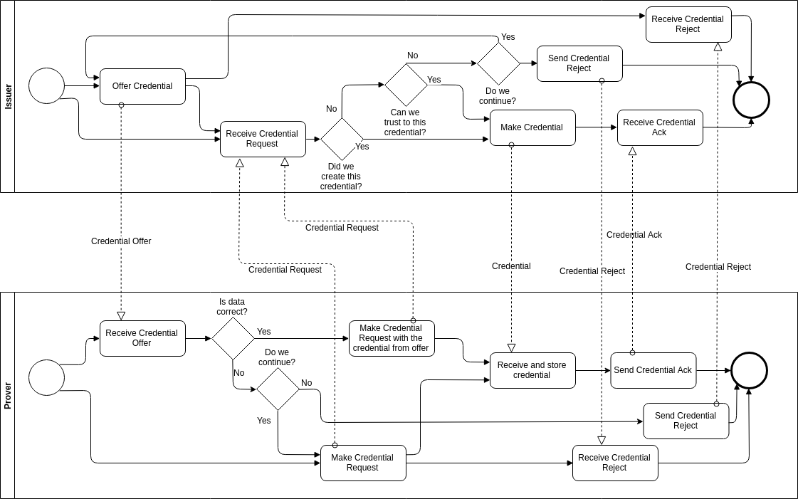
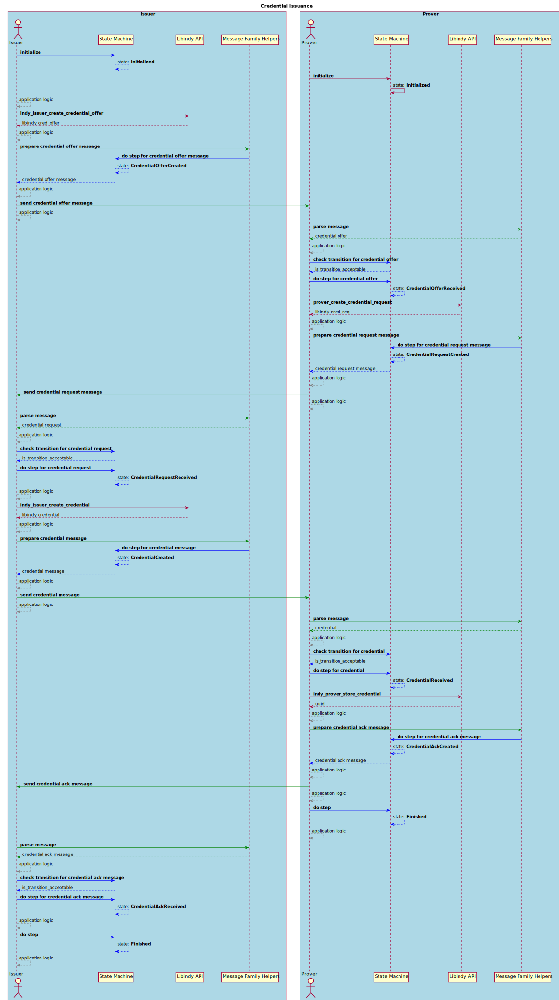

# Message Families

This design proposes definition of default credential exchange message family protocol and 
the way how a developer can extend Libindy to use his own API helper functions to support 
a new protocol message family definition.  

## Goals and ideas

* Allow extending LibIndy to support new protocol message families and modifying the implementation.
* Simplify process of making new message family definitions available in the common Indy ecosystem.
* Simplify the process of support new agents.
* Define default protocol message families. 
* Define State Machine that developer have to follow to support new protocol message families.
* Define the way LibIndy can consume new API functions.
* Define the flow of communication Libindy static API, custom Libindy API helpers and an application.

## Components

## Credential Issuance

### Message Family

The Credential Issuance Message Family consists of the following messages:

* Credential Offer
* Credential Request
* Credential Reject
* Credential
* Credential Ack

### State Machine

The Credential Issuance State Machine consists of the following states:

* Initialized
* Issuer related states:
    * CredentialOfferCreated
    * CredentialRequestReceived
    * CredentialRejectReceived
    * CredentialCreated
    * CredentialRejectCreated
    * CredentialAckReceived
* Prover related states:
    * CredentialOfferReceived
    * CredentialRequestCreated
    * CredentialRejectCreated
    * CredentialReceived
    * CredentialRejectReceived
    * CredentialAckCreated
* Finished

<table>
    <tr><th colspan="2">State Transitions</th><tr>
    <tr>  
      <th>State</th>
      <th>Transitions</th>
    </tr>
    <tr>
      <th colspan="2">Issuer related</th>
    <tr>
    <tr>
      <td>Initialized</td>
      <td>CredentialOfferCreated</td>
    </tr>
    <tr>
      <td>CredentialOfferCreated</td>
      <td>
        CredentialRequestReceived 
        CredentialRejectReceived
      </td>
    </tr>
    <tr>
      <td>CredentialRequestReceived</td>
      <td>
        CredentialCreated 
        CredentialRejectCreated
      </td>
    </tr>
    <tr>
      <td>CredentialCreated</td>
      <td>
        CredentialAckReceived 
        CredentialRejectReceived
      </td>
    </tr>
    <tr>
      <td>CredentialAckReceived</td>
      <td>Finished</td>
    </tr>
    <tr>
      <th colspan="2">Prover related</th>
    </tr>
    <tr>
      <td>Initialized</td>
      <td>CredentialOfferReceived</td>
    </tr>
    <tr>
      <td>CredentialOfferReceived</td>
      <td>
        CredentialRequestCreated 
        CredentialRejectCreated
      </td>
    </tr>
    <tr>
      <td>CredentialRequestCreated</td>
      <td>
        CredentialReceived 
        CredentialRejectReceived
      </td>
    </tr>
    <tr>
      <td>CredentialReceived</td>
      <td>
        CredentialAckCreated 
        CredentialRejectCreated
      </td>
    </tr>
    <tr>
      <td>CredentialAckCreated</td>
      <td>Finished</td>
    </tr>
    <tr>
      <th colspan="2">Common</th>
    <tr>
    <tr>
      <td>CredentialRejectCreated</td>
      <td>Finished</td>
    </tr>
    <tr>
      <td>CredentialRejectReceived</td>
      <td>Finished</td>
    </tr>
</table>

### Workflow

The Credential Issuance positive workflow is demonstrated on the following diagram:

## Credential Exchange

### Message Family

The Credential Exchange Message Family consists of the following messages:

* Presentation Request
* Presentation
* Presentation Ack
* Presentation Reject

### State Machine

The Credential Exchange State Machine consists of the following states:

* Initialized
* Prover related states:
    * PresentationRequestReceived
    * PresentationCreated
    * PresentationRejectCreated
    * PresentationAckReceived
    * PresentationRejectReceived
* Verifier related states:
    * PresentationRequestCreated
    * PresentationReceived
    * PresentationRejectReceived
    * PresentationAckCreated
    * PresentationRejectCreated
* Finished

<table>
    <tr><th colspan="2">State Transitions</th><tr>
    <tr>  
      <th>State</th>
      <th>Transitions</th>
    </tr>
    <tr>
      <th colspan="2">Verifier related</th>
    <tr>
    <tr>
      <td>Initialized</td>
      <td>PresentationRequestCreated</td>
    </tr>
    <tr>
      <td>PresentationRequestCreated</td>
      <td>
        PresentationReceived 
        PresentationRejectReceived
      </td>
    </tr>
    <tr>
      <td>PresentationReceived</td>
      <td>
        PresentationAckCreated 
        PresentationRejectCreated
      </td>
    </tr>
    <tr>
      <td>PresentationAckCreated</td>
      <td>Finished</td>
    </tr>
    <tr>
      <th colspan="2">Prover related</th>
    </tr>
    <tr>
      <td>Initialized</td>
      <td>PresentationRequestReceived</td>
    </tr>
    <tr>
      <td>PresentationRequestReceived</td>
      <td>
        PresentationCreated 
        PresentationRejectCreated
      </td>
    </tr>
    <tr>
      <td>PresentationCreated</td>
      <td>
        PresentationAckReceived 
        PresentationRejectReceived
      </td>
    </tr>
    <tr>
      <td>PresentationAckReceived</td>
      <td>Finished</td>
    </tr>
    <tr>
      <th colspan="2">Common</th>
    </tr>
    <tr>
      <td>PresentationRejectCreated</td>
      <td>Finished</td>
    </tr>
    <tr>
      <td>PresentationRejectReceived</td>
      <td>Finished</td>
    </tr>
</table>

### Workflow

The Credential Exchange positive workflow is demonstrated on the following diagram:

## Unresolved questions

* Which one approach should be used for Transport layer?
    * Framework specific functions calling by an application.
    * Pluggable functions defined as a part of Libindy Helpers API.
    * Callbacks passed to `do step` state machine function and automatically called.
