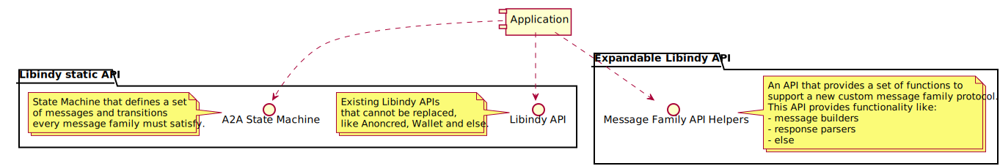
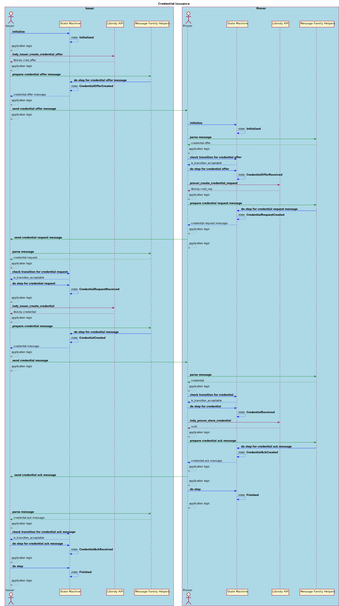
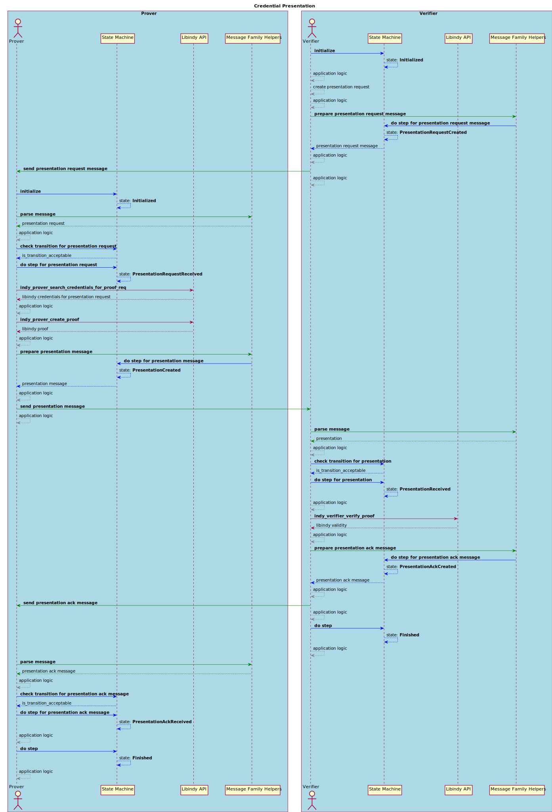

# Message Families

This design proposes definition of default credential exchange message family protocol and 
the way how a developer can extend Libindy to use his own API helper functions to support 
a new protocol message family definition.  

## Goals and ideas

* Allow extending LibIndy to support new protocol message families and modifying the implementation.
* Simplify process of making new message family definitions available in the common Indy ecosystem.
* Simplify the process of support new agents.
* Define default protocol message families. 
* Define State Machine that developer have to follow to support new protocol message families.
* Define the way LibIndy can consume new API functions.
* Define the flow of communication Libindy static API, custom Libindy API helpers and an application.

## Components



## Credential Issuance

### Message Family

The Credential Issuance Message Family consists of the following messages:

* Credential Offer
* Credential Request
* Credential Reject
* Credential
* Credential Ack

#### Credential Offer
This message is sent by Issuer to Prover to initiate credential issuance process. 
Schema:
```json
{
    "@type": "did:sov:BzCbsNYhMrjHiqZDTUASHg;spec/credential-issuance/1.0/credential-offer",
    "@id": "<uuid-offer>",
    "cred_def_id": "KTwaKJkvyjKKf55uc6U8ZB:3:CL:59:tag1",
    "comment": "some comment",
    "~attach": [
        {
            "nickname": "libindy-cred-offer",
            "mime-type": "application/json",
            "content": {
                "base64": "<bytes for base64>"
            }
        },
        {
            "nickname": "credential-preview",
            "mime-type": "application/json",
            "content": {
                "base64": "<bytes for base64>"
            }
        }
    ]
}
```

Description of fields:
* `comment` - a field that provide some human readable information about this Credential Offer.
* `cred_def_id` - id cof credential definition for offered credential
* attachment `libindy-cred-offer` - libindy generated data about credential offer
* attachment `credential-preview` - preview of credential.

#### Credential Request
This message is sent in response to Credential Offer by Prover to give needed details for credential issuance.
Schema:
```json
{
    "@type": "did:sov:BzCbsNYhMrjHiqZDTUASHg;spec/credential-issuance/1.0/credential-request",
    "@id": "<uuid-request>",
    "cred_def_id": "2hoqvcwupRTUNkXn6ArYzs:3:CL:1766",
    "comment": "some comment",
    "~attach": [
        {
            "nickname": "libindy-cred-req",
            "mime-type": "application/json",
            "content": {
                "base64": "<bytes for base64>"
            }
        },
        {
            "nickname": "credential-preview",
            "mime-type": "application/json",
            "content": {
                "base64": "<bytes for base64>"
            }
        }
    ]
}
```

Description of Fields:
* `cred_def_id` - Credential Definition ID for requested credential
* `comment` - a field that provide some human readable information about this Credential Offer.
* attachment `libindy-cred-req` - libindy generated data that is needed to Issuer to issue a credential.
* attachment `credential-preview` - optional attachment with preview of credential that Prover wants to get.

#### Credential
This message contains the credential and sent in responce to Credential Request by Issuer. 
Schema:
```json
{
    "@type": "did:sov:BzCbsNYhMrjHiqZDTUASHg;spec/credential-issuance/1.0/credential",
    "@id": "<uuid-credential>",
    "rev_reg_def_id": "<rev_reg_def_id>",
    "cred_def_id": "2hoqvcwupRTUNkXn6ArYzs:3:CL:1766",
    "~attach": [
        {
            "nickname": "libindy-cred",
            "mime-type": "application/json",
            "content": {
                "base64": "<bytes for base64>"  
            }
        }
    ]
}
```

Description of fields:

* `rev_reg_def_id` - ID of Revocation Registry Definition this credential were issued to
* `cred_def_id` - ID of Credential Definition this credential were issued to
* attachment `libindy-cred` - an actual credential to store, it is a json encoded in base64

#### Credential Reject
This message can be sent by any side of the conversation to finish credential issuance process without any credential created. 
Schema:
```json
{
    "@type": "did:sov:BzCbsNYhMrjHiqZDTUASHg;spec/credential-issuance/1.0/reject",
    "@id": "id"
}
```

#### Credential Ack
This message is sent by Prover as he confirms that he had received the credential and everything is correct. 
Schema:
```json
{
    "@type": "did:sov:BzCbsNYhMrjHiqZDTUASHg;spec/credential-issuance/1.0/ack",
    "@id": "id"
}
```

### State Machine

The Credential Issuance State Machine consists of the following states:

* Initialized
* Issuer related states:
    * CredentialOfferCreated
    * CredentialRequestReceived
    * CredentialCreated
    * CredentialAckReceived
* Prover related states:
    * CredentialOfferReceived
    * CredentialRequestCreated
    * CredentialReceived
    * CredentialAckCreated
* CredentialRejectCreated
* CredentialRejectReceived
* Finished

#### Initialized
Common state for both parties. Indicates initiation of issuance process.
Transitions:
* Issuer
    * CredentialOfferCreated - issuer acts as an initiator.
    * CredentialRequestReceived - prover already prepared credential request and sent to issuer (prover acts as an initiator). 
* Prover
    * CredentialOfferReceived - prover received Credential Offer message from issuer.
    * CredentialRequestCreated - prover already has data for request creation and acts as an initiator.

#### CredentialOfferCreated
Issuer specific state that means that Credential Offer message has been created and sent to Prover.
Transitions:
* CredentialRequestReceived - prover replied with Credential Request message.
* CredentialRejectReceived - prover replied woth Credential Reject message.
    
#### CredentialRequestReceived
Issuer specific state that means that Prover replied with Credential Request message on offer.
Transitions:
* CredentialCreated - credential created and sent to prover
* CredentialRejectCreated - issuer interrupted credential issuance process for some reason.

#### CredentialCreated
Issuer specific state that means that Credential message has been created and sent to Prover.
Transitions:
* CredentialAckReceived - prover accepted credential and replied with Credential Ack message.
* CredentialRejectReceived - prover rejected credential for some reason.
    
#### CredentialAckReceived
Issuer specific state that means that Prover replied with Credential Ack message on credential.
Transitions:
* Finished - credential issuance process is completed.

#### CredentialOfferReceived
Prover specific state that means that Credential Offer message has been received from Issuer.
Transitions:
* CredentialRequestCreated - prover accepted offer and replied with Credential Request message.
* CredentialRejectCreated - prover rejected credential offer for some reason.

#### CredentialRequestCreated
Prover specific state that means that Credential Offer message has been accepted and 
Credential Request message created and sent to Issuer.
Transitions:
* CredentialReceived - credential message received from Issuer.
* CredentialRejectReceived - issuer interrupted issuance process for some reason.

#### CredentialReceived
Prover specific state that means that Credential message has been received from Issuer.
Transitions:
* CredentialAckCreated - prover accepted credential and replied with Credential Ack message.
* CredentialRejectCreated - prover rejected credential and interrupted issuance process for some reason.

#### CredentialAckCreated
Prover specific state that means that Credential Ack message created and sent to Issuer.
Transitions:
* Finished - credential issuance process is completed.

#### CredentialRejectCreated
Common state for both parties. Indicates interruption of issuance process.
Transitions:
* Finished - credential issuance process is interrupted.

#### CredentialRejectReceived
Common state for both parties. Indicates interruption of issuance process by opposite side.
Transitions:
* Finished - credential issuance process is interrupted.

### Choreography Diagram


### Workflow

The Credential Issuance positive workflow is demonstrated on the following diagram:



## Credential Presentation

### Message Family

The Credential Presentation Message Family consists of the following messages:

* Presentation Request
* Presentation
* Presentation Ack
* Presentation Reject

#### Presentation Request
Presentation Request is a message from Verifier to Prover that describes values that 
need to be revealed and predicates that need to be fulfilled. 
Schema:
```json
{
    "@type": "did:sov:BzCbsNYhMrjHiqZDTUASHg;spec/credential-presentation/1.0/presentation-request",
    "@id": "<uuid-request>",
    "comment": "some comment",
    "~attach": [
        {
            "nickname": "libindy-presentation-request",
            "mime-type": "application/json",
            "content":  {
                "base64": "<bytes for base64>"
            }
        }
    ]
}
```

Description of fields:

* `comment` -- a field that provide some human readable information about this Credential Offer.
* attachment `libindy-proof-request` -- base64-encoded data needed for libindy to process proof request.

#### Presentation
This message is a response to a Presentation Request message and contains signed presentations. 
Schema:
```json
{
    "@type": "did:sov:BzCbsNYhMrjHiqZDTUASHg;spec/credential-presentation/1.0/presentation",
    "@id": "<uuid-presentation>",
    "comment": "some comment",
    "~attach": [
        {
            "nickname": "libindy-presentation",
            "mime-type": "application/json",
            "content": {
                "base64": "<bytes for base64>"
            }
        },
        {
            "nickname": "presentation-request-preview",
            "mime-type": "application/json",
            "content": {
                "base64": "<bytes for base64>"
            }
        }
    ]
}
```

Decription of fields:

* `comment` -- a field that provide some human readable information about this Credential Offer.
* attachment `libindy-presentation` -- actual presentation for presentation request, represented by base64-encoded json.
* attachment `presentation-request-preview` -- preview of presentation request that prover is willing to fullfil. Used for negotiation purposes.

#### Presentation Reject
This message can be sent by any side of the conversation to finish credential presentation process without any proof provided. 
Schema:
```json
{
    "@type": "did:sov:BzCbsNYhMrjHiqZDTUASHg;spec/credential-presentation/1.0/reject",
    "@id": "id"
}
```

#### Presentation Ack
This message is sent by Verifier as he confirms that he had received the proof and validated it. 
Schema:
```json
{
    "@type": "did:sov:BzCbsNYhMrjHiqZDTUASHg;spec/credential-presentation/1.0/ack",
    "@id": "id"
}
```

### State Machine

The Credential Presentation State Machine consists of the following states:

* Initialized
* Verifier related states:
    * PresentationRequestCreated
    * PresentationReceived
    * PresentationAckCreated
* Prover related states:
    * PresentationRequestReceived
    * PresentationCreated
    * PresentationAckReceived
* PresentationRejectCreated
* PresentationRejectReceived
* Finished

#### Initialized
Common state for both parties. Indicates initiation of presentation process.
Transitions:
* Verifier
    * PresentationRequestCreated - Presentation Request message sent to prover.
* Prover
    * PresentationRequestReceived - Presentation Request message received from verifier.

#### PresentationRequestCreated
Verifier specific state that means that Presentation Request message has been created and sent to Prover.
Transitions:
* PresentationReceived - prover accepted request and replied with Presentation message.
* PresentationRejectReceived - prover rejected request and replied with Presentation Reject message.
    
#### PresentationReceived
Verifier specific state that means that Prover accepted presentation request and replied with Presentation message.
Transitions:
* PresentationAckCreated - verifier accepted presentation and replied with Presentation Ack message.
* PresentationRejectCreated - verifier rejected presentation and replied with Presentation Reject message.
    
#### PresentationAckCreated
Verifier specific state that means that presentation has been accepted and Presentation Ack sent to Prover.
Transitions:
* Finished - credential presentation process is completed.

#### PresentationRequestReceived
Prover specific state that means that Presentation Request message has been received from Verifier.
Transitions:
* PresentationCreated - prover accepted presentation request, created a proof and replied with Presentation message.
* PresentationRejectCreated - prover rejected presentation request for some reason.

#### PresentationCreated
Prover specific state that means that Presentation message has been sent to Verifier.
Transitions:
* PresentationAckReceived - prover accepted presentation and replied with Presentation Ack message.
* PresentationRejectReceived -  prover rejected presentation and interrupted process for some reason.

#### PresentationAckReceived
Prover specific state that means that Presentation has been accepted and Presentation Ack message received from Verifier.
Transitions:
* Finished - credential presentation process is completed.

#### PresentationRejectCreated
Common state for both parties. Indicates interruption of presentation process.
Transitions:
* Finished - presentation process is interrupted.

#### PresentationRejectReceived
Common state for both parties. Indicates interruption of presentation process by opposite side.
Transitions:
* Finished - presentation process is interrupted.

### Choreography Diagram


### Workflow

The Credential Presentation positive workflow is demonstrated on the following diagram:



## Unresolved questions

* Which approach should be used for Transport layer?
    * Framework specific functions calling by an application.
    * Pluggable functions defined as a part of Libindy Helpers API.
    * Callbacks passed to `do step` state machine function and automatically called.
