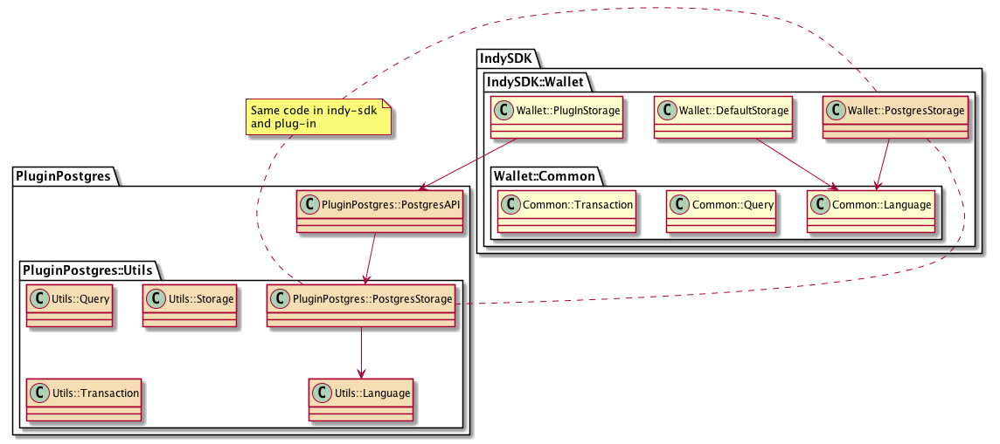
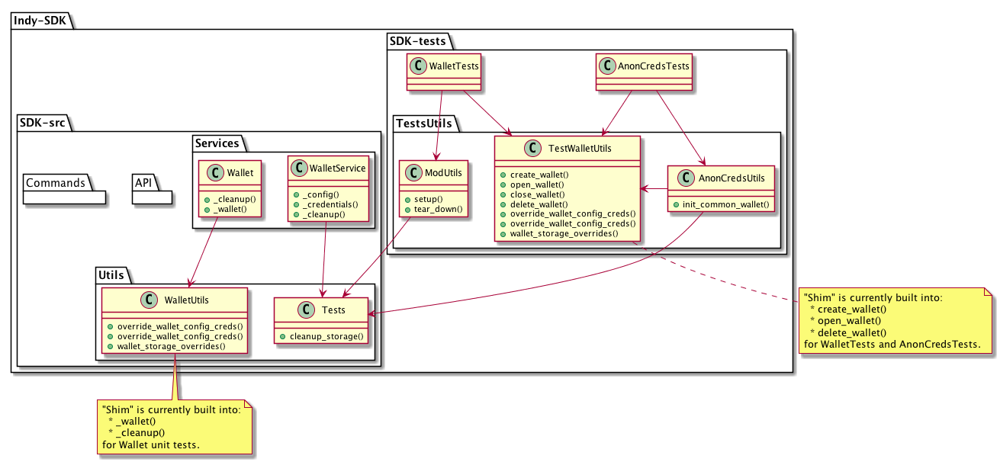

# Summary
[summary]: #summary

This repository contains a Postgres wallet storage plug-in for Indy-sdk.

This document contains the following sections:

- "Tutorial" - How to install, test and integrate the Postgres storage plug-in
- "Reference" - Design and implementation of the Postgres plug-in
- "Outstanding Issues".  Outstanding issues (including "hacks" that had to be made to get the Postgres plug-in working)

# Tutorial
[tutorial]: #tutorial

This section describes how to install and run the Postgres wallet storage plug-in.

The Postgres storage plug-in is based on the indy-sdk wallet plug-in storage design:

- https://github.com/hyperledger/indy-sdk/tree/master/docs/design/003-wallet-storage

This plug-in is implemented for a Postgres database.

## Installing and Testing the Postgres Plug-in

Before you can test the Postgres plug-in you need to have an Indy network running, as well as a local Postgres database.

You can startup an Indy network in many ways, for example as documented in the Indy-sdk README (https://github.com/hyperledger/indy-sdk#1-starting-the-test-pool-on-localhost)

```
cd indy-sdk
docker build -f ci/indy-pool.dockerfile -t indy_pool .
docker run -itd -p 9701-9708:9701-9708 indy_pool
```

You can startup a local Postgres database with the following command:

```
docker run --name some-postgres -e POSTGRES_PASSWORD=mysecretpassword -d -p 5432:5432 postgres -c 'log_statement=all' -c 'logging_collector=on' -c 'log_destination=stderr'
```

Note this command is available in the local script "./start_postgres.sh".

You should have two docker containers running - one for the Indy network and one for the Postgres database.

Note that with the above command (it starts the Postgres database in debug mode) you can monitor database command activity as follows:

```
# first get the id of the Postgres docker container
docker ps
# then connect to the Postgres container and watch the log file:
docker exec -it <container id> bash
# in the Postgres docker container run the following:
cd /var/lib/postgresql/data/log
tail -f <the latest postgres log file>
# you will see each SQL command executed
```

This is useful to see when the application is actually connecting to Postgres.

To build and run the Postgres plug-in:

- Clone (or fork and clone) the above repository
- Build each project (indy-sdk/libindy, indy-sdk/cli, indy-sdk/experimental/plugins/postgres_storage):

```
git clone https://github.com/hyperledger/indy-sdk.git
cd <to each project directory>
cargo build
```

To run the unit tests for the Postgres storage plug-in:

```
cd indy-sdk/experimental/plugins/postgres_storage
RUST_BACKTRACE=1 cargo test -- --nocapture --test-threads=1
```

## Running CLI with the Postgres Plug-in

The CLI has been updated to include parameters to support loading external wallet storage from an external plug-in, and extra parameters to specify configuration and credentials when creating, opening and deleting a wallet:

```
indy> wallet create help
Command:
	wallet create - Create new wallet and attach to Indy CLI

Usage:
	wallet create <name-value> key[=<key-value>] [key_derivation_method=<key_derivation_method-value>] [storage_type=<storage_type-value>] [storage_config=<storage_config-value>] [storage_credentials=<storage_credentials-value>]

Parameters are:
	name - Identifier of the wallet
	key - (leave empty for deferred input) Key or passphrase used for wallet key derivation.
                                               Look to key_derivation_method param for information about supported key derivation methods.
	key_derivation_method - (optional) Algorithm to use for wallet key derivation. One of:
                                    argon2m - derive secured wallet key (used by default)
                                    argon2i - derive secured wallet key (less secured but faster)
                                    raw - raw wallet key provided (skip derivation)
	storage_type - (optional) Type of the wallet storage.
	storage_config - (optional) The list of key:value pairs defined by storage type.
	storage_credentials - (optional) The list of key:value pairs defined by storage type.

Examples:
	wallet create wallet1 key
	wallet create wallet1 key storage_type=default
	wallet create wallet1 key storage_type=default storage_config={"key1":"value1","key2":"value2"}

indy>
```

To run a CLI demo using the Postgres plug-in, there is a batch script which illustrates these commands:

```
cd indy-sdk/cli
RUST_BACKTRACE=1 LD_LIBRARY_PATH=../samples/storage/storage-postgres/target/debug/ cargo run ../samples/storage/storage-postgres/cli_ps_test.txt
```

This script dynamically loads the Postgres storage, creates and opens a wallet, creates a DID, and then closes and deletes the wallet.  Note this command is available in the local script "./postgres-cli-test.sh"

## Running Python "Getting Started" Example with the Postgres Plug-in

The Python "getting started" example has been updated to support use of a plug-in wallet storage, via command-line parameters to the "getting_started.py" script:

```
PYTHONPATH=.:../../wrappers/python/ python3 src/getting_started.py --help
usage: getting_started.py [-h] [-t STORAGE_TYPE] [-l LIBRARY] [-e ENTRYPOINT]
                          [-c CONFIG] [-s CREDS]

Run python getting-started scenario (Alice/Faber)

optional arguments:
  -h, --help            show this help message and exit
  -t STORAGE_TYPE, --storage_type STORAGE_TYPE
                        load custom wallet storage plug-in
  -l LIBRARY, --library LIBRARY
                        dynamic library to load for plug-in
  -e ENTRYPOINT, --entrypoint ENTRYPOINT
                        entry point for dynamic library
  -c CONFIG, --config CONFIG
                        entry point for dynamic library
  -s CREDS, --creds CREDS
                        entry point for dynamic library
```

The command to run "getting_started.sh" with the Postgres plug-in is:

```
PYTHONPATH=.:../../wrappers/python/ python3 src/getting_started.py -t postgres_storage -l ../../experimental/plugins/postgres_storage/target/debug/libindystrgpostgres.dylib -e postgresstorage_init -c '{"url":"localhost:5432"}' -s '{"account":"postgres","password":"mysecretpassword","admin_account":"postgres","admin_password":"mysecretpassword"}'
```

Note that this is also available in the local script "./postgres-getting-started.sh"

## Running Indy-sdk Tests with the Postgres Plug-in

<blockquote>

Note that this section describes updates to unit tests that have not been incorporated into the hyperledger repository.  The code is available (not maintained) in "https://github.com/ianco/indy-sdk/tree/postgres_plugin".

</blockquote>

<blockquote>

Note that the Postgres shared library is built in the "indy-sdk/samples/storage/storage-postgres/target/debug" directory - this directory needs to be added to the LD_LIBRARY_PATH environment variable in order to load this shared library.  You can set this variable globally ("export LD_LIBRARY_PATH=<path to shared lib>"), or it can be set when running each command.

Several environment variables have been setup to specify when the non-default wallet storage is to be used for unit tests:

| Variable | Value (e.g.) | Description |
|-|-|-|
| STG_CONFIG | {"url":"http://localhost:5432"} | Json configuration string to be passed to the plug-in |
| STG_CREDS | {"account":"posgres","password":"secret"} | Json credentials to be passed to the plug-in |
| STG_TYPE | postgres | Name of the storage plug-in type within Indy |
| STG_LIB | libindystrgpostgres.dylib | Name of the C-callable shared library to load |
| STG_FN_PREFIX | postgreswallet_fn_ | Prefix for all wallet API functions within the shared library |

Alternately, a shortcut is also available to default all of these parameters for the Postgres plug-in:

| Variable | Value (e.g.) | Description |
|-|-|-|
| STG_USE | postgres | Set all the above variables for the Postgres plug-in |

If none of these variables are specified, the tests will run against the default storage.

For example to run indy-sdk unit tests using the postgres wallet storage:

```
cd indy-sdk/libindy
export LD_LIBRARY_PATH=<path to shared lib>
RUST_BACKTRACE=1 STG_USE=postgres cargo test <test to run> -- --nocapture --test-threads=1
```

Sample test targets, that have been "shimmed" to understand plug-ins, include the following:

- dynamic_storage_cases - Tests that plug-ins can be loaded and executed
- wallet_tests - Unit tests for the wallet service, includes a large test suite for wallet search (which is currently not implemented within the plug-in unit tests)
- high_cases - Specifically for anoncreds and wallet - These are high-level tests within the "libindy/tests" directory

You can specify one of the above, or just run "STG_USE=postgres cargo test" to run *all* the tests.  If you monitor the Postgres database (as described above) you will see when a unit test interacts with the Postgres database.

Note that STG_USE in the above example is a shortcut for Postgres, you can also individually specify STG_CONFIG, STG_CREDS, STG_TYPE, etc.

</blockquote>

# Reference
[reference]: #reference

## Postgres Plug-in Design and Implementation

The Postgres plug-in was developed in two stages:

1. Copy the existing default plug-in and convert from SQLite to Postgres (within the indy-sdk)
1. "Wrap" the Postgres plug-in with a separate API class to handle marshalling and unmarshalling the API parameters and responses

In this manner the same code can run both the Indy-sdk and plug-in versions of the Postgres storage:



In the above diagram:

- The Postgres storage within the Indy-sdk is a copy of the existing "default" SQLite storage, modified to connect to a Postgres database (note this was a transitional step during development)
- The Postgres storage in the plug-in is essentially the same code, wrapped in a "shim" to support conversion between the c-callable API's and the rust functions

There were some changes required to support running in the plug-in vs statically linking in the Indy-sdk:

- Postgres database connections cannot be shared between threads, so the r2d2 connection pool was included to manage pooled connections (https://docs.rs/r2d2/0.8.2/r2d2/ and https://docs.rs/r2d2_postgres/0.14.0/r2d2_postgres/)
- Because database connections can't be shared, the StorageIterator wasn't implemented, and search results are cached as record sets (the full set of records is loaded and stored in a memory cache) - this is discussed below as an "outstanding issue"
- Some code is duplicated between the Indy-sdk and storage plug-in - this is illustrated in the above diagram

## Indy-sdk Testing Integration

<blockquote>

Note that this section describes updates to unit tests that have not been incorporated into the hyperledger repository.  The code is available (not maintained) in "https://github.com/ianco/indy-sdk/tree/postgres_plugin".

</blockquote>

<blockquote>

In order to leverage the existing set of unit tests for the Postgres storage plug-in (as well as for any future storage plug-ins as well) a set of "shims" were developed to insert the plugin into the existing Indy-sdk unit testing progress.

As described previously, the storage plug-in is specified by a set of environment variables when running the tests.  Based on the presence of these variables, a "shim" will load the specified wallet plug=in, rather than the default SQLite storage.

There are two (2) places where this "shim" is enabled, supporting three (3) collections of unit tests:



This can be used with any new wallet storage (plug-in or not), and provides an acceptance suite that validates that the storage correctly implements the design.

</blockquote>

## CLI Integration

As described above, a new command has been added to the CLI to register a new plug-in storage.  Once registered, this can be used to create and open a new wallet, and supports all wallet functions.

This implementation follows the standard CLI architecture.

## Python "Getting Started" Integration

As described above, command-line arguements have been added to the Python "getting_started.py" script to support running the example with the Postgres wallet storage.

# Outstanding Issues
[drawbacks]: #drawbacks

There are some issues and outstanding questions with the current implementation.  JIRA tickets are identified where logged:

1. Shared codebase to facilitate development of storage plug-ins.  As mentioned there is a lot of duplicated code between Indy-sdk and the Postgres plug-in
1. Sharing database connections in a multi-threaded environment - Postgres connections cannot be shared between threads (in rust), so in the Postgres plug-in they are wrapped in a connection pool.  This has not been fully tested, and there are potential stability issues (testing is on-going)
1. Because of the Postgres Connection sharing issue, the StorageIterator could not be implemented in a shared library (as it has to maintain an active sql statement and result set).   (JIRA IS-1114)  The plug-in currently fetches the entire result sect and caches this between calls to "next_search_record()", which is not an ideal implementation:
    - Store search results:  https://github.com/ianco/indy-sdk/blob/postgres_plugin/samples/storage/storage-postgres/src/postgres_wallet.rs#L609
    - Fetch next record: https://github.com/ianco/indy-sdk/blob/postgres_plugin/samples/storage/storage-postgres/src/postgres_wallet.rs#L732
1. Errors codes to be re-factored (JIRA IS-1129) - Keep one plain Error enum without suberrors or may be use failure library instead. Implement conversion to ErrorCode as a To trait.
